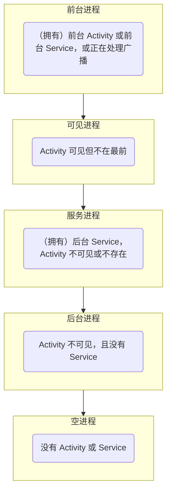
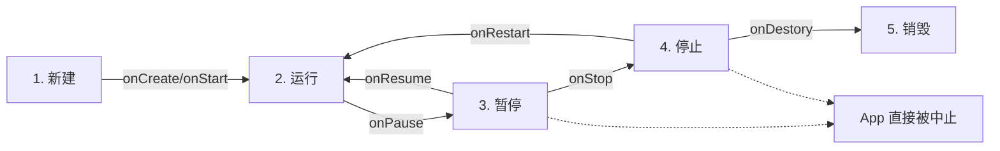

# 基础知识

Android 应用程序开发主要有两大技术路线，**原生开发**和**混合开发**。原生开发即完全使用 Google 提供的技术栈，混合开发就是加入一些其它技术栈，如 H5。一般来说，原生开发性能更好，混合开发视觉效果更好、便于跨平台。

应用**行为**可选 Java 或 Kotlin 编写。[Kotlin](./kotlin-101.md) 也是基于 Java 的，Google 正在大力推广它的使用。有时为了实现高性能操作，应用程序还需要引入 C/C++ 语言，如开发对延迟有一定要求的游戏。

应用**界面**传统采用 XML 语言（标记语言，如 HTML），使用 _android_ 前缀表示标准 Android 属性，但近年有被基于 Kotlin 的 [Compose](./compose-101.md) 取代的趋势。

应用**数据库**采用 SQLite，它是一种嵌入式的关系型数据库。开发者可借 HTTP 接口访问客户端数据库，从而实现远程读写数据。

## 应用程序组件

**应用程序组件**是一个 Android 应用程序的基本构建块。这些组件由**应用清单文件**（AndroidManifest.xml）松耦合的组织。清单描述了应用程序的每个组件，以及它们之间如何交互。

以下是可以在 Android 应用程序中使用的四个主要组件。

| 组件                | 描述                                        | 角色             |
| ------------------- | ------------------------------------------- | ---------------- |
| Activities          | 描述 UI，并且处理用户与机器屏幕的交互。     | 视图层和控制器层 |
| Services            | 处理与应用程序关联的后台操作。              | 业务层           |
| Broadcast Receivers | 处理 Android 操作系统和应用程序之间的通信。 | **通知层**       |
| Content Providers   | 处理数据和数据库管理方面的问题。            | 持久化层         |

## Hello World

启动 [Android Studio](https://developer.android.google.cn/studio/)，新建 Empty Activity 工程。

:::tip
在近些年版本的 Android Studio 中，Empty Activity 一般指的就是继承了 `AppCombatActivity` 类的原型。但在最新版中，指的是基于 Jetpack Compose 的、继承 `ComponentActivity` 类的原型。
:::


SDK 从性能考虑可选高 API 等级，从兼容性考虑可选低 API 等级（Android Lollipop 最佳）。


构建虚拟机或者连接物理机（需要开启 USB 调试模式），运行工程，即可看到应用程序界面。


由此，你得到了你的第一个 Android 应用程序。

## 工程目录结构

Android 应用程序工程分为两个层次，**项目**（Project）和**模块**（Module）。模块依附于项目，每个项目至少有一个模块。**模块对应着实际的应用程序。**

项目下有两个分类，_app_（模块集合）和 _Gradle Scripts_。


_AndroidManifest.xml_ 是应用的运行配置文件；*java 目录*下放的是当前模块的源代码和测试代码；*res 目录*下放的是当前模块的资源文件，如图片（_drawable_）、布局（_layout_）、启动图标（_mipmap_）、常量定义（_values_）等；*raw 目录*下放的是当前模块的音视频等多媒体文件。

_Gradle Scripts_ 下主要是工程的**编译**配置文件。_build.gradle_ 分为项目级和模块级两种，用于描述工程的编译规则；_proguard-rules.pro_ 用于描述代码的混淆规则；_gradle.properties_ 用于配置编译工程的命令行参数，一般无需改动；_settings.gradle_ 配置了需要编译哪些模块，初试内容为 _include ':app'_，表示只编译 _app_ 模块；_local.properties_ 用于描述开发者电脑的环境配置，它在编译时自动生成，包含 SDK 的路径、NDK 的路径等。

:::details 你知道吗：什么是 Gradle？
Gradle 是一个项目**自动化构建工具**，帮助添加依赖、打包、部署、发布和管理渠道差异。和 **Maven** 类似。
:::

## 简单应用程序

在 Android 应用程序开发中，界面设计（XML）和行为设计（Java）是分开的，这与 Web 前端设计（结构样式与行为分离）是很类似的。

一个应用默认从 _res/layout/activity_main.xml_ 载入界面。

```XML
<?xml version="1.0" encoding="utf-8"?>
<!-- LinearLayout 表示线性布局。 -->
<!-- xmlns 表示 xml namespace（xml 命名空间），冒号后跟的是命名空间名。 -->
<!-- 命名空间 android 下有变量为 layout_width（布局宽度），它的值被取为 match_parent，表示填充父母（父母是屏幕，即像屏幕一样宽）。 -->
<!-- 命名空间 android 下有变量为 orientation（方向），它的值被取为 vertical（垂直）。 -->
<LinearLayout
    xmlns:android="http://schemas.android.com/apk/res/android"
    android:layout_width="match_parent"
    android:layout_height="match_parent"
    android:orientation="vertical">

 <!-- 下跟一个文本控件。 -->
    <!-- id 为自定义的内容。 -->
    <!-- 其宽高都是“包裹内容”，表示刚刚好。 -->
    <!-- 内容为为自定义的内容。 -->
    <TextView
        android:id="@+id/tv"
        android:layout_width="wrap_content"
        android:layout_height="wrap_content"
        android:text="Hello World!" />

</LinearLayout>
<!-- 标记语言要求“有始有终”，别忘了终结符。 -->
```

一个程序默认从 _java/包名/MainActivity.java_ 载入行为。

```java
package com.penyo.simulator;

import androidx.appcompat.app.AppCompatActivity;

import android.os.Bundle;
import android.widget.TextView;

// MainActivity 是一切行为的开始。
public class MainActivity extends AppCompatActivity {

    @Override
    protected void onCreate(Bundle savedInstanceState) {
        super.onCreate(savedInstanceState);
        // 设置起始布局是 activity_main
        setContentView(R.layout.activity_main);
        // 根据 id 查找对象，并更改内容。
        ((TextView) findViewById(R.id.tv)).setText("捏马。");
    }
}
```

做好这些，再编译运行，就会发现屏幕上没有出现 “Hello World!” 而是“捏马。”。

## 创建新的界面和行为

当我们的应用有多层级时，我们就会需要不止一个界面。这时候如何从主界面跳转到其他界面呢？一般需要三个步骤：

- 在 *layout 目录*下创建 xml 文件。
- 创建与 xml 文件对应的 Java 代码。
- 在 _AndroidManifest.xml_ 中注册页面配置。

如我们在 _activity_main.xml_ 同目录下创建 _activity_2.xml_：


默认是 Design 模式，切换到 Code 模式（窗口右上角）即可显示代码：


```xml
<?xml version="1.0" encoding="utf-8"?>
<!-- gravity 取 center 的时候，所有元素都尽量靠近窗口的中心。 -->
<LinearLayout xmlns:android="http://schemas.android.com/apk/res/android"
    android:layout_width="match_parent"
    android:layout_height="match_parent"
    android:orientation="vertical"
    android:gravity="center">

    <!-- text 的值为字符串，建议放在字符串常量池里。 -->
    <TextView
        android:layout_width="wrap_content"
        android:layout_height="wrap_content"
        android:text="@string/demotext" />

</LinearLayout>
```

此时在 _res/values/strings.xml_ 里......

```xml
<resources>
    <string name="app_name">Penyo 模拟器</string>
    <string name="demotext">你是内内个内内内个内个内内</string>
</resources>
```

要想控制这个新的界面，可以再创建一个行为 _Activity2.java_：


```java
package com.penyo.simulator;

import android.os.Bundle;

import androidx.annotation.Nullable;
import androidx.appcompat.app.AppCompatActivity;

// 必须使类继承 AppCompatActivity 类，它能解决很多兼容性问题
public class Activity2 extends AppCompatActivity {
    // 必须重写 onCreate() 方法，它接收一个参数（非常重要！）
    @Override
    protected void onCreate(@Nullable Bundle savedInstanceState) {
        super.onCreate(savedInstanceState);
        // 记得设置界面
        setContentView(R.layout.activity_2);
    }
}
```

在 _AndroidManifest.xml_ 中注册界面：

```xml
<activity android:name=".Activity2"></activity>
```

想从主界面跳转到第二界面，我们需要一个交互控件。因此回到 _activity_main.xml_，向其线性布局添加一个按钮，希望按下它就发生跳转：

```xml
<Button
    android:id="@+id/bt"
    android:layout_width="wrap_content"
    android:layout_height="wrap_content"
    android:text="跳转" />
```

在 _MainActivity.java_ 中部署按钮相关的行为：

```java
Button bt = findViewById(R.id.bt);
// 注册监听
bt.setOnClickListener(new View.OnClickListener() {
    @Override
    public void onClick(View view) {
        // 定义意图
        Intent i = new Intent();
        // 设置意图的内容为设置类到新界面（暂时不要求理解）
        i.setClass(MainActivity.this, Activity2.class);
        // 应用意图
        startActivity(i);
    }
});
```

但是其实以上所有行为都可以用以下一个操作代替：


它自动生成 java 文件和 xml 文件，并帮助你自动配置注册、挂钩等。

## 应用程序生命周期

Android 应用程序生命周期不由进程自身控制，而是由系统决定。**当前可用内存、进程重要性**都会影响这一策略。

进程重要性排序如图：



## AndroidManifest.xml 与权限

应用程序所需的权限需要在内部显示标出：

```xml
<uses-permission android:name="android.permission.SEND_SMS" />
```

权限的定义在 `Manifest.permission` 里。

你亦可自定义权限以便其他应用程序调用本应用程序服务：

```xml
<permission android:name="net.penyo.fuckexam.UNTITLED_PERMISSION" />
```

## Activity 组件

四大组件之一。`Activity` 几乎是一个应用的全部，既可展示可视化内容，亦可隐藏起来执行任务。

每个“界面”在代码层面上对应一个 Activity 的实现类。

Java 主要负责视图的行为，纯粹的视图被存储在 XML 文件里：

```java
package net.penyo.fuckexam;

import android.os.Bundle;

import androidx.appcompat.app.AppCompatActivity;

/**
 * 示例活动实现类
 */
public class YourNaiveActivity extends AppCompatActivity {
    
    @Override
    protected void onCreate(Bundle savedInstanceState) {
        super.onCreate(savedInstanceState);
        setContentView(R.layout.activity_main); // 设置内容视图，指向 res/layout/activity_main.xml
    }
}
<LinearLayout xmlns:android="http://schemas.android.com/apk/res/android"
    android:layout_width="match_parent"
    android:layout_height="match_parent"
    android:orientation="vertical">

    <TextView
        android:layout_width="wrap_content"
        android:layout_height="match_parent"
        android:layout_gravity="center"
        android:text="So, fuck exam!" />
</LinearLayout>
```

> 仔细想一下，上面的 XML 里，全部的属性你都认识吗？

Activity 可由 `startActicity()` 或 `startActivityForResult()` 启动，具体不同在[后面](#Intent 类)阐述；由 `finish()` 自杀。

其生命周期如下：



多个 Activity 会被放在**任务栈**（Task）里，可以根据实际需求配置管理方案。

## 常用静态控件

所有控件都继承自 `View`。

除去 `TextView` 可以显示素文本，还可以用 `ImageView` 显示图片、用 `Button` 创建可点击对象、用 `EditText` 创建输入框......

为了区分同种不同样的控件，使用 *android:id* 记载唯一识别码：

```xml
<AnyView android:id="@+id/component_name" />
```

尺寸涉及两种单位，*sp* 为**响应式布局**服务，常用于文字；*dp* 为一般布局服务。

特别地，你需要记住一些组件的独有属性：

| 属性名          | 含义                       | 值形式               |
| --------------- | -------------------------- | -------------------- |
| android:src     | 为 ImageView 提供源        | @drawable/image_name |
| android:onClick | 将函数传入 Button 的触发器 | onSomethingHappening |
| android:hint    | 作为 EditText 的默认值     | any text             |

## 常用布局

布局是一种特殊的控件，全部继承自 `ViewGroup`，间接继承自 `View`。布局可以合适地容纳任何控件。

中时代 Android 拥有六大布局，不过你可以先不全部了解。常见的布局如下：

| 类名           | 含义                                                     |
| -------------- | -------------------------------------------------------- |
| LinearLayout   | 提供线性排布，可指定 horizontal 或 vertical。            |
| FrameLayout    | 提供“画布式”排布（有点像绝对定位），控件可以重叠摆放。   |
| RelativeLayout | 提供相对排布，控件可设置在父容器的内部指定位置（9 个）。 |

其中，RelativeLayout 确定控件位置，需要“叠加两轴上的影响”：

```xml
<RelativeLayout
    android:layout_width="match_parent"
    android:layout_height="match_parent">

    <Button
        android:layout_width="30dp"
        android:layout_height="20dp"
        android:layout_alignParentLeft="true"
        android:layout_alignParentBottom="true" />
    <!-- 按钮在容器的左下角 -->
</RelativeLayout>
```

或者是根据其他平级控件的 id 确定位置（*android:layout_alignRight="@+id/another_component"*）。

> `ConstraintLayout` 在 2016 年被提出，用于简化可视化 GUI 设计。这里仅做了解。

## 事件监听

事件模型由事件源、事件和事件监听器构成。

1. 获取事件源

    ```java
    Button bt = (Button) findViewById(R.id.first_bt);
    ```

2. 设计监听器

    ```java
    View.OnClickListener listener = new View.OnClickListener() {
    
        @Override
        public void onClick(View v) {
            // 弹出一个底部通知，短暂地停留
            Toast.makeText(YourNaiveActivity.this, "你点我干啥子", Toast.LENGTH_SHORT).show();
        }
    }
    ```

3. 注册监听器到事件源上

    ```java
    bt.setOnClickListener(listener);
    ```

除了借助显式监听器，你还可以指定控件的 *android:onClick* 来指定方法。

除了单击型，Android 还支持很多种外部动作的事件模型：长按（LongClick）、轻触（Touch）、创建上下文菜单（CreateContextMenu）等。

## 常用动态控件

一般的**模态弹窗**（AlertDialog）构造模板如下：

```java
AlertDialog.Builder dialog = new AlertDialog.Builder(YourNaiveActivity.this)
        .setTitle("弹窗标题")
        .setIcon(R.drawable.dialog_icon)
        .setMessage("你最好点“知道了”！")
        .setPositiveButton("知道了", new DialogInterface.OnClickListener() {
            
            @Override
            public void onClick() {
                Toast.makeText(YourNaiveActivity.this, "真乖", Toast.LENGTH_SHORT).show();
            }
        })
        .setNegativeButton("不接受", anotherListener);

dialog.create().show();
```

弹窗内除了文字，也可以放置列表、日期、进度条，甚至是自定义的 View。

一般的**选项菜单**（轻触出来的）（OptionMenu）构造模板如下：

```xml
<menu xmlns:android="http://schemas.android.com/apk/res/android"
    xmlns:app="http://schemas.android.com/apk/res-auto">

    <item
        android:id="@+id/action_one_of_options"
        android:title="这是其中一个选项"
        app:showAsAction="never" />
    <!-- showAsAction 控制了选项是否直接出现在 ActionBar 中，可选值 always、never、ifRoom -->
</menu>
```

特别的，`<item>` 里也可以再容纳 `<menu>`。

为了使其正常显示，需要在 Activity 里重写监听器：

```java
@Override
public boolean onCreateOptionsMenu(Menu menu) {
    getMenuInflater().inflate(R.menu.menu_fuck, menu);
    return true;
}

@Override
public boolean onOptionsItemSelected(MenuItem item) {
    int id = item.getItemId();
    if (id == R.id.action_one_of_options) {
        Toast.makeText(YourNaiveActivity.this, "你其实也点了唯一一个选项", Toast.LENGTH_SHORT).show();
    }
    return true;
}
```

一般的**上下文菜单**（长按出来的）（ContextMenu）与选项菜单类似，只是重写监听器不同：

```java
@Override
public boolean onCreateContextMenu(ContextMenu menu, View v, ContextMenu.ContextMenuInfo menuInfo) {
    MenuInflater inflator = new MenuInflater(this);
    inflator.inflate(R.menu.menu_fuck_2, menu);
    menu.setHeaderTitle("我是你按出来的菜单");
    return true;
}

@Override
public boolean onContextItemSelected(MenuItem item) {
    int id = item.getItemId();
    if (id == R.id.action_one_of_options) {
        Toast.makeText(YourNaiveActivity.this, "你敷衍地关闭了它", Toast.LENGTH_SHORT).show();
    }
    return true;
}
```

并根据需要绑定到任意 View 上：

```java
View v = findViewById(R.id.first_bt);
registerForContextMenu(v);
```

这会使得 `onCreateContextMenu()` 里的 View 成为每一个被设置注册的 View。为了辨别不同的 View，可以使用 *switch (v.getId())*。

## 伸缩设计

当 LinearLayout 的内容太多且**元素具备同质性**时，就可以考虑使用**列表视图**（ListView）。

列表视图通过单个元素布局确定模板，通过**转换器**（Adapter）将数据填充到模板里。

`ArrayAdapter<T>` 是 Adapter 的常见实现类：

```java
String[] rawData = new String[]{"第一项", "第二项", "第三项"};
ArrayAdapter<String> strings = new ArrayAdapter(YourNaiveActivity.this, R.layout.array_item, rawData);
```

其中 *array_item* 是单个元素的布局设计。

然后将适配器应用到 ListView 实例里：

```java
ListView lv = (ListView) findViewById(R.id.first_listview);
lv.setAdapter(strings);
```

> 使用 `SimpleAdapter` 可以实现单元素包含多种数据类型的 ListView。如果有更复杂的需求，则需要手动实现 `BaseAdapter` 类。

对内部项设置事件监听：

```java
lv.setOnItemClickListener(new AdapterView.OnItemClickListener() {
    
    @Override
    public void onItemClick(AdapterView<?> adapterView, View view, int i, long l) {
        Toast.makeText(YourNaiveActivity.this, "你点的是第" + i + "项", Toast.LENGTH_SHORT).show();
    }
})
```

> 如果需要更复杂的排列元素方案，可以使用 `ExpandableListView`、`GridView`、`RecyclerView` 等。

## 显式 Intent

Activity、Service、BroadcastReceiver 之间通信需要通过 `Intent` 帮助传递数据。ContentProvider 自带 `ContentResolver`，与 Intent 作用类似，就不需要 Intent 了。

Activity 可以借助 Intent 传递数据，并将目标唤醒：

```java
Intent i = new Intent(MainActivity.class, FuckActivity.class); // 从“源”到“目标”
i.putExtra("data", "fuck the exam!"); // 键值式存放数据
startActicity(i); // 启动目标活动，并携带数据
```

被唤醒的目标可以获取“意图”里的数据：

```java
Intent i = getIntent();
String data = i.getStringExtra("data");
```

如果需要传输大量数据，则可以先使用 `Bundle` 封装。

以上这种方法会一次性传输数据，且信道不可复用。如果希望目标还能返回结果给源，则应使用 `startActivityForResult()`：

```java
final int ACTIVITY_A_CODE = 0x233;
Intent i = new Intent(MainActivity.class, FuckActivity.class);
i.putExtra("data", "fuck the exam!");
startActivityForResult(i, ACTIVITY_A_CODE);
```

目标准备好要返回的数据：

```java
final int ACTIVITY_B_CODE = 0x666;
Intent result = new Intent();
result.putExtra("result", "fuck yeah!");
setResult(ACTIVITY_B_CODE, result);
finish();
```

源活动需要准备监听器：

```java
@Override
protected void onActivityResult(int requestCode, int resultCode, Intent data) {
    super.onActivityResult(requestCode, resultCode, data);
    if (requestCode == ACTIVITY_A_CODE && resultCode == ACTIVITY_B_CODE) {
        Toast.makeText(YourNaiveActivity.this, data.getStringExtra("data"), Toast.LENGTH_SHORT).show();
    }
}
```

这仍然是一次性的，但是数据双向传输。

## 消息机制

线程共享内存，多线程操作 UI 控件不安全。因此规定只有主线程才能修改 UI 控件，子线程想修改就要和主线程通信协商。

常见消息机制有 **Handler、AsyncTask、RxJava** 等......

以 Handler 为例，先创建接收者：

```java
final int OPERATION_A = 0x1024;
Handler receiver = new Handler() {

    @Override
    public void handleMessage(Message msg) {
        switch (msg.what) {
            case OPERATION_A:
                Toast.makeText(YourNaiveActivity.this, "A", Toast.LENGTH_SHORT).show();
                break;
        }
    }
}
```

发送者可以新建线程，制造信息：

```java
Thread sender = new Thread() {

    @Override
    public void run() {
        Message msg = Message.obtain();
        msg.what = OPERATION_A;
        receiver.sendMessage(msg);
    }
};

sender.start();
```

Handler 发送消息实际上借助了**消息队列**（MessageQueue），**循环器**（Looper）会一直检查队列里有没有待发送的消息。主线程默认带一套消息队列和循环器，但子线程没有，需要手动创建。

## 隐式 Intent 和 IntentFilter

当目标明确时，可以创建**显示意图**。但当目标不明确，只知道目标的部分特征时，就要创建**隐式意图**，并利用**意图过滤器**圈中目标。这常发生在跨 APP 通信中。

Intent 包含 7 个属性：

| 名称      | 含义                                |
| --------- | ----------------------------------- |
| Component | 明确目标组件名称                    |
| Action    | 动作                                |
| Category  | 动作的执行环境                      |
| Data      | 动作所操作的数据                    |
| Type      | 指定数据属性 URI 所对应的 MIME 类型 |
| Extra     | 携带数据                            |
| Flag      | 控制标识                            |

举例：

```java
Intent i = new Intent();
i.setAction(Intent.ACTION_CALL);
i.setData(Uri.parse("tel://10086"));
startActicity(i);
```

在上面这个例子中，我们希望有一个活动能够支持拨号，且拨打 10086。这便是只关心任务，而不关心谁来完成。按照常识，这将会调起系统拨号软件。

又比如说打开网页、打开图片：

```java
Intent i1 = new Intent();
i1.setAction(Intent.ACTION_VIEW);
i1.setData(Uri.parse("https://wiki.penyo.ru"));
startActicity(i1);

Intent i2 = new Intent();
i2.setAction(Intent.ACTION_GET_CONTENT);
i2.setType("image/*");
startActicity(i2);
```

若想要设置自己的 Activity 能够“包揽”指定的隐式意图，则应该在 [AndroidManifest.xml](#AndroidManifest.xml 与权限) 的 Activity 下添加 *intent-filter* 节点。

## Service 组件

四大组件之一。`Service` 被用于在后台执行**长期任务**。

Service 必须依附上下文，通过 `startService()` 或 `bindService()` 启动，通过 `stopService()` / `stopSelf()` / `stopSelfResult()` / `unBindService()` 销毁。上下文销毁时也会销毁相关的所有服务。

## BroadcastReceiver 组件

四大组件之一。`BroadcastReceiver` 可在不同的组件、应用间传递消息。

## ContentProvider 组件

四大组件之一。`ContentProvider` 可跨进程共享数据。

## 持久化

`SharedPreferences` 可以以键值式存储简单的数据。

```java
// 从上下文获得键值数据库
SharedPreferences sharedPreferences = getSharedPreferences("table_name", MODE_PRIVATE);
// 获取 Editor 对象的引用
SharedPreferences.Editor editor = sharedPreferences.edit();
// 将获取过来的值放入文件
editor.putString("name", "lucas");
editor.putInt("age", 30);
editor.putBoolean("islogin", true);
// 提交数据
editor.commit();
```

你还可以使用存储数据文件或者 SQLite 实现持久化，它们更适合大量的数据。
