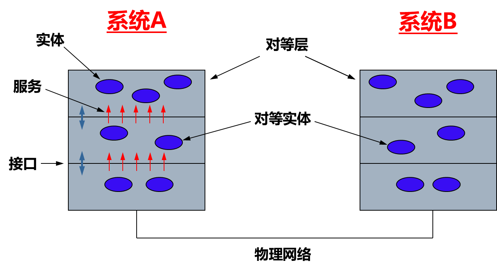
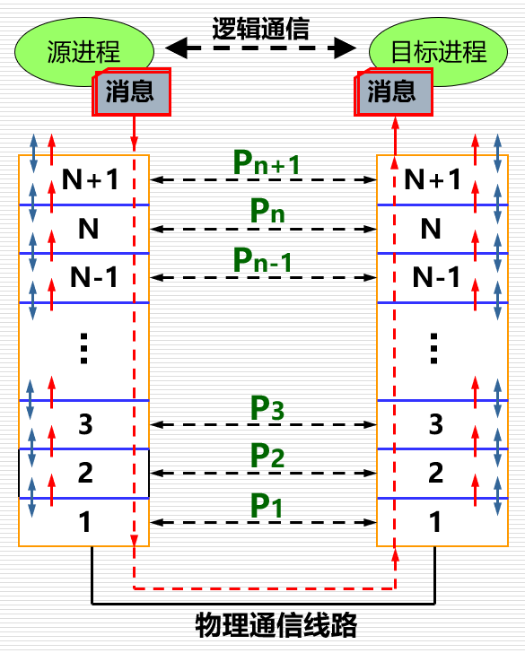
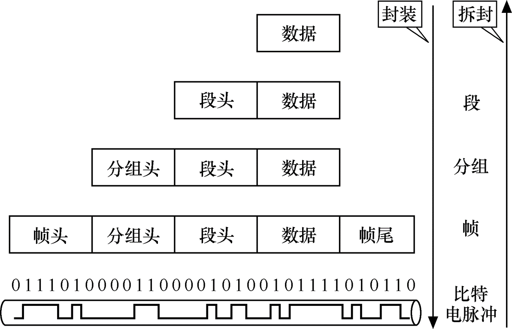
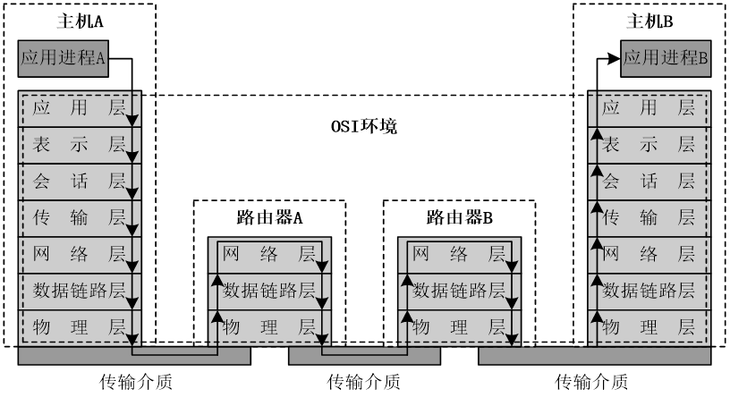
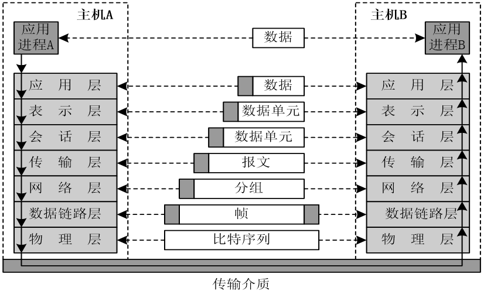

# 体系结构

## 认识计算机网络体系结构

网络体系结构提出的背景为计算机网络的复杂性、异质性。

- 不同的通信介质——有线、无线......
- 不同种类的设备——主机、路由器、交换机、复用设备......
- 不同的操作系统——Unix、Windows......
- 不同的软/硬件、接口和通信约定（协议）
- 不同的应用环境——固定、移动......
- 不同种类业务——分时、交互、实时......
- 宝贵的投资和积累——有形、无形......
- 用户业务的延续性——不允许出现大的跌宕起伏

对于复杂的网络系统，**分而治之**能合理地组织网络的结构，以达到：

- 结构清晰
- 简化设计与实现
- 便于更新与维护
- 较强的独立性和适应性

**层次**的观点：每层实现一种特定的服务

- 通过自己内部的功能
- 依赖自己的下层提供的服务

计算机网络中也采用了分层方法。把复杂的问题划分为若干个较小的、单一的局部问题，在不同层上予以解决。
网络的层次结构方法要解决的问题：

- 网络应该具有哪些层次？每一层的功能是什么？（**分层与功能**）
- 各层之间的关系是怎样的？它们如何进行交互？（**服务与接口**）
- 通信双方的数据传输要遵循哪些规则？（**协议**）

计算机网络中，**层、协议和层间接口**的集合被称为**计算机网络体系结构**。换句话说：体系结构包括三个内容：**分层结构与每层的功能，服务与层间接口，协议**。最早的网络体系结构源于IBM的SNA；其它的网络体系结构还有DEC的DNA等由国际化标准组织ISO制定的网络体系结构国际标准是OSI/RM；实际中应用最广泛的是TCP/IP体系结构。

层次结构方法的优点：

- 独立性强
  - 上层只需了解下层通过层间接口提供什么服务。
- 适应性强
  - 只要服务和接口不变，每层的实现方法可任意改变。
- 易于设计、实现和维护
  - 把复杂的系统分解成若干个涉及范围小、功能简单的子单元：
    - 使系统的结构清晰，实现、调试和维护变得简单和容易。
    - 使设计人员能专心设计和开发所关心的功能模块。

网络体系结构相关的基本概念：

- 实体：每一层中实现该层功能的软件或硬件。（可以是进程、硬件设备，也可能是人）
- 对等层：两个不同系统的同级层次。
- 对等实体：分别位于不同系统对等层中的两个实体
- 接口：相邻两层之间交互的界面，定义相邻两层之间的操作及下层对上层的服务。
- 服务：某一层及其以下各层的一种能力，通过接口提供给其相邻上层（即提供一组原语操作）。
- 服务访问点：同一结点中，相邻两层的实体相互作用的地方。是上下层实体之间信息交换的接口。（简称SAP）
- 协议：通信双方在通信中必须遵守的规则。

- 网络中的任何一个系统都是按照层次结构来组织的。
- 同一网络中，**任意两个端系统必须具有相同的层次**。
- 每层使用其下层提供的服务，并向其上层提供服务。
- 通信只在对等层间进行（**间接的、逻辑的、虚拟的**），非对等层之间不能互相通信。
- 实际的物理通信只在最底层完成。

源进程传送消息到目标进程的过程：

- 消息送到源系统的最高层；
- 从最高层开始，自上而下逐层**封装**；
- 经物理线路传输到目标系统；
- 目标系统将收到的信息自下而上逐层处理并**拆封**；
- 由最高层将消息提交给目标进程。

在各层中实现的主要功能：

- 差错控制
  - 使对等层的通信更加可靠
- 流量控制
  - 控制发送端的速率，使接收端能来得及接收
- 分段和重装
  - 发送端将数据块分成更小的单位，并在接收端重新组合
- 复用和分用
  - 多个高层的对等层通信会话复用一条低层连接
- 建立连接和释放连接

通信协议的三要素：

- 语义
  - 对协议中各协议元素的含义的解释，例如：在HDLC协议中，标志*Flag(7EH)*表示报文的开始和结束。
- 语法
  - 协议元素与数据的组合格式，即报文格式。
- 时序
  - 通信过程中，通信双方操作的执行顺序和规则。**也称同步，即实体通信实现顺序的详细说明。**

网络体系结构中，每层可能会有若干个协议，一个协议只属于一个层次。协议可以由软件或硬件来实现：如网络通信协议软件、网络驱动程序和网络硬件。常用协议组：TCP/IP（Windows、Unix、Linux）、NetBEUI（Windows）、IPX/SPX（NetWare、Windows）。

网络体系结构中，对等层之间交换的信息报文统称为**协议数据单元**（Protocol Data Unit，PDU）。

传输层及以下各层的PDU另外还有各自特定的名称：

- 传输层——段（Segment）
- 网络层——分组/包（Packet）
- 数据链路层——帧（Frame）
- 物理层——比特（Bit）

PDU由**协议控制信息**（协议头）和数据（SDU）组成。协议头部中含有完成数据传输所需的控制信息，如地址、序号、长度、分段标志、差错控制信息等。

下层把上层的PDU作为本层的数据加以**封装**，然后加入本层的协议头部（和尾部）形成本层的PDU。

- 封装：就是在数据前面加上特定的协议头部。

因此，数据在源站自上而下递交的过程实际上就是不断封装的过程。到达目的地后自下而上递交的过程就是不断拆封的过程。

在目的站，某一层只能识别由源站对等层封装的“信封”，而对于被封装在“信封”内部的“数据”仅仅是拆封后将其提交给上层，本层不作任何处理。即**每一层只处理本层的协议头部**！

## 开放系统互联参考模型（OSI/RM）

在制定计算机网络标准方面，起着很大作用的两大国际组织是：

- 国际电报与电话咨询委员会（CCITT）
- 国际标准化组织（ISO）

CCITT与ISO的工作领域不同：

- CCITT主要是考虑通信标准的制定；
- ISO主要是考虑信息处理与网络体系结构。

在OSI中的“开放”是指只要遵循OSI标准，一个系统就可以与位于世界上任何地方、同样遵循同一标准的其它任何系统进行通信。

**OSI/RM 参考模型的结构分为7层：**

- 应用层 Application：为网络应用提供服务
- 表示层 Presentation：数据表示（加密、压缩等）
- 会话层 Session：在用户间建立会话关系
- 传输层 Transport：不同主机进程间的通信
- 网络层 Network：在主机间传输分组
- 数据链路层 Data Link：在节点间可靠地传输帧
- 物理层 Physical：位流的传输

在网络体系结构中讨论的服务可以分为**通信子网对网络中数据传输所提供的服务**，与**整个网络系统为用户提供的服务**；通信子网的服务是指通信子网对主机间数据传输的效率和可靠性所提供的保证机制；通信服务可以分为两大类：

- 面向连接服务（Connect-oriented Service）
  - 面向连接服务的数据传输过程必须经过**连接建立、连接维护与释放连接**的三个过程；
  - 面向连接服务的在数据传输过程中，各分组可以不携带目的结点的地址；
  - 面向连接服务的传输连接类似一个通信管道，发送者在一端放入数据，接收者从另一端取出数据；
  - 面向连接数据传输的收发数据顺序不变，传输可靠性好，但是**协议复杂，通信效率不高**。
- 无连接服务（Connectless Service）
  - 无连接服务的每个分组都携带完整的目的结点地址，各分组在系统中是独立传送的；
  - 无连接服务中的数据传输过程不需要经过连接建立、连接维护与释放连接的三个过程；
  - 数据分组传输过程中，目的结点接收的数据分组可能出现乱序、重复与丢失的现象；
  - 无连接服务的可靠性不好，但是**协议相对简单，通信效率较高**。

网络数据传输的可靠性一般通过**确认和重传机制**保证.

- 确认是指数据分组的接收结点在正确地接收到每个分组后，要求向发送结点发回接收分组的确认信息；
- 在规定的时间内，如果发送结点没有接收到接收结点的确认信息，就认为该数据分组发送失败，发送结点重新发送该数据分组；
- 确认和重传机制可以提高数据传输的可靠性，但是它需要制定较为复杂的确认和重传协议，并且需要增加网络额外的通信负荷，占用网络带宽。

通信协议存在四种类型：

- 面向连接与确认服务；
- 面向连接与不确认服务；
- 无连接与确认服务；
- 无连接与不确认服务；

设计者可以根据不同的通信要求，决定选择不同的服务类型。

> 你知道吗：OSI模型的缺陷
>
> - OSI 模型协议制定的时机较晚，OSI协议出现时，TCP/IP协议已大量应用在大学和科研机构。人们不会轻易改动协议。
> - OSI 模型设计亦有一定缺陷。首先会话层对大多数应用没有用，表示层几乎是空的；而数据链路层和网络层功能太多。
> - OSI模型以及与其相关的服务定义和协议极其复杂，实现起来困难且操作效率不高。

## TCP/IP体系结构

TCP/IP参考模型的发展：

- 在TCP/IP协议研究时，并没有提出参考模型；
- 1974年Kahn定义了最早的TCP/IP参考模型；
- 80年代Leiner、Clark等人对TCP/IP参考模型进一步的研究；
- TCP/IP协议一共出现了6个版本，后3个版本是版本4、版本5与版本6；
- 目前我们使用的是版本4，一般被称为**IPv4**；
- \***\*IPv6**被称为下一代的IP协议。\*\*

TCP/IP体系结构分为4层：

- 应用层
- 传输层
- 网际层
- 网络接口层（数据链路层+物理层）
  _TCP/IP体系结构有时也采用5层表示方法，即用数据链路层和物理层代替网络接口层。_

TCP/IP协议的特点：

- 开放的协议标准;
- 独立于特定的计算机硬件与操作系统；
- 独立于特定的网络硬件，可以运行在局域网、广域网，更适用于互连网中；
- 统一的网络地址分配方案，使得整个TCP/IP设备在网中都具有唯一的地址；
- 标准化的高层协议，可以提供多种可靠的用户服务。

- TCP/IP不是一个单个的协议，而是由数十个具有层次结构的协议组成的一个**协议集**。
  - TCP和IP是该协议集中的两个最重要的核心协议。
- TCP/IP是Internet上的标准通信协议集。
- TCP/IP以**请求注释**（RFC）文档发布：
  - TCP（[RFC 793](https://www.rfc-editor.org/rfc/rfc793)）, UDP（[RFC 768](https://www.rfc-editor.org/rfc/rfc768)）
  - IP [RFC 791]
  - DNS [RFC 1034, 1035], FTP [RFC 959, 1635]
    _RFC（Request For Comments）包含了关于Internet的几乎所有重要的文字资料，制定于1969年（当时 Internet还是指ARPANET）。RFC文档主要涉及计算处理和计算机通信方面的网络技术协议、过程、程序和理论概念。这种Internet协议组规范文档，由Internet工程任务组（IETF）及Internet工程指导小组（IESG）共同制定，命名为RFC。_

## OSI和TCP/IP的主要层概述
