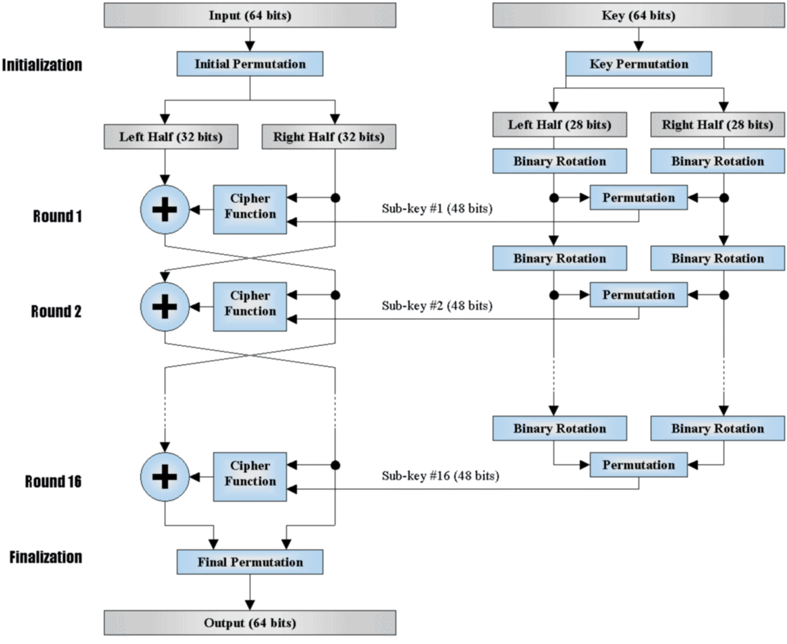

# 古典加密

在通信过程中，待加密的信息称为明文，已被加密的信息称为密文，仅有收、发双方知道的信息称为**密钥**。在密钥控制下，由明文变到密文的过程叫加密，其逆过程叫脱密或解密。在密码系统中，除合法用户外，还有非法的截收者，他们试图通过各种办法窃取机密（又称为被动攻击）或窜改消息（又称为主动攻击）。

古典加密是最早的密码学研究方向，加密和解密共用同一个密钥，因此双方必须持有相同的密钥，且了解加密规律。密钥一旦泄露，且加密规律被猜到，则该方案不再安全。

古典加密也叫**对称加密**。

## 恺撒加密

根据苏维托尼乌斯于公元二世纪写的《恺撒传》中的记载，恺撒曾用此方法对重要的军事信息进行加密：

> 如果需要保密，信中便用暗号，也即是改变字母顺序，使局外人无法组成一个单词。如果想要读懂和理解它们的意思，得用第 4 个字母置换第一个字母，即以 D 代 A，余此类推。
>
> ```mermaid
> graph LR
>     o["ABCD"] -- "caesar(4)" --> c["DEFG"]
> ```

同样，奥古斯都也使用过类似方式，只不过他是把字母向右移动一位，而且末尾不折回。每当他用密语写作时，他都用 B 代表 A，C 代表 B，其余的字母也依同样的规则；他用 A 代表 Z。

简而言之，就是将真正的信件内容（明文）中的每一个字母用其后的第 N 个字母代替，转换成一封密信（密文）。这样，即便敌军截住信件，也不知其意。据说，这种加密方法在当时的古罗马颇为流行。这种将字母表中的字母移动一定位置而实现加密的方法，被称为“恺撒移位密码”，简称“恺撒密码”。移动的位数 N 就是加密和解密的密钥。

另外，有证据表明，恺撒曾经使用过更为复杂的密码系统：文法学家普罗布斯曾经写过一份独具创新的手稿，研究恺撒书信中包含有秘密信息的字母。

已经无法弄清恺撒密码在当时有多大的效果，但是有理由相信它是安全的。因为恺撒大部分敌人都是目不识丁的，而其余的则可能将这些消息当作是某个未知的外语。即使有某个敌人获取了恺撒的加密信息，根据现有的记载，当时也没有任何技术能够解决这一最基本、最简单的替换密码。现存最早的破解方法记载在公元 9 世纪阿拉伯的阿尔·肯迪的有关发现频率分析的著作中。

## 谜式密码机 Enigma

传统的**移位式/替换式**加密存在一个致命漏洞：每个字符都唯一映射到另一个字符。

举个例子：A 如果被替换为 B，那么一定没有其他任何字符也被替换成 B。这导致我们可以通过对明文样本集进行[频次分析](./analysis.md)，找到最常出现的字符，从而确定密文中最常出现字符是哪个字符。之后以此类推，直到无法确定最后几个字符时，可以根据语言特性猜测它们。

如果替换方案是动态的，进一步地来说，是根据上下文而实时变化的，那么破解难度将上升到“无法破解”的地步。就算能耗费天文人力物力解出，信息也早就失去了时效性。

二战时期，纳粹德国开发出 **Enigma**，它使用一系列相似的转子机械加解密，并包括了许多不同的型号，使用了对称加密算法中的流加密。

键盘一共有 26 个键，键盘排列和广为使用的计算机键盘基本一样，只不过为了使通讯尽量地短和难以破译，空格、数字和标点符号都被取消，而只有字母键。键盘上方就是显示器，这可不是意义上的屏幕显示器，只不过是标示了同样字母的 26 个小灯泡，当键盘上的某个键被按下时，和这个字母被加密后的密文字母所对应的小灯泡就亮了起来，就是这样一种近乎原始的“显示”。


在显示器的上方是三个直径 6 厘米的转子，它们的主要部分隐藏在面板下，转子才是 Enigma 最核心关键的部分。如果转子的作用仅仅是把一个字母换成另一个字母，那就是密码学中所说的“简单替换密码”，而在公元九世纪，阿拉伯的密码破译专家就已经能够娴熟地运用统计字母出现频率的方法来破译简单替换密码，柯南·道尔在他著名的福尔摩斯探案《跳舞的小人》里就非常详细地叙述了福尔摩斯使用频率统计法破译跳舞人形密码（也就是简单替换密码）的过程。——之所以叫“转子”，因为它会转！这就是关键！当按下键盘上的一个字母键，相应加密后的字母在显示器上通过灯泡闪亮来显示，而转子就自动地转动一个字母的位置。举例来说，当第一次键入 A，灯泡 B 亮，转子转动一格，各字母所对应的密码就改变了。第二次再键入 A 时，它所对应的字母就可能变成了 C；同样地，第三次键入A时，又可能是灯泡 D 亮了。

这就是 Enigma 难以被破译的关键所在，这不是一种简单替换密码。同一个字母在明文的不同位置时，可以被不同的字母替换，而密文中不同位置的同一个字母，又可以代表明文中的不同字母，字母频率分析法在这里丝毫无用武之地了。这种加密方式在密码学上被称为“复式替换密码”。

## 混淆、扩散

在克劳德·香农的定义之中，**混淆**主要是用来使密文和对称式加密方法中密钥的关系变得尽可能的复杂；而**扩散**则主要是用来使用明文和密文的关系变得尽可能的复杂，明文中任何一点小更动都会使得密文有很大的差异。

混淆用于掩盖明文与密文之间的关系。这可以挫败通过研究密文以获取冗余度和统计模式的企图。做到这一点最容易的方法是“代替”。

扩散通过将明文冗余度分散到密文中使之分散开来。即将单个明文或密钥位的影响尽可能扩大到更多的密文中去。产生扩散最简单的方法是换位（置换）。

## DES 与 AES 算法

**DES**（Data Encryption Standard）是一种对称加密算法。它是在 20 世纪 70 年代初期由 IBM 研发的。它的设计目标是提供高度的数据安全性和性能，并且能够在各种硬件和软件平台上实现。

DES 的功能是：给定一个 64 位的明文和一个 64 位的密钥，输出一个 64 位的密文。这个密文可以用相同的密钥解密。所谓“64 位的密钥”，其实里面只有 54 位在起作用。剩余的位可以直接丢弃，或者当作奇偶校验位。

虽然 DES 一次只能加密 8 个字节，但我们只需要把明文划分成每 8 个字节一组的块，就可以实现任意长度明文的加密。如果明文长度不是 8 个字节的倍数，还得进行填充。现在流行的填充方式是 **PKCS7/PKCS5**，用于把任意长度的文本填充成 8 字节的倍数长，也能方便地恢复原文，这里不再赘述。此外，独立地对每个块加密，最后直接拼起来是不行的（这种方式称为“电子密码本”，ECB 模式。它会导致明文中重复的块，加密结果也重复，这对于图片之类的数据来说几乎是致命的）。这个问题我们将在以后的小节中探讨。

整个算法分为两大部分——**迭代加密**（左边的 16 轮迭代操作），以及**密钥调度**（右边生成子密钥的算法）:



从图中可以看出，过程可分为 5 部分：

1. 初始置换（Initial Permutation） ：

   将 64 位明文按照固定的顺序重新排列，得到 L0 和 R0 两部分，每部分 32 位。

2. 轮函数（Round Function） ：

   包括扩展置换、与轮密钥异或、S 盒替换和 P 盒置换等操作。

3. 轮密钥生成（Key Schedule） ：

   根据56位初始密钥生成 16 个 48 位轮密钥，用于每一轮的加密过程。

4. 16 轮加密（16 Rounds Encryption） ：

   将明文经过初始置换后的 L0 和 R0 部分分别进行 16 轮的加密处理，每轮包括轮函数和密钥混合。

5. 逆初始置换（Final Permutation） ：

   将经过 16 轮加密后的数据按照逆序的方式重新排列，得到最终的 64 位密文数据。

**其中，S 盒至关重要，并不能随意设计，否则安全性将大打折扣。**

现在 DES 算法的安全性受到挑战，主要是因为 56 位密钥长度较短，易受到暴力破解攻击。因此，现在通常不推荐使用 DES 算法来加密敏感数据，而是选择更安全的加密算法，如 AES 算法：

在 DES 中，明文被分为两半，然后再被进一步处理；而在 AES 中，整个块不进行除法，而是一起处理以生成密文。相对而言，AES 比 DES 快得多，与 DES 相比，AES 能够在几秒钟内加密大型文件。由于 DES 中使用的共享密钥的比特大小较小，因此它被认为不如 AES 安全。DES 被认为更容易受到暴力攻击，而到目前为止，AES 尚未遇到任何严重攻击。在灵活性的基础上评估算法的实现，AES 比 DES 更具灵活性，因为它允许包括 128、192、256 位在内的各种长度的文本，而 DES 只允许对 64 位固定文本进行加密。
