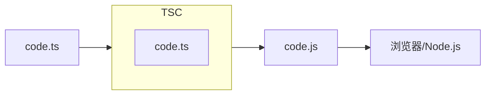
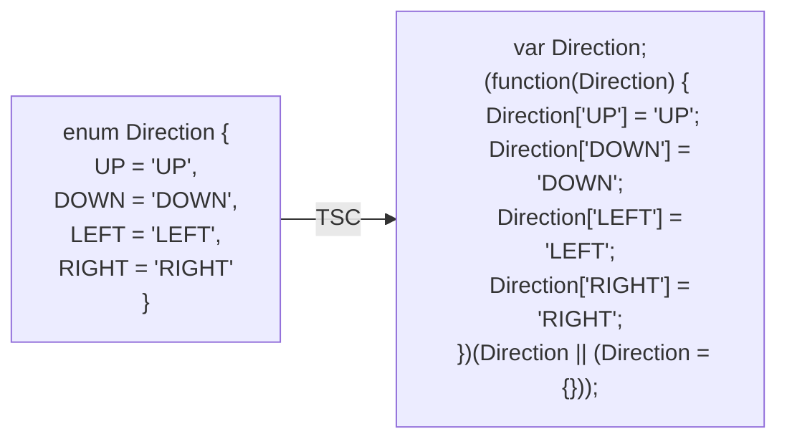

# TypeScript 基础

:::tip
阅读本章需要 JS 和 Node.js 的基础知识储备。
:::

**TypeScript**（TS）是 JavaScript 的超集，在 JS 的基础上增加了**类型支持**，属于**静态类型语言**（编译器做类型检查）。

由于 JS 代码中绝大多数错误都是类型错误（TypeError），所以调试的时候很浪费时间。而 TS 将这种隐患扼杀在 IDE 里——在编写的时候就必须改正，而不是到执行才知道有错误。

此外，TS 总是支持最新的 ECMAScript 语法 + 很多前端框架都已与 TS 完美契合，这下要狠狠拷打我们的 JS 了。

## 第一个程序

下图指导了我们要做的事情：



先编写一个 TS 程序：

```ts
let hello: string = "Hello, TypeScript!"; // 类型标注是最大的特色
console.log(hello);
```

由于浏览器 / Node.js 不能直接识别 TS 代码，因此需要安装转译到 JS 的 Node.js 包：

```txt
npm i -g typescript
```

该包提供了 `tsc` 命令以供我们操作 TS。

转译会根据 TS 文件生成一个同名的 JS 文件：

```txt
tsc Demo.ts
```

:::tip
如果你遇到了 _tsc : 无法加载文件，因为在此系统上禁止运行脚本_，说明 PowerShell 的安全策略将 nrm 命令视为了不安全脚本，不允许执行。只需要放开权限就可以了（一劳永逸）：

```txt
set-ExecutionPolicy RemoteSigned
```

:::

在 Node.js 里运行结果即可：

```txt
node Demo.js
```

## ts-node

**ts-node** 包可以直接执行 TS 代码，使我们的调试更简单。安装：

```txt
npm i -g ts-node
```

运行 TS：

```txt
ts-node Demo.ts
```

## 类型检查

在 JS 中，以下代码是不会出错的：

```js
let a = 114514;
a = "114514"; // 类型变化了
```

但是在 TS 中，会出错：_不能将类型“string”分配给类型“number”_，无论你有没有标注 _a_ 是数值。这就是 TS 的类型检查机制。

对于数组变量，有特殊的写法：

```ts
let nums: number[] = [];
let complexNums: Array<number> = [];
```

对于函数变量，有特殊的写法：

```ts
function add(...nums: number): number {
    let total: number = 0
    for (let num: number of nums)
        total += num
    return total
}
const addVar = (...nums: number): number => {
    let total: number = 0
    for (let num: number of nums)
        total += num
    return total
}
const addVarEZ: (...nums: number) => number = (...nums) = > {
    let total: number = 0
    for (let num: number of nums)
        total += num
    return total
}
```

若函数的参数是可选的，要在冒号前加上半角问号。可选参数之后不能有必选参数。

```ts
function getGirlPhoneNumber(phoneNumber?: number | string): void {
  if (phoneNumber) return console.log("电话号码为：" + phoneNumber);
  return console.log("没要到");
}
```

对于对象变量，有特殊的写法：

```ts
let dangdang: { name: string; age: number; play(msg: string): void } = {
  name: "Dai Tsingtong",
  age: 19,
  play(msg) {
    console.log(msg);
  },
};
```

当对象是函数的参数时，部分可选的成员也可以在冒号前加上半角问号。

为了更灵活地控制类型，而不至于像 C 或 Java 那样死板，TS 新增了一些类型：

| 类型                   | 关键字/用例                    | 描述                                 |
| ---------------------- | ------------------------------ | ------------------------------------ |
| 联合类型               | type1 \| type2                 | 既可以是 type1 型，也可以是 type2 型 |
| 自定义类型（类型别名） | type Custom = (type1 \| type2) | 包装一种新的类型为 Custom            |
| 接口                   | interface Custom {}            | 包装一种新的对象类型为 Custom        |
| 元组                   | [type1, type2]                 | 数组长度为 2，分别为 type1、type2 型 |
| 字面量枚举             | value1 \| value2               | 既可以是 value1，也可以是 value2     |
| 枚举                   | enum Custom = {}               | 包装一组常量为新的类型 Custom        |
| 空                     | void                           | 当函数没有返回值时，是空类型         |
| 任意                   | any                            | 可以是任何类型（逃逸类型检查）       |

## 接口

**接口**（interface）用于描述对象类型，与类型别名类似。

```ts
// 定义了对象类型：女儿
interface Daughter {
  name: string;
  age: number;
  play(msg: string): void;
  phoneNumber?: string | number;
}

// 创建女儿类型的对象，没有电话号码
let shinray: Daughter = {
  name: "Liu Shinray",
  age: 19,
  play(msg) {
    console.log(msg);
  },
};
```

**接口与类型别名在效果上完全一样。** 但是接口没有用到 `=`；且接口只能为对象指定类型，类型别名能为任意类型指定别名。

```ts
// 定义了类型别名：女儿
type Daughter = {
  name: string;
  age: number;
  play(msg: string): void;
  phoneNumber?: string | number;
};
```

如果两个接口之间有大量相同的属性或方法，可以将公共成员抽离出来，通过**继承**（extends）来实现复用。

```ts
// 定义了接口：人
interface Person {
  sex: string;
  age: number;
}
// 定义了接口：中国人，继承自：人
interface Chinese extends Person {
  knownChineseTradition: string[];
}
```

## 元组

**元组**（tuple）可以确切地标记出数组的长度，以及每个元素的类型。

```ts
// 定义元组：带宽
let bandwidth: [number, string, number, string] = [1, "Gbps", 125, "Mbps"];
```

## 类型推论

在 TS 中，某些没有明确指出类型的地方，TS 的类型推论机制会帮助提供类型。在一些类型很容易看出来的场景，我们可以省略不写类型，以节省时间。

```ts
let name = "Dai Tsingtong"; // 很显然是 string 型
function add(num1: number, num2: number) {
  // 很显然是 number 型
  return num1 + num2;
}
```

若只是声明变量但不初始化值，则不得省略类型标注。

## 类型断言

对于一个 DOM 元素，它的类型肯定属于 HTMLElement，但这可能并不够具体。比如，一个 `<a>` 被 getElementById() 获取时，会显示是一个 HTMLElement。**在 TS 中**，HTMLElement 只包含所有标签公共的属性，尝试访问 HTMLAnchorElement 特有的 href 属性就会得到 _undefined_：

```ts
let a = document.getElementById("link");
```

这时候就要使用**类型断言**来指定更加具体的类型：

```ts
let a = document.getElementById("link") as HTMLAnchorElement;
// 或
let aWithGenerics = <HTMLAnchorElement>document.getElementById("link"); // 与 JSX 语法冲突
```

## 字面量类型与枚举

在 TS 中，常量的值是不可变的。没有特别指定的情况下（即 TS 自行推论），其类型为它的值。如：

```ts
const num = 114514; // 类型为 114514
const str = "114514"; // 类型为 "114514"
const bool = true; // 类型为 true
```

这些类型都属于**字面量类型**。

:::warning
字面量类型是基于基本数据类型的更精确的类型，而不是完全独立于基本数据类型外的新类型！
:::

字面量类型常与联合类型共用，以表示一组明确的可选值，如：

```ts
// 定义状态变量：骰子点数
let dicePoint: 1 | 2 | 3 | 4 | 5 | 6;
// 定义函数：更改主题
function changeTheme(theme: "light" | "dark") {
  let link = document.querySelector("link") as HTMLLinkElement;
  link.href = theme + ".css";
}
```

**枚举**（enum）可以定义一组命名常量为类型。因此上面的案例还可以改成：

```ts
// 定义枚举：骰子面。内含六个成员，第一个值被指定为 1，故全体实值分别为 1、2、3、4、5、6
enum DiceFace {
  P1 = 1,
  P2,
  P3,
  P4,
  P5,
  P6,
} // 枚举成员命名规则与变量命名规则相同（不能再以数字开头）
let dicePoint: DiceFace = DiceFace.P6; // 调用枚举成员，与调用类静态成员相同
// 定义枚举：主题。内含两个成员，实值分别为 "light"、"dark"
enum Theme {
  LIGHT = "light",
  DARK = "dark",
}
function changeTheme(theme: Theme) {
  let link = document.querySelector("link") as HTMLLinkElement;
  link.href = theme + ".css";
}
```

枚举成员值只能是数值或字符串。若不指定枚举成员值，则默认第一个成员值为 0，后续依次 +1。若一个枚举成员值为字符串，则在下一个数值成员前，其之后所有枚举成员都要赋值。

枚举是 TS 为数不多的非类型型扩展。TS 的类型在转换为 JS 时会被移除，但枚举会转换成实的 JS 代码（因为要提供值）：



## 逃逸类型检查

在 TS 中，当我们不希望变量的类型受监管时，可以使其类型为 any：

```ts
let obj: any = 114514;
obj = "114514";
obj = {};
obj = [];
```

:::warning
`any` 会使 TypeScript 变为 “AnyScript”（又变回 JavaScript 了）！
:::

原则上不该使用 `any`，除非临时使用来“避免”书写很长很复杂的类型。

在以下两种情况下，变量隐式为 any：

1. 声明变量不提供类型也不初始化
2. 函数参数不提供类型

## typeof

在 JS 中，`typeof` 可用于计算数据类型。TS 在此基础上发展了引用类型的功能（可在类型上下文中引用变量或属性类型）：

```ts
// 点 实例
let point = { x: 1.0, y: 1.0 };
// 计算平面中过两点最小矩形面积
function getArea(p1: typeof point, p2: typeof point) {
  return (p2.x - p1.x) * (p2.y - p1.y);
}
// 三维点 模板
type Point3D = { x: typeof point.x; y: typeof point.x; z: typeof point.x };
```

特别的，`typeof` 只能引用静态类型信息。下面演示了一种错误的用法：

```ts
function add(num1: number, num2: number) {
    return num1 + num2
}

type Type = typeof add(1, 1)
```
