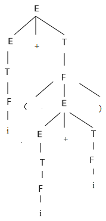

# 编译原理基础

## 文法与语言描述

**二型文法式子左边必须是非终结符，式子右边可以有多个字符。**

> 给出生成下述语言的上下文无关文法（II 型）：
>
> $$
> L(G)=\{a^nb^na^mb^m|n,m\ge0\}
> $$

$G(S): \\ S\rarr AA \\ A\rarr aAb|\epsilon$

**三型文法式子左边只能有一个字符，而且必须是非终结符；式子右边最多有两个字符。如果有两个字符必须是*终结符 + 非终结符*的格式，如果是一个字符，那么必须是终结符。**

> 给出生成下述语言的正规文法（III 型）：
>
> $$
> L(G)=\{a^nb^m|n,m\ge1\}
> $$

$G(S): \\ S\rarr aA|bB \\ A\rarr aA|bB|\epsilon \\ B\rarr bB|\epsilon$

> 文法 $G(S): \\ S\rarr dAB \\ A\rarr aA|\epsilon \\ B\rarr Bb|\epsilon$ 描述的语言 $L(G)$ 是什么？

$L(G)=\{da^nb^m|n\gt0,m\ge0\}$

> 写一文法，使其语言是偶正整数的集合，要求不允许 0 开头。

$G(S): \\ S\rarr B(A|B|C)^* \\ A\rarr 1|3|5|7|9 \\ B\rarr 2|4|6|8 \\ C\rarr 0$

**句柄是直接短语中的，位居图最左的一个短语。**

> 已知 $G(S): \\ E\rarr T|E+T \\ T\rarr F|T*F \\ F\rarr (E)|i$，试给出表达式 $i+(i+i)$ 的规范推导及语法树，并给出其短语、直接短语、句柄。

$E \\ \Rarr E+T \\ \Rarr E+F \\ \Rarr E+(E) \\ \Rarr E+(E+T) \\ \Rarr E+(E+F) \\ \Rarr E+(E+i) \\ \Rarr E+(T+i)  \\ \Rarr E+(F+i) \\ \Rarr E+(i+i)  \\ \Rarr T+(i+i)  \\ \Rarr F+(i+i)  \\ \Rarr i+(i+i)$



短语：$i_1、i_2、i_3、i_2+i_3、(i_2+i_3)、i_1+(i_2+i_3)$

直接短语：$i_1、i_2、i_3$

句柄：$i_1$

## 正规式、NFA 与 DFA

> 设计一个 DFA，识别 $R=(a^*b)^*ba$ 的描述的正规集合。
>
> 1. 构造该正规式所对应的 NFA；
> 2. 将所求的 NFA 确定化；
> 3. 将所求的 DFA 最小化。

1.  ```mermaid
    graph LR
        S((S))
        A((A))
        B((B))
        C((C))
        G((G))
        F((F))
        Z(((Z)))

        S -- \0 --> A -- \0 --> B -- b --> C -- a --> Z
        A -- \0 --> G -- a --> G -- \0 --> F -- b --> A
    ```

**DFA 转 NFA 主要靠“闭包 a”法（先取输入能到达的集合，再取空串能到达的集合，两结果合并）。**

2.  | $I$         | $I_a$   | $I_b$       |
    | ----------- | ------- | ----------- |
    | [S,A,B,G,F] | [G,F]   | [A,B,C,G,F] |
    | [G,F]       | [G,F]   | [A,B,G,F]   |
    | [A,B,C,G,F] | [F,G,Z] | [A,B,C,G,F] |
    | [A,B,G,F]   | [G,F]   | [A,B,C,G,F] |
    | [F,G,Z]     | [G,F]   | [A,B,G,F]   |

    ```mermaid
    graph LR
        0((_))
        1((1))
        2((2))
        3((3))
        4((4))
        5(((5)))

        0 --> 1
        1 -- a --> 2 -- a --> 2 -- b --> 4 -- b --> 3 -- a --> 5 -- b --> 4
        1 -- b --> 3 -- b --> 3
        4 & 5 -- a --> 2
    ```

3.  先将终态和非终态分成两个集：$K_1=\{1,2,3,4\}$，$K_2=\{5\}$ 对于 $K_1$ 中的 3 态输入 a 则进入 $K_2$ 集，而 1、2、4 态输入 a 仍然在 $K_1$ 中，故 $K_1$ 可一分为二 $K_{11}=\{1,2,4\}$ 和 $K_{12}=\{3\}$；考察 $K_{11}$ 对于 1、4 态输入 b 到达 3 态而 2 态输入 b 到达 4 态。故 $K_{11}$ 可一分为二 $K_{111}=\{1,4\}$，$K_{112}=\{2\}$。

    其状态图如下：

    ```mermaid
    graph LR
        0((_))
        1((1))
        2((2))
        3((3))
        5(((5)))

        0 --> 1
        1 -- a --> 2 -- a --> 2 -- b --> 1
        1 -- b --> 3 -- b --> 3 -- a --> 5 -- a --> 2
        5 -- b --> 1
    ```

## LL(1) 文法

> 已知文法 $G(S): \\ S\rarr S+aF|aF|+aF \\ F\rarr *aF|*a$，求：
>
> 1. 消除左递归和回溯；
> 2. 构造 FIRST、FOLLOW、SELECT 集合；
> 3. 判断其是否是 LL(1) 文法；
> 4. 构造 LL(1) 文法分析表；
> 5. 分析 +a\*a 是否是文法的句子。

1.  $G(S): \\ S\rarr aFS|+aFS' \\ S'\rarr +aFS'|\epsilon \\ F\rarr *aF' \\ F'\rarr F|\epsilon$

**First 元素即取右部的第一个终结字符；Follow 元素指的是左部符号在全局任意右部之后的终结字符，而不是 First 元素之后的元素；Select 元素指的是推导式中左部能推出的全部起始符号，如果右部为空则指向左部的 Follow 集合与右部的 First 集合（去掉空串）的并集。**

2.  $FIRST(S)=\{a,+\} \\ FIRST(S')=\{+,\epsilon\} \\ FIRST(F)=\{*\} \\ FIRST(F')=\{*,\epsilon\}$

    $FOLLOW(S)=\{\#\} \\ FOLLOW(S')=\{\#\} \\ FOLLOW(F)=\{+,\#\} \\ FOLLOW(F')=\{+,\#\}$

    $SELECT(S\rarr aFS')=\{a\} \\ SELECT(S\rarr +aFS')=\{+\} \\ SELECT(S'\rarr +aFS')=\{+\} \\ SELECT(S'\rarr\epsilon)=\{\#\} \\ SELECT(F\rarr *aF')=\{*\} \\ SELECT(F'\rarr F)=\{*\} \\ SELECT(F'\rarr\epsilon)=\{+,\#\}$

3.  因为 $\{a\}\cap\{+\}=\empty$、$\{+\}\cap\{\#\}=\empty$、$\{*\}\cap\{+,\#\}=\empty$，故该文法是 LL(1) 文法。

4.  预测分析表为：

    |     | a             | +                 | \*            | #                 |
    | --- | ------------- | ----------------- | ------------- | ----------------- |
    | S   | $S\rarr aFS'$ | $S\rarr +aFS'$    |               |                   |
    | S'  |               | $S'\rarr +aFS'$   |               | $S'\rarr\epsilon$ |
    | F   |               |                   | $F\rarr *aF'$ |                   |
    | F'  |               | $F'\rarr\epsilon$ | $F'\rarr F$   | $F'\rarr\epsilon$ |

5.  符号串 +a\*a 是否为句子的分析过程：

    | 步骤 | 符号栈 S   | 输入串 | 规则                                 |
    | ---- | ---------- | ------ | ------------------------------------ |
    | 1    | $\#S$      | +a\*a# | $S\rarr +aFS'$                       |
    | 2    | $\#S'Fa+$  | +a\*a# | 匹配                                 |
    | 3    | $\#S'F$    | \*a#   | $F\rarr *aF'$                        |
    | 4    | $\#S'F'a*$ | \*a#   | 匹配                                 |
    | 5    | $\#S'F'$   | #      | $F'\rarr\epsilon$，$S'\rarr\epsilon$ |
    | 5    | $\#$       | #      | 成功，STOP                           |

## LR(0) 与 SLR(1) 文法

> 给定文法 $G(A): \\ A\rarr aAd|aAb|\epsilon$，
>
> 1. 判断该文法是否是 SLR(1) 文法；
> 2. 若是，则构造其分析表；
> 3. 对输入串 ab 进行分析。

1. 拓广文法：

   $G(A): \\ A'\rarr A\ (0) \\ A\rarr aAd\ (1) \\ A\rarr aAb\ (2) \\ A\rarr\epsilon\ (3)$

   构造识别该文法所有规范句型活前缀的 DFA：

   

   发现 $I_2$ 存在**移进-规约**冲突。

   因 $FIRST(A)=\{a,\epsilon\} \\ FOLLOW(A)=\{d,b,\#\}$，故 $FOLLOW(A)\cap\{a\}=\empty$，是 SLR(1) 文法。

**ACTION 表示遇到终结符，GOTO 表示遇到非终结符；i 表示拓广文法里式子的序号，$S_i$ 表示移进（变框），$r_i$ 表示使用第 i 个规约式，acc 表示接受（推理结束）。**

2. 构造 SLR(1) 分析表：

   

3. 输入串 ab 分析过程：

   
