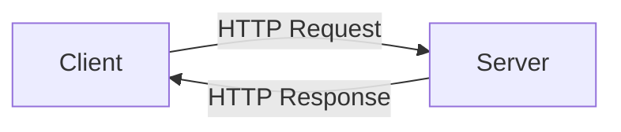

# HTTP 协议

**HTTP**（HyperText Transfer Protocol，超文本传输协议）是一种**请求/响应式**的协议。



从图中可见，HTTP协议**支持 C/S 模式**。而且请求比较**简单**，只需要传送请求方式（GET？POST？）和路径。不同的请求方式规定了 C/S 联系的类型不同。这也就注定 HTTP 是**快速**的。HTTP 还允许传输各种类型的数据，由 _Context-Type_ 标记，这使得其很**灵活**。HTTP 不会记忆已处理的事务，若后续处理需要之前的信息，则需要重传，这便是**无状态**的特性。

HTTP 自 1991 年发布以来，已迭代四个版本，你可以在[这里](https://zhuanlan.zhihu.com/p/37387316)浏览它们的区别。

## 请求消息

一个完整的请求消息由**请求行**、**请求头**和**实体内容**三部分组成。

请求行位于请求消息的第一行，它记载了请求方式、请求资源路径和协议版本，如：

```txt
GET /index.html HTTP/1.1
```

HTTP 的**请求方式**有 8 种，常用的是前两种：

| 请求方式 | 含义                                                       |
| -------- | ---------------------------------------------------------- |
| GET      | 请求获取请求行的 URI 所标识的资源                          |
| POST     | 向指定资源提交数据，请求服务器进行处理（如提交表单、文件） |
| HEAD     | 请求获取由 URI 所标识资源的响应消息头                      |
| PUT      | 将网页放置（上传/移动）到指定 URL 位置                     |
| DELETE   | 请求服务器删除 URL 删除所标识的资源                        |
| TRACE    | 请求服务器会送收到的请求信息，主要用于测试或诊断           |
| CONNECT  | 保留将来使用                                               |
| OPTIONS  | 请求查询服务器的性能，或者查询与资源相关的选项和需求       |

:::tip
URI（统一资源标识符）是一个字符序列，用于唯一地标识和命名某个资源。它可以表示不仅仅是 Web 资源，还可以表示本地文件、数据库条目、电子邮件地址等。URI 由两部分组成：标识符的格式和解析该标识符的协议。URI 的例子包括 URL 和 URN（Uniform Resource Name）。

URL（统一资源定位器）是 URI 的一种具体类型，它描述了一个网络上的资源的位置。URL 指明了如何从互联网中获取一个资源，包括协议类型（如 HTTP、HTTPS 等）、服务器地址、路径和查询参数等。URL 通常用于定位 Web 页面或其他类型的资源。例如，<https://penyoofficial.github.io/index.html> 就是一个 URL。

简而言之，URL 是 URI 的子集，它专门用于定位互联网资源。URI 可以包括更广泛的标识符范围，不仅限于 Web 资源的定位。

需要注意的是，根据 RFC 3986 （URI 的定义标准），URI 包括 URL 和 URN 两种形式，但在实际应用中，常常混用 URI 和 URL，特别是在 Web 开发中。
:::

其中 GET 以**明文**形式存储在 URL 中，且最多只能携带 2KB 的纯文本数据；POST 通过实体传输数据，且不限制传输数据大小。

**请求头**包含诸多信息，比较重要的有 _Referer_ 和 _User-Agent_。_Referer_ 记录了用户如何进入网页，开发人员可以利用这一点**防盗链**（未从本网站访问则视为外站跳转，屏蔽之）；_User-Agent_ 可能记录了 OS 及版本、浏览器及版本、渲染引擎、浏览器语言等信息，以便服务器返回合适的数据。

## 响应消息

一个完整的响应消息由**响应状态行**、**响应状态头**和**实体内容**三部分组成。

响应状态行位于响应消息的第一行，它记载了协议版本、状态码和状态描述，如：

```txt
HTTP/1.1 200 OK
```

**状态码**由 3 位数字组成，表示请求是否被理解或满足。第一位确定了类别，后两位没有具体的分类。第一位有五种可能：

- 1??：表示请求已接收，需要继续处理
- 2??：表示请求已成功被服务器接收、理解并接受
- 3??：为完成请求，客户端需要进一步细化需求
- 4??：客户端的请求有错误
- 5??：服务器端出现错误
