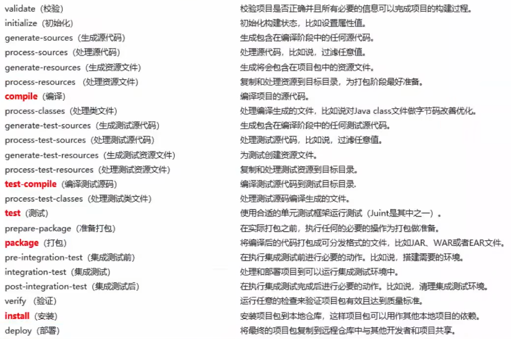

# Maven

:::tip
在学习 Maven 之前，必须先了解 HTML / XML 的基本知识。
:::

传统项目管理存在诸多问题：

- jar 包不统一、不兼容（一个项目引用的多个依赖之间有可能有冲突）
- 工程升级维护过程操作繁琐（不同平台、不同版本情况难以预料）
- ...

而 **Maven** 解决了这种困境，它的本质是一个项目管理工具，将项目开发和管理过程**抽象**成一个**项目对象模型**（Project Object Model, POM）。由于 Maven 是基于 Java 开发的，所以它常被用于管理 Java 项目。

Maven 依靠 _pom.xml_ 存储对象的属性，根据其构建一个项目的对象。对象要用到的资源需要借助[**依赖管理**](#依赖管理)，在使用其的过程中，自身也变成其他模块的资源。依赖管理是建立在**仓库**（分本地、中央）之上的，对中央仓库镜像的仓库被称为**私服**（如阿里云提供的）。此外，Maven 还可以用于构建项目，即**构建[生命周期](#生命周期与插件)/阶段**，你可以在此得到项目的 jar 包、源代码（特定位置的）、文档、war 包、XML 等。

**Maven 最重大的意义是确立了一套开发结构标准**，大家都遵守这种标准，使得软件之间的代沟变窄。

## Maven 部署与基础概念

Maven 由 Apache 基金会管理，它是公益的，你可以从其官网上下载合适的版本下载，并对其目录添加环境变量（_MAVEN_HOME_ 和 _%MAVEN_HOME%\\bin_）。Maven 运行时会检测环境变量中的 _JAVA_HOME_，请确保你正确配置了它。

**仓库**用于存放依赖，所有可配置的依赖都位于 Maven 云端的**中央仓库**。本地项目需要某一依赖时，会从中央仓库下载到**本地仓库**。_由于全球用户在不间断地折磨中央仓库，其下载速度会非常慢。_ 为了节省下载时间，建议优先从私服下载。

:::tip
Apache 为了践行开源理念，中央仓库中的依赖全是开源的。而私服则不必受此限制，可以包含受版权保护的依赖、魔改后的开源依赖或自主开发的依赖。
:::

**坐标**用于描述仓库中的资源位置（_就是链接_），其形如：

```txt
https://repo1.maven.org/maven2/groupId/artifactId/version
```

_groupId_ 定义当前项目隶属组织名称，通常是域名反写，如 _com.penyo_；_artifactId_ 定义项目/模块名称；_version_ 定义项目版本号；~~_packaging_ 定义该项目的打包方式~~。

下载到本地的依赖默认存储在 _${user.name}/.m2/repository_，且不会自动被移除，这可能会很占空间。若需要更改依赖的存储位置，需要将目标路径配置在 _conf/settings.xml_ 中的 _settings>localRepository_ 里。若需要更改远程仓库位置，则把下面一段代码配置到 _settings>mirrors_ 里：

```xml
<mirror>
 <!-- 此镜像的唯一标识符，用来区分不同的 mirror 元素 -->
 <id>nexus-aliyun</id>
 <!-- 对哪种仓库进行像，简单说就是替代哪个仓库 -->
 <mirrorOf>central</mirrorOf>
 <!-- 镜像名称 -->
 <name>Nexus aliyun</name>
 <!-- 镜像URL -->
 <url>http://maven.aliyun.com/nexus/content/groups/public</url>
</mirror>
```

:::tip
_mirror>id_ 的根据在 _lib/maven-model-builder\*.jar/org/apache/maven/model/pom\*.xml_ 中。
:::

以上修改的是全局配置，若需要配置用户配置，则在 _repository_ 同目录下粘贴 _settings.xml_。

## 项目结构与构建

一个标准的 Maven 项目的目录树应该如下：

- project-name **项目外壳**
  - src **源代码**
    - main **主程序**
      - java **Java 源代码**
      - resources **配置文件**
    - test **测试程序**
      - java **Java 源代码**
      - resources **配置文件**
  - pom.xml **Maven 工程标识/配置**

:::tip
实际的 _.java_ 文件应该再根据包名在 _java_ 文件夹中创建若干个文件夹。
:::

我们重点解析 _pom.xml_（仅核心部分）：

```xml
<?xml version="1.0" encoding="UTF-8"?>

<project xmlns="http://maven.apache.org/POM/4.0.0" xmlns:xsi="http://www.w3.org/2001/XMLSchema-instance"
  xsi:schemaLocation="http://maven.apache.org/POM/4.0.0 http://maven.apache.org/xsd/maven-4.0.0.xsd">
  <!-- 表示 POM 的对象版本为 4.0.0，与项目、Maven 版本无关 -->
  <modelVersion>4.0.0</modelVersion>

  <!-- 项目包名（仅包含组织名称） -->
  <groupId>com.example</groupId>
  <!-- 项目名称 -->
  <artifactId>demo</artifactId>
  <!-- 项目版本 -->
  <version>1.0-SNAPSHOT</version>
  <!-- 打包方式，可以为 jar、war 等。war 表示 Web 工程 -->
  <packaging>war</packaging>

  <!-- 依赖 -->
  <dependencies>
    <dependency>
      <!-- 测试插件 -->
      <groupId>junit</groupId>
      <artifactId>junit</artifactId>
      <version>4.11</version>
    </dependency>
  </dependencies>

  <!-- 构建时需要 -->
  <build>
    <!-- 插件 -->
    <plugins>
      <plugin><!-- groupId、artifactId、version --></plugin>
    </plugins>
  </build>
</project>
```

在 _pom.xml_ 所在的文件夹层级可构建 Maven 项目，常用到以下命令：

```txt
mvn compile  #编译
mvn clean    #清理
mvn test     #测试
mvn package  #打包
mvn install  #安装到本地仓库
```

编译产生的字节码文件位于 _target/classes_ 中。清理是指删除 _target_ 文件夹。测试能反应出编译后文件中的崩溃、错误和跳过，电子报告位于 _target/surefire-reports_ 中。打包是编译、测试、包装的集合。安装是打包、文件复制的集合。

实际上，构建项目是有更简单的方法的。如果每构建一次都要这样手动频繁操作，未免太过于麻烦。Maven 提供了**原型**来一键生成工程，你只需要提供一些关键信息即可：

```txt
#构建一个 webapp 型的工程
mvn archetype:generate -DgroupId=com.example -DartifactId=web-project -DarchetypeArtifactId=maven-archetype-webapp -Dversion=0.0.1-SNAPSHOT -DinteractiveMode=false
```

:::tip
Web App 是基于 JSP 的一种动态网页技术。目前已经被淘汰，但你可以通过其一窥**模板引擎**的魅力。
:::

## 依赖管理

你可以通过手动编辑 _dependencies_ 来管理依赖，也可以依靠 IDE 自带的依赖管理机制。不明确需要什么依赖可以去[搜索](https://mvnrepository.com/)。

被项目引用的依赖一般都会有自己引用的依赖，项目是可以直接调取依赖的依赖，这被称为**依赖传递**。因此依赖又可分为**直接依赖**和**间接依赖**。若依赖产生冲突（同名不同版本），则优先调用层级浅的（就近原则）、先声明的（同一层级中，先声明的会覆盖后声明的）、后配置的（同一文件中，后声明的会覆盖先声明的）。

为了保护项目所使用的依赖的隐私（隐藏起来），可配置 _dependencies>optional_ 为 _true_，该依赖成为**可选依赖**，但其子依赖仍会正常显示。若需要主动断开某一子依赖，可配置 _dependency>exclusions>exclusion_ 中的 _groupId_ 和 _artifactId_。

每个 Java 工程都可配置其依赖的作用范围，通过配置 _denpendency>scope_ 为 _compile_（默认，参与主程序、测试和打包）、_test_（参与测试）、_provided_（参与主程序和测试）或 _runtime_（参与打包）。当项目配置直接依赖为 _compile_ 或 _runtime_ 时，直接依赖配置项目间接依赖以自身为准；当项目配置直接依赖为 _test_ 或 _provided_ 时，直接依赖配置项目间接依赖不会被传递。

## 生命周期与插件

一个项目构建是有**生命周期**的，比方说有编译、编译、打包、部署。Maven 对项目构建的生命周期划分为 3 套：

- clean：清理工作
  - pre-clean
  - clean：移除所有上一次构建生成的文件
  - post-clean
- default：核心工作，如编译、测试、打包、部署（test 模式下则只执行 test 及之前的步骤）
  - 
- site：产生报告，发布站点等
  - pre-site
  - site：生成项目的站点文档
  - post-site
  - site-deploy：将生成的站点文档部署到特定的服务器上

**插件**与生命周期内的阶段绑定，通过配置 _plugin>executions>execution>goals>goal_ 在执行到对应的生命周期时执行对应的插件功能，具体生命周期由 _execution>phase_ 指定。
