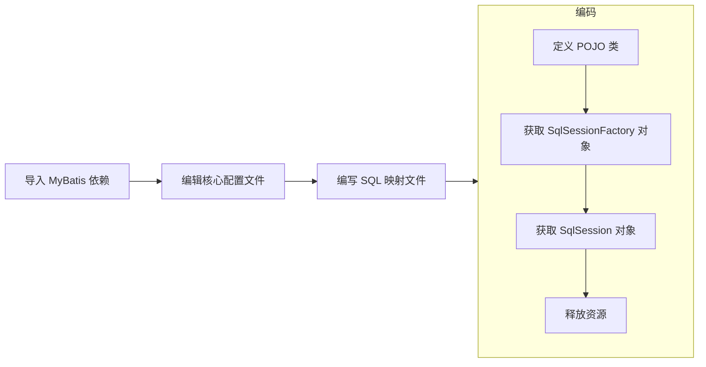

# MyBatis

一个 Jakarta EE 项目一般分为三层：表现层（视图）、业务层（处理数据）、持久层（存储数据）。MyBatis 是一款优秀的**持久化**框架，用于简化 JDBC 开发——令 raw SQL 与项目解耦。

传统的 JDBC 硬编码使得代码维护更困难、操作繁琐使程序员更难聚焦于业务本身，而 MyBatis 提供一系列方法来解决这些问题。

使用 MyBatis 的大致步骤如下：



## 使用步骤详解

0. 编写数据库访问配置：

```yml
driver: com.mysql.cj.jdbc.Driver
url: jdbc:mysql:///demo_schame?serverTimezone=UTC
username: root
password: "1234"
```

1. 在基于 Maven 的项目中引入依赖：

```xml
<dependency>
  <groupId>org.mybatis</groupId>
  <artifactId>mybatis</artifactId>
  <version>3.5.14</version>
</dependency>
```

2. 在类路径下创建 MyBatis 配置文件：

```xml
<?xml version="1.0" encoding="UTF-8" ?>
<!DOCTYPE configuration PUBLIC "-//mybatis.org//DTD Config 3.0//EN"
    "http://mybatis.org/dtd/mybatis-3-config.dtd">
<configuration>
  <!-- 数据库访问配置，默认是 properties，在安装 yml 扩展后可以使用 yml -->
  <properties resource="db.config.yml"/>
  <settings>
    <!-- 特性启用 -->
    <setting name="cacheEnabled" value="true"/>
    <setting name="lazyLoadingEnabled" value="true"/>
    <setting name="multipleResultSetsEnabled" value="true"/>
    <setting name="useColumnLabel" value="true"/>
    <setting name="useGeneratedKeys" value="false"/>
  </settings>
  <typeAliases>
    <!-- MyBatis 自动为我们装箱，在此指定所涉 POJO 类定义 -->
    <package name="com.penyo.demo.pojo"/>
  </typeAliases>
  <environments default="development">
    <environment id="development">
      <transactionManager type="JDBC"/>
      <!-- 开启池化连接 -->
      <dataSource type="POOLED">
        <!-- 数据库访问配置，字段值由配置决定 -->
        <property name="driver" value="${driver}"/>
        <property name="url" value="${url}"/>
        <property name="username" value="${username}"/>
        <property name="password" value="${password}"/>
      </dataSource>
    </environment>
  </environments>
  <mappers>
    <!-- 映射文件路径 -->
    <mapper resource="com/penyo/demo/mapper/PrincessMapper.xml"/>
    <mapper resource="com/penyo/demo/mapper/PrinceMapper.xml"/>
    <!-- 如果没有使用 xml，而是 Mapper 配置类，则： -->
    <!-- <mapper class="com.penyo.demo.mapper.PrincessMapper"/> -->
    <!-- 或者干脆把整个包都弄进来： -->
    <!-- <package name="com.penyo.demo.mapper"/> -->
  </mappers>
</configuration>
```

3. 编写映射文件：

```xml
<?xml version="1.0" encoding="UTF-8"?>
<!DOCTYPE mapper PUBLIC "-//mybatis.org//DTD Mapper 3.0//EN"
    "http://mybatis.org/dtd/mybatis-3-mapper.dtd">
<!-- 命名空间指定。MyBatis 将唯一根据此寻找映射内容 -->
<mapper namespace="com.penyo.demo.mapper.PrincessMapper">

  <!-- 插入行为 -->
  <!-- MyBatis 将唯一根据 id 来建立映射状态（Statement） -->
  <!-- 传入参数类型会被视为 Princess 对象拆箱到 #{name} 和 #{age} -->
  <insert id="add" parameterType="Princess">
    INSERT princesses (name, age)
    VALUES (#{name}, #{age})
  </insert>

  <!-- 当传入参数为单个基本类型时，引用名称不再重要（不强制为 #{id}） -->
  <delete id="delete" parameterType="int">
    DELETE
    FROM princesses
    WHERE id = #{id}
  </delete>

  <update id="update" parameterType="Princess">
    UPDATE princesses
    SET name = #{name},
        age  = #{age}
    WHERE id = #{id}
  </update>

  <!-- 返回类型会被智能封箱为 Princess 对象，但要求字段一一对应 -->
  <select id="select" resultType="Princess" parameterType="int">
    SELECT *
    FROM princesses
    WHERE id = #{id}
  </select>

</mapper>
```

4. 定义 POJO 类：

```java
package com.penyo.demo.pojo;

public class Princess {
  private int id;
  private String name;
  private int age;

  // 省略空参构造器、getter 和 setter
}
```

5. 建立单例化的 `SqlSessionFactory`：

```java
package com.penyo.demo.util;

import org.apache.ibatis.session.SqlSession;
import org.apache.ibatis.session.SqlSessionFactory;
import org.apache.ibatis.session.SqlSessionFactoryBuilder;

public class Pool {
  // 使用了反射来获取配置文件
  private static final SqlSessionFactory POOL = new SqlSessionFactoryBuilder().build(Pool.class.getClassLoader().getResourceAsStream("mybatis.config.xml"));

  public static SqlSession getSession() {
    return POOL.openSession();
  }
}
```

6. 使用 `SqlSession`：

```java
package com.penyo.demo.util;

import com.penyo.demo.pojo.Princess;
import com.penyo.demo.util.Pool;

import org.apache.ibatis.session.SqlSession;

public class PrincessDao {
  // 省略增删改的调用方法...

  public Princess select(int id) {
    Princess o = null;

    // try-with-resources 自动释放资源，无需再手动调用 SqlSession.close()
    try (SqlSession s = Pool.getSession()) {
      // 特意指定返回值是单体，需要时也可使用 selectList() 来获得集合
      o = s.selectOne("com.penyo.demo.mapper.PrincessMapper.selectById", id);
    }
    return o;
  }
}
```

:::warning
MyBatis 默认将我们的行为打包成事务。因此如果执行增、删、改这种影响数据的操作，则最终必须调用 `SqlSession.commit()`，否则行为不生效。
:::

## 类型别名与类型映射

类型别名（type aliases）可为静态类型设置一个代号。它仅作用于 XML 配置，不会影响到代码执行。

类型别名配置由 MyBatis Config 中的 `typeAliases` 节点指定：

```xml
<typeAliases>
  <!-- 整包代指，别名默认为其中的各个类名的小驼峰式 -->
  <package name="com.penyo.demo.pojo"/>
  <!-- 单类代指，别名可自己指定 -->
  <typeAlias type="com.penyo.demo2.pojo.MikuMikuDanceVideo" alias="mmdv"/>
</typeAliases>
```

这样在 Mapper Config 里，就可以使用别名来表示静态类型了：

```xml
<select id="select" resultType="mmdv" parameterType="int">
  SELECT *
  FROM mmds
  WHERE size &gt; #{size}
</select>
<!-- &gt; 表示 greater than -->
<!-- &lt; 表示 less than -->
```

类型映射可在类型别名的基础上**建立原始字段到 Java POJO 字段的映射**。Java 里变量的命名法使用小驼峰法，而数据库里用的是下划线命名法，这就导致 MyBatis 不能识别 _exampleField_ 和 _example_field_ 的关系。而类型映射可以让我们解决这个问题。

类型映射在 Mapper Config 中的 `resultMap` **节点**指定：

```xml
<!-- id 为被引用时的唯一标识符，type 为基类型 -->
<resultMap id="extendedAnyBaseType" type="anyBaseType">
  <!-- property 为 Java 成员名，column 为数据库字段名 -->
  <id property="id" column="id"/>
  <result property="exampleField" column="example_field"/>
</resultMap>
```

要引用该类型的节点使用 `resultMap` **属性**接受其 id。

:::warning
`*Map` 和 `*Type` 属性不可以同时使用！如：

```xml
<select id="select" resultMap="extendedAnyBaseType" resultType="mmdv" parameterType="int">...</select>
```

:::

## 关联映射与集合映射

当 POJO 的成员是另一个 POJO 时，MyBatis 瞬间汗流浃背了。我们需要告诉它这其中一对一、一对多、多对多的关系。

1. 一对一

```xml
<!-- 一个萝莉只有一个丈夫 -->
<resultMap id="loliMap" type="loli">
  <!-- 指出成员名和成员类型 -->
  <association property="husbend" javaType="lolicon">
    <id property="id" column="h_id"/>
    <result property="name" column="h_name"/>
    <result property="age" column="h_age"/>
    <result property="loveDegree" column="h_love_degree"/>
  </association>
</resultMap>
```

2. 一对多

```xml
<!-- 一个萝莉控有多个娇妻 -->
<resultMap id="loliconMap" type="lolicon">
  <!-- 集合：指出成员名和成员类型 -->
  <collection property="wifes" ofType="loli">
    <id property="id" column="w_id"/>
    <result property="name" column="w_name"/>
    <result property="age" column="w_age"/>
    <result property="loveDegree" column="w_love_degree"/>
  </association>
</resultMap>
```

3. 多对多（其实与一对多一致）

```xml
<!-- 多个萝莉参与多场“活动” -->
<resultMap id="loliMap2" type="loli">
  <collection property="doingTimes" ofType="loli">
    <id property="id" column="d_id"/>
    <result property="timestamp" column="d_timestamp"/>
  </association>
</resultMap>
```

:::details 你知道吗：怎么优雅地实现复杂查询？
在不涉及 MyBatis 前，我们必须通过一次极为复杂的查询（多表联查）来获得结果，这种操作被称为**嵌套结果**；而 MyBatis 可以帮我们把多次简单查询的结果拼合到一起，这被称为**嵌套查询**。

下面展示了一个支持嵌套查询的 `resultMap`：

```xml
<!-- 查询萝莉控的娇妻 -->

<mapper namespace="com.penyo.demo.mapper.LoliconMapper">
  <resultMap id="loliconMap2" type="lolicon">
    <collection
      property="wifes"
      ofType="lolicon"
      column="w_id"
      select="com.penyo.demo.mapper.LoliconMapper.queryLoliById"
    />
  </resultMap>

  <select id="queryLolicons" resultMap="loliconMap2">
    SELECT * FROM lolicons
  </select>
</mapper>

<mapper namespace="com.penyo.demo.mapper.LoliMapper">
  <select id="queryLoliById" resultType="loli" parameterType="int">
    SELECT * FROM lolis WHERE id = #{id}
  </select>
</mapper>
```

:::

## 条件与循环控制

在构建 SQL 语句时，难免需要根据参数规模确定语句具体长度，即动态 SQL。

MyBatis 提供了若干声明式标签帮助我们构造控制流：

| 节点名    | 描述                                  |
| --------- | ------------------------------------- |
| if        | 单条件判断。test 属性容纳判断句。     |
| choosen   | 声明多条件组合。                      |
| when      | 多条件其一判断。test 属性容纳判断句。 |
| otherwise | 多条件其末判断。                      |
| foreach   | 迭代集合并生成格式化语句片段。        |

先来展示条件控制流：

```xml
<select id="queryLoliByName" parameterType="java.lang.String" resultType="loli">
  SELECT * FROM lolis WHERE 1=1
  <!-- 只有一个判断，但是两个条件不互斥 -->
  <if test="name != null and name.length() &gt; 0">
    AND name = #{name}
  </if>
</select>

<select id="queryLolisByLoli" parameterType="loli" resultType="loli">
  SELECT * FROM lolis
  <where>
    <!-- 多重判断，优先级从上至下不断降低 -->
    <choose>
      <when test="id != null">
        id = #{id}
      </when>
      <when test="name != null">
        name LIKE CONCAT("%", #{name}, "%")
      </when>
      <when test="age != null">
        age &lt; #{age}
      </when>
      <otherwise>
        1=1
      </otherwise>
    </choose>
  </where>
</select>
```

当传入的参数是[集合](../java-se/collection.md)时，不再需要显式指定 `parameterType` 属性。对集合迭代使用 `foreach` 节点：

```xml
<select id="queryLolisByIds" resultType="loli">
  SELECT * FROM lolis WHERE id in
  <!-- 迭代整型线性表，每个元素为 lid -->
  <!-- 整个语句开始前、结束后、每次迭代后均指定了要添加的字符 -->
  <foreach collection="list" item="lid" open="(" separator="," close=")">
    #{lid}
  </foreach>
</select>
```
