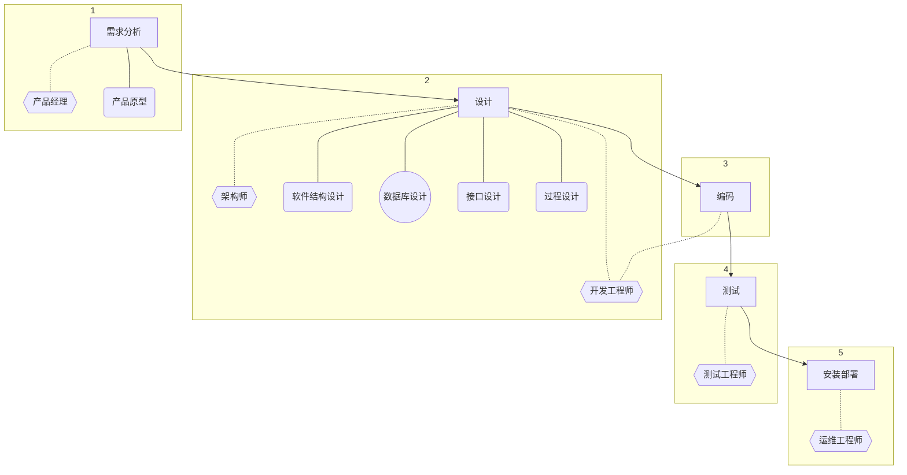

# MySQL

:::tip
在学习关系型数据库前，建议先了解数据库系统的基本知识。
:::

**SQL**（Structured Query Language），结构化查询语言，于所有的**关系型**数据库管理系统（DBMS）所通用。

市面上有几百款 DBMS，为什么我们单单选择 MySQL 学习呢？因为相较于 Oracle DBMS 和 MS SQL Server 等商业产品，它是唯一一个主流且开源的 DBMS，也是如今许多互联网公司的首选。哪怕将来我们的工作环境用的 DBMS 不是 MySQL ，我们也可以用通用的 SQL 操作它们。**所以我们学习 MySQL 其实就是学习 SQL。**

## MySQL 配置

从[这里](https://dev.mysql.com/downloads/mysql/)获取最新版本或者从[这里](https://downloads.mysql.com/archives/community/)获取老版本。

我们将从官网上获取到一个压缩包，解压到合适的路径后，**需要增加环境变量**为其下的 _bin_ 文件夹。

向其根目录添加内容如下的 _my.ini_：

```txt
[mysql]
default-character-set=utf8

[mysqld]
character-set-server=utf8
default-storage-engine=INNODB
sql_mode=STRICT_TRANS_TABLES,NO_ZERO_IN_DATE,NO_ZERO_DATE,ERROR_FOR_DIVISION_BY_ZERO,NO_ENGINE_SUBSTITUTION
```

在**管理员级**命令行中输入以下命令来初始化：

```txt
mysqld --initialize-insecure
```

安装服务：

```txt
mysqld -install
```

启动服务：

```txt
net start mysql
```

完成上列操作后，你的计算机就是一台 MySQL 服务器了。

管理员注册（用户名固定为 _root_，密码假设为 _1234_）：

```txt
mysqladmin -u root password 1234
```

用户登录（方括号内是选配）：

```txt
mysql -u root -p 1234 [-h 127.0.0.1 -P 3306]
```

完成上列操作后，你就已经连接到 MySQL 服务了。

如果你需要退出，你可以：

```txt
exit
```

或

```txt
quit
```

如果你需要结束服务，你可以：

```txt
net stop mysql
```

如果你要移除服务，你可以：

```txt
mysqld -remove mysql
```

## 关系型数据库

关系型数据库是建立在**关系模型**基础上的数据库，简单说，关系型数据库是由多张能互相连接的**二维表**组成的数据库。

- 优点
  - 都是使用表结构，格式一致，易于维护。
  - 使用通用的 SQL 操作，使用方便，可用于复杂查询。
  - 数据存储在硬盘中，安全。

一个 DBMS 中，可含有多个 DB，其实质是文件夹；一个 DB 中，可含有多个 DT（数据表），其实质是文件（如 \*.frm）；一个 DT 中，可含有多项数据，其实质亦是文件（如 \*.MYD）。

## SQL 数据类型

SQL 中的数据类型可以分成三类：

- 数值
  |数据类型名|大小（字节）|描述|
  |-|-|-|
  |tinyint|1|微整数值|
  |smallint|2|小整数值|
  |mediumint|3|中整数值|
  |int或integer|4|整数值|
  |bigint|8|大整数值|
  |float|4|单精度浮点数值|
  |double|8|双精度浮点数值|
  |decimal|_按需_|确切小数值|
- 日期和时间
  |数据类型名|大小（字节）|描述|
  |-|-|-|
  |date|3|年月日值|
  |time|3|时分秒值|
  |year|1|年值|
  |datetime|8|年月日时分秒值|
  |timestamp|4|时间戳|
- 字符串
  |数据类型名|大小（字节）|描述|
  |-|-|-|
  |char|[0, 255]|定长字符串|
  |varchar|[0, 65535]|变长字符串|
  |tinyblob|[0, 255]|微二进制字符串|
  |tinytext|[0, 255]|微文本字符串|
  |blob|[0, 65535]|二进制字符串|
  |text|[0, 65535]|文本字符串|
  |mediumblob|[0, 16777215]|中二进制字符串|
  |mediumtext|[0, 16777215]|中文本字符串|
  |longblob|[0, 4294967295]|长二进制字符串|
  |longtext|[0, 4294967295]|长文本字符串|

其中，部分数据类型在声明对应项时，可以跟进一些参数。如 `char` 的参数表示指定字符串的长度（不足长的用半角空格填充）；`varchar` 的参数表示指定容纳字符个数的上限；`double` 的两个参数分别表示整数与小数部分（小数点不占位）的总长度和小数点后保留的位数。

**字符，还是字节？**

在 MySQL 中，5.0 版本之前， `char(10)` 指的是 10 **字节**，如果存放 UTF-8 中文字符，最多只能存 3 个（每个中文字符 3 字节）；5.0 版本之后，`char(10)` 指的是 10 **字符**，无论存放的是数字、字母还是 UTF-8 中文字符，都可以存放 10 个。`varchar` 同理。

**用 char 还是 varchar？**

对于 `varchar` 而言，每次赋值都要计算值的实际长度再转化为最小大小的 `char`，且最后总是留下至少1字节空间用于存储长度，产生了一定的空间和性能损失。所以当值长度是可预见的时候，我们应当优先使用 `char`。

**用 char 还是 nchar？**

在老版本的 MySQL 中，`char` 存储 ANSI 字符，这对于亚洲文字很不友好，想解决这个问题只能使用 `nchar`，它存储 Unicode 字符。之后新的 `char` 在效果上取代了 `nchar`，所以 `nchar` 默认指向 `char`。`varchar` 与 `nvarchar` 同理。

## SQL 基本指令

- SQL 语句可以单行或多行书写，以分号结尾。
- MySQL 中的 SQL 语句**不区分大小写**，关键字建议使用大写。
- 单行注释使用 `--` （注意空格）或 `#` 开头，多行注释使用 `/* */` 包围。

### DDL（Data Definition Language）：定义

操作数据库常用的指令：

| 关键字 | 用途           | 示例                      |
| ------ | -------------- | ------------------------- |
| show   | 陈列数据库     | show databases;           |
| create | 创建数据库     | create database _dbName_; |
| drop   | 删除数据库     | drop database _dbName_;   |
| use    | 进入数据库     | use _dbName_;             |
| select | 查看数据库名称 | select database();        |

初始状态下，键入 `show databases;` 可得到如下输出：

```txt
+--------------------+
| Database           |
+--------------------+
| information_schema |
| mysql              |
| performance_schema |
| sys                |
+--------------------+
4 rows in set (0.00 sec)
```

四个初始的数据库分别存储了：

- 信息。该数据库为**视图**，没有物理存在形式。
- 安全配置。
- 性能配置。
- 系统配置。

一般情况下，我们不会去操作这四个初始化数据库。

如果想要增加自己的数据库，键入 `create database dbName;` ，再查询可得到：

```txt
+--------------------+
| Database           |
+--------------------+
| dbname             |
| information_schema |
| mysql              |
| performance_schema |
| sys                |
+--------------------+
5 rows in set (0.00 sec)
```

但如果已有数据库占用了新数据库的名称，则会创建失败——报错。

为了防止这种情况的产生，我们需要**判重**：

```sql
create database if not exists dbName;
```

这样就不会出错了。

当你需要删除某个数据库时（**危险！**），使用 `drop database dbName;` ；为了防止删除不存在的数据库而报错，使用 `drop database if exists dbName` 。

当你想要使用某个数据库时，键入 `use dbName;` 。当你想要查看当前使用的数据库名称时，键入 `select database();` 。

操作表常用的指令：

| 关键字 | 用途   | 示例                                                  |
| ------ | ------ | ----------------------------------------------------- |
| show   | 陈列表 | show tables;                                          |
| desc   | 陈列项 | desc _tableName_;                                     |
| create | 创建表 | create table _tableName_ (_fieldName1_ _type1_, ...); |
| drop   | 删除表 | drop table _tableName_;                               |
| alter  | 修改表 | _具体见下述_                                          |

如若需要创建一个具有3个项的表，我们可以这样做：

```sql
create table excel (
    id int,
    name varchar(10),
    score double(4, 1)
);
```

效果：

```txt
+-------+-------------+------+-----+---------+-------+
| Field | Type        | Null | Key | Default | Extra |
+-------+-------------+------+-----+---------+-------+
| id    | int         | YES  |     | NULL    |       |
| name  | varchar(10) | YES  |     | NULL    |       |
| score | double(4,1) | YES  |     | NULL    |       |
+-------+-------------+------+-----+---------+-------+
3 rows in set (0.00 sec)
```

在判重上与操作数据库相同。对表的删除同理。

修改表则复杂得多，根据需要的不同，你可能会用到如下的一些指令：

| 关键字    | 用途               | 指令                                                             |
| --------- | ------------------ | ---------------------------------------------------------------- |
| rename to | 修改表名           | alter table _tableName_ rename to _newTableName_;                |
| add       | 添加列             | alter table _tableName_ add _rowName_ _type_;                    |
| modify    | 修改数据类型       | alter table _tableName_ modify _rowName_ _newType_;              |
| change    | 变更列名和数据类型 | alter table _tableName_ change _rowName_ _newRowName_ _newType_; |
| drop      | 删除列             | alter table _tableName_ drop _rowName_;                          |

此处不再演示。

### DML（Data Manipulation Language）：操作

在 DDL 中，我们学会了对数据库、表和列的操作。而 DML 的“操作”专指**对数据进行操作**。

添加数据：

| 用途                   | 示例                                                                 |
| ---------------------- | -------------------------------------------------------------------- |
| 给指定列添加数据       | insert into _tableName_(_rowName1_, ...) values(_value1_, ...);      |
| 给全部列添加数据       | insert into _tableName_ values(_value1_, ...);                       |
| 给指定列批量添加数据   | insert into _tableName_(_rowName1_, ...) values(_value1_, ...), ...; |
| 给全部列列批量添加数据 | insert into _tableName_ values(_value1_, ...), ...;                  |

演示：

```sql
insert into excel values(114514, '田所浩二', 19.19), (114810, '我修院', 23.33);
```

效果（使用 `select * from excel;` 查询）：

```txt
+--------+--------------+-------+
| id     | name         | score |
+--------+--------------+-------+
| 114514 | 田所浩二     |  19.2 |
| 114810 | 我修院       |  23.3 |
+--------+--------------+-------+
2 rows in set (0.00 sec)
```

修改数据：

| 示例                                                                   |
| ---------------------------------------------------------------------- |
| update _tableName_ set _rowName1_ = _value1_, ... [where *condition*]; |

若 _condition_ 为空，则表中所有行的数据都会被修改。

演示：

```sql
update excel set name = '淳平' where id = 114514;
```

效果：

```txt
+--------+-----------+-------+
| id     | name      | score |
+--------+-----------+-------+
| 114514 | 淳平      |  19.2 |
| 114810 | 我修院    |  23.3 |
+--------+-----------+-------+
2 rows in set (0.00 sec)
```

删除数据：
|示例|
|-|
|delete from _tableName_ [where *condition*];|

若 _condition_ 为空，则表中所有行的数据都会被删除。

此处不再演示。

### DQL（Data Query Language）：查询

查询是我们使用 SQL 的主要需求，即重中之重。

DQL 语句的完整结构如下：

| 示例                                                                                                                                                                                 |
| ------------------------------------------------------------------------------------------------------------------------------------------------------------------------------------ |
| select _keyWord_ <br>from _tableName_ <br>where _condition1_ <br>group by _toDevideKeyWord_ <br>having _condition2_ <br>order by _toRankKeyWord_ <br>limit _beginIndex_, _queryNum_; |

我们将依次学习上列关键字。

**基础查询**：

| 用途         | 示例                                                    |
| ------------ | ------------------------------------------------------- |
| 查询多个字段 | select _keyWord1_, ... from _tableName1_, ...;          |
| 去除重复记录 | select distinct _keyWord1_, ... from _tableName1_, ...; |
| 指定别名     | [as *nickName*]                                         |

若 _keyWord_ 为 \*，则匹配任何字符。列名与别名间也可以没有 `as` 。

演示：

```sql
drop table if exists excel; -- 删除旧的数据表

create table excel (
    name varchar(10),
    height double(3, 2),
    weight double(5, 2)
); -- 创建表

insert into excel values
    ('王捏马', 1.88, 91),
    ('段捏马', 1.72, 55),
    ('李捏马', 1.92, 95.1),
    ('张捏马', 1.72, 101.25); -- 插入数据

select name as 姓名, height as 身高（米）, weight as 体重（千克） from excel; -- 查询1
select distinct height from excel; -- 查询2
```

效果：

```txt
+-----------+-----------------+--------------------+
| 姓名      | 身高（米）      | 体重（千克）       |
+-----------+-----------------+--------------------+
| 王捏马    |            1.88 |              91.00 |
| 段捏马    |            1.72 |              55.00 |
| 李捏马    |            1.92 |              95.10 |
| 张捏马    |            1.72 |             101.25 |
+-----------+-----------------+--------------------+
4 rows in set (0.00 sec)
+--------+
| height |
+--------+
|   1.88 |
|   1.72 |
|   1.92 |
+--------+
3 rows in set (0.00 sec)
```

**条件查询（`where`）**

| 示例                                                 |
| ---------------------------------------------------- |
| select _keyWord_ from _tableName_ where _condition_; |

条件指的是包含下列给出的符号/关键字的表达式：
|符号或关键字|功能|
|-|-|
|>|大于|
|<|小于|
|>=|大于等于|
|<=|小于等于|
|=|等于|
|<>或!=|不等于|
|between...and...|（数值/日期）在某个闭区间内|
|in(...)|多（值）选一|
|like _placeholder_|模糊查询（`_` 表单个任意字符， `%` 表至少零个任意字符）|
|is null|为空|
|is not null|不为空|
|and或&&|与|
|or或\|\||或|
|not或!|非|

其中，判断值为/不为空必须使用 `is null` / `is not null` ，而不可使用 `= null` / `!= null` 。

模糊查询表示只有部分字段需要匹配的查询。如需要查询所有姓王的人，我们可以：

```sql
select * from excel where name like '王%';
```

**排序查询（`order by`）**

| 示例                                                                           |
| ------------------------------------------------------------------------------ |
| select _keyWord_ from _tableName_ order by _toRankKeyWord1_ \[_method1_], ...; |

排序方式有两种：

- ASC：升序排列（默认）
- DESC：降序排列

若有多个排序条件，则每前一级排序发生后，同条件行间才能再进行排序。

**聚合函数**：

聚合函数，就是将一列数据作为一个整体，进行纵向计算。**_null_ 值不参与所有聚合函数运算。**

| 示例                                          |
| --------------------------------------------- |
| select _aggFunc_(_keyWord_) from _tableName_; |

聚合函数分类：
|函数名|描述|
|-|-|
|count()|统计数量（其参数一般为**主键**或 **\***）|
|max()|求最大值|
|min()|求最小值|
|sum()|求和|
|avg()|求均值|

**分组查询（`group by`）**

| 示例                                                                                                     |
| -------------------------------------------------------------------------------------------------------- |
| select _keyWord_ from _tableName_ [where *condition1*] group by _toDevideKeyWord_ [having *condition2*]; |

注意，分组后，查询的字段应为聚合函数和分组字段，查询其他字段无意义。

where 和 having 的区别：

- where 是分组之前进行限定，未满足此次限定的不参与分组，而 having 是分组之后对结果进行过滤。
- where 不能对聚合函数进行判断，having 可以。

执行顺序：where > aggFunc > having

**分页查询（`limit`）**

:::tip
`limit` 属于 MySQL 的方言。需要完成等效操作，在 Oracle DBMS 中使用 `rownumber` ；在 SQL Server 中使用 `top` 。
:::

| 示例                                                              |
| ----------------------------------------------------------------- |
| select _keyWord_ from _tableName_ limit _beginIndex_, _queryNum_; |

起始索引从 0 开始计算。每逻辑页的起始索引都等**页码（从1开始） - 1**与**每页显示的条目数**的乘积。

### DCL（Data Control Language）：控制（用户权限）

请跳转[此处](https://www.cnblogs.com/Rohn/p/11722515.html)。

## 约束

- 约束是作用于表中列上的规则，用于限制加入表的数据。
- 约束的存在保证了数据库中数据的正确性、有效性和完整性。

约束的分类：

| 约束分类 | 描述                                                         | 关键字      |
| -------- | ------------------------------------------------------------ | ----------- |
| 非空约束 | 保证列中所有数据不能有 _null_ 值                             | not null    |
| 唯一约束 | 保证列中所有数据各不相同                                     | unique      |
| 主键约束 | 主键是一行数据的唯一标识，要求非空且唯一                     | primary key |
| 检查约束 | 保证列中的值满足某一条件                                     | check       |
| 默认约束 | 保存数据时，未指定值则采用默认值                             | default     |
| 外键约束 | 外键用于使两个表的数据之间建立联系，保证数据的一致性和完整性 | foreign key |

MySQL 不支持检查约束。

约束是在声明项时使用的：

```sql
create table employee (
    id int primary key auto_increment, -- 员工身份码，主键且自增
    name varchar(10) not null unique, -- 员工姓名，非空且唯一
    department varchar(10) foreign key refenences dpm_info(name),
        -- 部门名，外键连接到表 dpm_info 的 name 列
    bonus double(7, 2) default 0, -- 奖金，默认为 0
    salary double(7, 2), -- 薪资

    default 2000(salary) -- 薪资默认为 2000
    -- 单独在此添加外键也是可以的
    -- [constraint 键名] foreign key(从表相关列名) refenences 主表名(主表相关列名)
)
```

也可以在修改列时使用（不同约束的应用方式略有不同）：

```sql
alter table tableName modify KeyWord type not null;
```

移除约束（不同约束的应用方式略有不同）：

```sql
alter table tableName modify keyWord type;
-- 移除外键需要遵守以下框架：
-- alter table 从表名 drop foreign key 键名;
```

其中，要建立两个表之间的联系，必须先创建逻辑上的主表，再创建从表。

## 数据库设计

在开发软件前，我们都需要进行以下几个步骤：



数据库设计概念：

- 数据库设计就是根据业务系统的具体需求，结合我们所选用的 DBMS，为这个业务系统构造出最优的数据存储模型。
- 建立数据库中的表结构以及表与表之间的关联关系的过程。
- 有哪些表？表里有哪些字段？表和表之间有什么关系？

数据库设计的步骤：

- 需求分析（数据是什么？数据具有哪些属性？数据与属性的特点是什么）
- 逻辑分析（通过 **ER 图**对数据库进行逻辑建模，不需要考虑我们所选用的数据库管理系统）
- 物理设计（根据数据库自身的特点把逻辑设计转换为物理设计）
- 维护设计（1. 对新的需求进行建表；2. 表优化）

表之间的关系：

- 一对一（多用于表拆分）
- 一对多
- 多对多

:::tip
在生产中，为了节省时间、更直观地控制 DB，一般会借助可视化工具设计或管理 DB。常用的可视化工具有 Navicat 和 DataGrip。
:::
