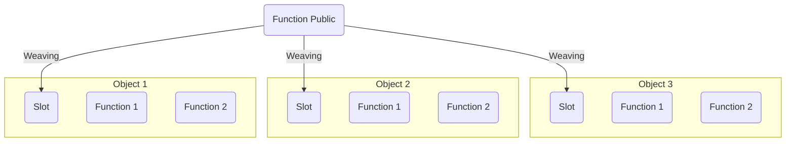

# Spring

:::tip
阅读本章需要具备软件设计模式相关的知识。
:::

:::details 背景故事：Spring 与 EJB 之争
你问我 Java EE 的核心技术是什么？Oracle 也许会说是 [EJB](https://zhuanlan.zhihu.com/p/127949264)（Enterprise Java Bean），但业界一直认为是 Spring，它为之后的轻量企业级开发提供了基础。_而“功臣” EJB 则彻底摧毁了 Java EE 一统企业级市场的可能。_

Spring，只使用基本的 [Java Bean](#javabean-技术)，就做到了 EJB 能做到的绝大多数事情。它取代了 EJB 臃肿、低效的开发模式。

但不得不承认，最新版本的 EJB 具有无比优越的设计模式。只可惜，越是优雅的设计模式，就越难以理解、应用。
:::

**Spring** 是 Jakarta EE 开发中最重磅的一环，无论是 SSH、SSM 还是当今流行的 SpringBoot、SpringCloud，都离不开 Spring。

在前面的开发中，我们的项目常常会有一些设计模式上的缺陷。如：

- 实例化分散：业务层为了调用逻辑层的方法，直接在自己的方法里实例化了逻辑层类/接口。
- 缺乏灵活性和可扩展性：项目中的代码缺乏良好的设计模式，导致难以应对需求变化和功能扩展。
- 高耦合性：各个模块之间的依赖关系过于紧密，导致修改一个模块可能会影响到其他相关模块。
- 代码重复：相同的代码逻辑在不同的地方出现，增加了维护成本并且容易引入 bug。
- 缺乏可测试性：代码难以进行单元测试或集成测试，导致测试覆盖率低下。
- ......

Spring 框架（**Spring Framework** 及其他 Spring 子组件）帮我们解决了这些问题，提高了工程化程度。

## 创建空工程

:::tip
本节及之后全部的内容建立在使用 [Spring 6](https://docs.spring.io/spring-framework/reference/index.html) 或更加先进的版本上。
:::

:::tip
Spring 是一个**约定大于配置**的框架，即：能遵从默认配置，就不要额外配置。
:::

在空 [Maven](./maven.md) 工程中，导入关键依赖：

```xml
<dependency>
  <groupId>org.springframework</groupId>
  <artifactId>spring-core</artifactId>
  <version>6.0.11</version>
</dependency>
<dependency>
  <groupId>org.springframework</groupId>
  <artifactId>spring-beans</artifactId>
  <version>6.0.11</version>
</dependency>
<dependency>
  <groupId>org.springframework</groupId>
  <artifactId>spring-context</artifactId>
  <version>6.0.11</version>
</dependency>
<dependency>
  <groupId>org.springframework</groupId>
  <artifactId>spring-aop</artifactId>
  <version>6.0.11</version>
</dependency>
```

新建 _src/main/resources/applicationContext.xml_（你也可以不使用该文件名）。这是 Spring 在启动前必须读取的配置文件。

```xml
<?xml version="1.0" encoding="UTF-8"?>
<beans xmlns="http://www.springframework.org/schema/beans"
    xmlns:xsi="http://www.w3.org/2001/XMLSchema-instance"
    xsi:schemaLocation="http://www.springframework.org/schema/beans
    http://www.springframework.org/schema/beans/spring-beans.xsd">
  <bean id="context" class="com.whoever.whatever.util.WhateverContext" />
</bean>
```

## JavaBean 技术

**JavaBean** 是指一种符合特定规范的 Java 类，它通常具备如下特点：

- 具有无参的默认构造函数。
- 属性私有化，并通过 `public` 的 `getter` 和 `setter` 方法来访问。
- 实现序列化接口（`Serializable`），以便于它能够在网络上传输或者在程序中进行持久化存储。

JavaBean 被广泛地应用于 Java 的各种框架中，例如 Spring、Struts 等。这是因为 JavaBean 具备良好的封装性和可扩展性，可以将数据和业务逻辑分离开来，使代码更加清晰易懂。

对于一个类来说，如果它遵循了上述规范，那么我们就可以称之为 JavaBean。在实际编程中，我们通常会定义一些 JavaBean 来表示**业务模型或者数据模型**，以便于在不同的层之间传递数据。另外，由于 JavaBean 可以被序列化，因此它也常用于远程调用或者分布式计算中。

下面展示了一个标准的 JavaBean：

```java
public class GirlFriend implements Serializable {
  private String name;
  private double[] bwh;
  private boolean isAdult;

  public String getName() {
    return name;
  }

  public void setName(String name) {
    this.name = name;
  }

  public double[] getBwh() {
    return bwh;
  }

  public void setBwh(double[] bwh) {
    // 不一定非要这么简单，这里也可以加一些三围数据的校验
    this.bwh = bwh;
  }

  // 注意到了吗，一旦涉及到布尔型的获取，就不再使用 get， 而是 is
  public boolean isAdult() {
    return isAdult;
  }

  public void setAdult(boolean isAdult) {
    this.isAdult = isAdult;
  }
}
```

## IoC 与 DI 技术

:::tip
IoC 不是 Spring 提出来的，它们在 Spring 之前其实已经存在了，只不过当时更加偏向于理论。Spring 在技术层次将这个思想进行了很好的实现。下文的 AOP 也是这样。
:::

**IoC**（Inversion of Control）：**控制反转**，是一个理论、概念、思想。把对象的**创建、赋值、管理**工作都交给代码之外的容器实现，也就是对象的创建是有其它外部资源完成，这样做实现了与解耦合。

**正转**是指对象的创建、赋值等操作交由程序员手动完成，即使用类似 _new Xxx(Xxx Xxx)_、_Xxx.setXxx()_ 语句完成对象的创建与赋值，缺点是一旦程序功能发生改变，涉及到的类就要修改代理，耦合度高，不便于维护和管理。

**反转**是指对象的创建、赋值等操作交由代码之外的容器实现，由容器代替程序员完成对象的创建、赋值；且当程序功能发生变化时，只需要修改容器的配置文件即可。

:::tip
从以上两种开发方式的对比来看：我们“丧失”了一个权力（创建、管理对象的权力），但也得到了一个好处（不用再考虑对象的创建、管理等一系列的事情）。
:::

IoC 是 Spring 两大核心之一。它是其他组件功能的基础，主要涉及 Bean 产生和关系等。

:::details 你知道吗：IoC 的设计有什么实际意义？
IoC 的思想最核心的地方在于，资源不由使用资源者管理，而由不使用资源的第三方管理，这可以带来很多好处。第一，资源集中管理，实现资源的可配置和易管理；第二，降低了使用资源双方的依赖程度，也就是我们说的耦合度。

也就是说，甲方要达成某种目的不需要直接依赖乙方，它只需要将目的告诉第三方机构就可以了。比如甲方需要一双袜子，而乙方它卖一双袜子，它要把袜子卖出去，并不需要自己去直接找到一个卖家来完成袜子的卖出。它也只需要找第三方，告诉别人我要卖一双袜子。这下好了，甲乙双方进行交易活动，都不需要自己直接去找卖家，相当于程序内部开放接口，卖家由第三方作为参数传入。甲乙互相不依赖，而且只有在进行交易活动的时候，甲才和乙产生联系。反之亦然。这样做什么好处么呢，甲乙可以在**对方不真实存在的情况**下独立存在，而且保证不交易时候无联系，想交易的时候可以很容易的产生联系。甲乙交易活动不需要双方见面，避免了双方的互不信任造成交易失败的问题。因为交易由第三方来负责联系，而且甲乙都认为**第三方可靠**。那么交易就能很可靠很灵活的产生和进行了。
:::

**DI**（Dependency Injection）：**依赖注入**，只需要在程序中提供要使用的对象名称就可以，至于对象如何在容器中**创建、赋值、查找**都由容器内部实现。

**DI 是 IoC 技术的实现方式**（即容器如何创建对象这一问题的实现方式）。

:::tip
Tomcat 作为 Servlet 容器可以在效果上视为对 IoC/DI 的实现（尽管源码层面可能并不是这样）：我们没有手动控制 Servlet 实现类的实例化。
:::

## ApplicationContext 接口

Spring 的主要功能是通过核心容器实现的。Spring 为我们提供了两种核心容器，分别为 `BeanFactory` 和 `ApplicationContext`。

`ApplicationContext` 由 `org.springframework.context.ApplicationContext` 接口定义，是 `BeanFactory` 的子接口，在父接口的基础上添加了对**国际化、资源访问、事件传播**等功能的支持。

创建 `ApplicationContext` 接口实例，可采用两种方法：

1. 根据类路径的配置文件实例化

   ```java
   ApplicationContext applicationContext = new ClassPathXmlApplicationContext(String configLocation);
   ```

2. 根据绝对路径的配置文件实例化

   ```java
   ApplicationContext applicationContext = new FileSystemXmlApplicationContext(String configLocation);
   ```

核心容器将管理的 Java 类称为 **Bean**，即扩展的 JavaBean。我们在配置文件里，写的是有关 Bean 的信息。可选 XML 式或 Properties 式。

```xml
<?xml version="1.0" encoding="UTF-8"?>
<beans xmlns="http://www.springframework.org/schema/beans"
    xmlns:xsi="http://www.w3.org/2001/XMLSchema-instance"
    xsi:schemaLocation="http://www.springframework.org/schema/beans
    http://www.springframework.org/schema/beans/spring-beans.xsd">

  <!-- id 为唯一标识符，在调用时应给出 -->
  <!-- 亦可给出单个或多个 name 用于调用 -->
  <!-- class 为指向类的完整类名 -->
  <!-- scope 指出了 Bean 的作用域，默认是 singleton（单例）。此外还可选另 6 个取值 -->
  <bean id="whatever" class="com.whoever.whatever.Whatever" />
</beans>
```

:::details 你知道吗：Bean 的不同作用域有什么区别？
|取值|描述|
|-|-|
|singleton|无论有多少个 Bean 引用它，始终将指向同一个对象。|
|prototype|每次请求都将使容器创建一个新的 Bean 实例。|
|request|在一次 HTTP 请求中，容器会返回该 Bean 的同一个实例。对不同的 HTTP 请求则会产生一个新的 Bean，而且该 Bean 仅在当前 HTTP Request 内有效。|
|session|在一次 HTTP Session 中，容器会返回该 Bean 的同一个实例。对不同的 HTTP 请求则会产生一个新的 Bean，而且该 Bean 仅在当前 HTTP Session 内有效。|
|application|为每个 ServletContext 对象创建一个实例。仅在 Web 相关的 ApplicationContext 中生效。|
|globalSession|在一个全局的 HTTP Session 中，容器会返回该 Bean 的同一个实例。仅在使用 portlet 上下文时有效。|
|websocket|为每个 websocket 对象创建一个实例。仅在 Web 相关的 ApplicationContext 中生效。|
:::

如果有需要，我们可以指定 Bean 实例化的具体方式（**构造器实例化**（最常用）、**静态工厂方式实例化**和**实例工厂方式实例化**）。上面演示的就是第一种，由 Spring 直接接管。

```xml
<!-- 假设我们已经自己写了一个静态工厂方法 public static CatGirl createCatgirl() -->
<bean id="catgirl" class="com.whoever.whatever.pojo.GirlFactory" factory-method="createCatgirl" />

<!-- 或者拆成两个标签 -->

<bean id="girlFactory" class="com.whoever.whatever.pojo.GirlFactory" />
<bean id="catgirl" factory-bean="girlFactory" factory-method="createCatGirl" />
```

如果需要对实例化的 Bean 传入参数（依赖注入），可以展开 `<bean>` 标签：

```xml
<!-- 假设我们在 Whatever 里已有方法 setGirlFriend() -->
<!-- 且 Whatever 拥有一个无参构造器 -->
<bean id="whatever" class="com.whoever.whatever.Whatever">
  <!-- 成员名和引用类型（这个类型必须先前定义！） -->
  <!-- 如果值为基本数据类型，也可以指定 value 属性传入 -->
  <property name="girlFriend" ref="catgirl" />
</bean>

<!-- 上面的方式被称为设值注入，下面的是构造注入 -->

<!-- 假设 Whatever 有一个符合需要的有参构造器和显式的无参构造器 -->
<bean id="whatever" class="com.whoever.whatever.Whatever">
  <constructor-arg name="girlFriend" ref="catgirl" />
</bean>
```

:::tip
在设值注入中，如果我们遵守**同名约定**，则可以使用**自动装配**（autowire）。

```xml
<bean id="whatever" class="com.whoever.Whatever" autowire="byName" />
```

Spring 会读取 Whatever 里所有的 setter，并自动匹配、填充。
:::

获取 Bean 的实例可采用以下两种方法：

| 方法名                                 | 描述                                                                                               |
| -------------------------------------- | -------------------------------------------------------------------------------------------------- |
| Object getBean(String name)            | 根据容器中 Bean 的 id 或 name 来获取指定的 Bean，获取之后需要进行强制类型转换。                    |
| \<T> T getBean(Class\<T> requiredType) | 根据类的类型来获取 Bean 的实例。由于此方法为泛型方法，因此在获取 Bean 之后不需要进行强制类型转换。 |

## 基于注解的 Bean 管理

随着项目规模的扩大，导致 XML 文件过于臃肿。Spring 提供了对[**注解**](../java-se/annotation.md)的全面支持。

要启动相关注解，需要在配置文件中的 `<beans>` 中加入节点：

```xml
<context:component-scan base-package="com.whoever.whatever">
```

配置 Bean 可用 `@Component`（普通 Bean 用）、`@Repository`（数据访问层用）、`@Service`（业务层用）、`@Controller/@RestController`（控制层用）；装配 Bean 可用 `@Autowired`（同类自动装配）、`@Qualifier`（指定 Bean 名装配）。

:::tip
自 Spring 3 开始，全注解开发成为可能。即不再需要编写 XML 文件，而是用更直观的配置类代替。
:::

## AOP 技术

**AOP**（Aspect-Oriented Programming）：**面向切面编程**，作为面向对象的一种补充，将**公共逻辑（事务管理、日志、缓存等）** 封装成切面，跟业务代码进行分离，可以减少系统的重复代码和降低模块之间的耦合度。



**切面**是与业务无关，但所有业务模块都会调用的公共逻辑。

AOP 是 Spring 两大核心之另一，用横向抽取思想对 Bean 进行增强，主要涉及切面配置、声明式事务控制等。

把切面应用到目标对象并创建新的**代理对象**的过程被称为**织入**（Weaving）。织入有三种常见思路：

1. 动态织入 Hook 方式：在**运行期**，目标类加载后，为接口动态生成代理类，将切面植入到代理类中。相对于静态 AOP 更加灵活。但切入的关注点需要实现接口。对系统有一点性能影响。
2. 动态字节码生成：在**运行期**，目标字节码加载后，通过字节码技术为一个类创建子类，并在子类中采用方法拦截的技术拦截所有父类方法的调用，顺势织入横切逻辑。由于是通过子类来代理父类，因此不能代理被 `final` 字段修饰的方法。
3. 静态织入方式：在**编译期**，切面直接以字节码的形式编译到目标字节码文件中，这要求使用特殊的编译器；或者在**类装载期**，这要求使用特殊的类装载器。不够灵活，但对运行性能无影响。

Spring 使用 [AspectJ](https://www.cnblogs.com/duanxz/p/5194544.html) 的子集实现 AOP，它默认是**静态织入**的。

切面的工作被称为**通知**（Advice）。Spring 切面可以应用 5 种类型的通知：

1. 前置通知（Before）：在目标方法被调用之前调用通知功能；
2. 后置通知（After）：在目标方法完成之后调用通知，此时**不会关心方法的输出**是什么；
3. 返回通知（After-returning）：在目标方法成功执行之后调用通知；
4. 异常通知（After-throwing）：在目标方法抛出异常后调用通知；
5. 环绕通知（Around）：通知包裹了被通知的方法，在被通知的方法调用之前和调用之后执行自定义的逻辑。

## AspectJ 基础

在 Spring Config 中，可以配置 aop 命名空间下的节点来设计切面和切入点。

```xml
<!-- 注册切面类为 Bean -->
<bean id="demoAspect" class="com.penyo.demo.util.DemoAspect"/>
<!-- 全部与 AOP 相关的配置都挂载在该节点下 -->
<aop:config>
  <!-- 谁是切面？ -->
  <aop:aspect ref="demoAspect">
    <!-- 切到哪里？ -->
    <aop:pointcut
      id="loggerTrigger"
      expression="execution(* com.penyo.demo.*.*(..))"
    />
    <!-- 如何去切？ -->
    <aop:after
      method="outToTerminal"
      point-ref="loggerTrigger"
    />
  </aop:aspect>
</aop:config>
```

:::info
关于方法匹配表达式，可参考[外链](https://blog.csdn.net/qq525099302/article/details/53996344)。
:::

或者直接在切面类里用注解配置，更简单：

```xml
<aop:aspectj-autoproxy/>
```

```java
package com.penyo.demo.util;

import org.aspectj.lang.JoinPoint;
import org.aspectj.lang.annotation.*;
import org.springframework.stereotype.Component;

@Component
@Aspect
public class DemoAspect {
  @After("execution(* com.penyo.demo.*.*(..))")
  public void outToTerminal(JoinPoint joinPoint) {
    System.out.println(joinPoint.getSignature().toLongString() + " is called at " + new Date());
  }
}
```

:::info
关于注解配置，可参考[外链](https://juejin.cn/post/6844903987062243341)。
:::
