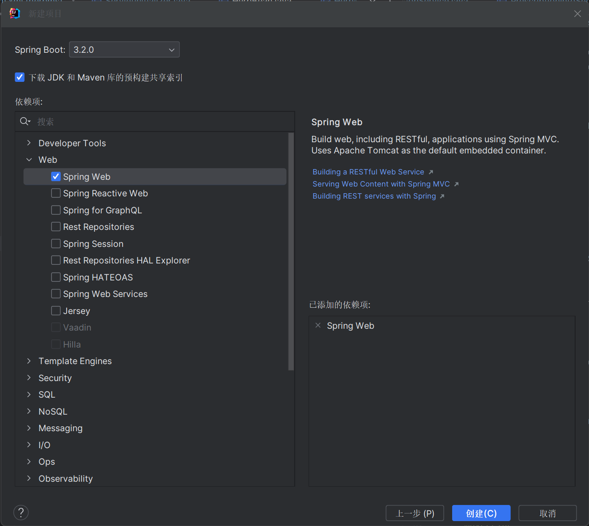

# SpringBoot

传统 Spring 程序由 **Spring Framework** 提供支持，将若干个 Spring 子项目联系到一起。但随着项目规模扩大，构建、组织项目的难度不断提升......构建完后，我们还得手动将 war 包放置到 Tomcat 中......如果需要更新配置，还需要重新构建，极其耗时......

SpringBoot 旨在解决这些问题，使得我们不用再在项目管理上浪费时间，从而可以聚焦于业务开发。

## 创建空工程

:::tip
最新的 SpringBoot 3 最低要求 JDK 17，请确保你已经**跟上时代**。
:::

SpringBoot 工程创建依赖 **Spring Initializr**（没打错字，就是没有 e），按照需要选择语言、包管理器、包名等信息后，点“下一步”：


:::warning
SpringBoot 已内嵌 Tomcat，我们不必将其构建为 war 包——jar 包就可以了。
:::

选中 **Spring Web** 依赖，它包含了我们在 Spring 中所有要用到的基础依赖，点“创建”即可得到空工程。



至于三方技术整合，我们会在后面提到。

## 配置自动导入

我们应用程序的配置一般放在 `application.properties` 或 `application.yml` 中。按照惯例，我们继续沿用 yml 形式。

使用注解 `@Value`（作用于成员，Spring 提供）或 `@ConfigurationProperties`（作用于类/方法，SpringBoot 提供）导入配置：

```yml
anywayDataObj:
  name: "阿弥诺斯1"
  meaninglessID: 114514
```

```java
// 或者直接在这写 @ConfigurationProperties(prefix = "anywayDataObj")
// 但必须确保成员名完全匹配！
public Class 阿弥诺斯 {
  @Value("${anywayDataObj.name}")
  private String name;

  @Value("${anywayDataObj.meaninglessID}")
  private int id;
}
```

:::tip
两种注解并不冲突，但 `@ConfigurationProperties` 更加优先。
:::

:::warning
[Lombok](https://zhuanlan.zhihu.com/p/272516657) 提供了一种过时的近似实现（`@Data`），不推荐使用。_除非你打算开发中途提桶跑路。_
:::
