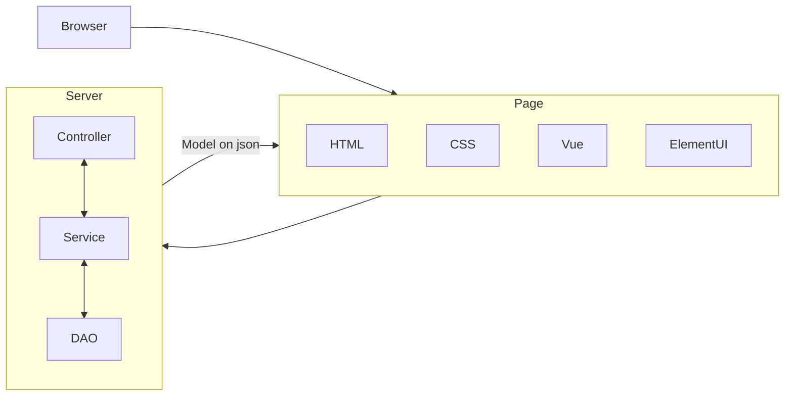

# SpringMVC

**SpringMVC** 是一种基于 Java 实现的 MVC 模型的轻量级 Web 框架。相比于 Servlet 使用简单、开发便捷、灵活性强。

**MVC** 技术将传统的交互拆解成 **Model**（模型）、**View**（用户界面/视图）和 **Controller**（控制器）三个部分，使得一个 Servlet 对象能处理多个请求。在 Spring 中，View 可以是 HTML + CSS + Vue + ElementUI，这是浏览器能直接渲染的；Controller、Service 和 DAO（Data Access Objects，数据存取对象。用于封装数据库操作）运行在后端服务器中，它们之间可以互相交换数据；Model 是被运算出的结果，（现在一般）以 json 的形式传回前端。SpringMVC 主要负责其中的 Controller 和 Model。



:::tip
最典型的 MVC 就是 [JavaBean](./spring.md#javabean-技术) + JSP + [Servlet](servlet.md)。
:::

## 基本配置

1. 在 Maven 工程中，导入依赖：

```xml
<dependency>
  <groupId>org.springframework</groupId>
  <artifactId>spring-webmvc</artifactId>
  <version>6.1.2</version>
</dependency>
```

2. 编写配置文件或配置类：

:::warning
配置文件管理已经渐渐不能跟上时代，请优先学习应用全注解开发形式！
:::

```xml
<beans xmlns="http://www.springframework.org/schema/beans"
       xmlns:xsi="http://www.w3.org/2001/XMLSchema-instance"
       xmlns:mvc="http://www.springframework.org/schema/mvc"
       xmlns:context="http://www.springframework.org/schema/context"
       xsi:schemaLocation="
        http://www.springframework.org/schema/mvc
				http://www.springframework.org/schema/mvc/spring-mvc-4.0.xsd
				http://www.springframework.org/schema/beans
				http://www.springframework.org/schema/beans/spring-beans-4.0.xsd
				http://www.springframework.org/schema/context
        http://www.springframework.org/schema/context/spring-context-4.0.xsd">
  <!-- 应用注解到具体类，而不是中心化配置 -->
  <mvc:annotation-driven/>
  <!-- 扫描哪个包？ -->
  <context:component-scan base-package="com.penyo.demo.controller"/>
  <!-- 配置总转发器 -->
  <bean class="org.springframework.web.servlet.view.InternalResourceViewResolver">
    <!-- 地址前缀、后缀配置，如果你用了 JSP 技术，也许会用到 -->
    <property name="prefix" value="/WEB-INF/jsp/"/>
    <property name="suffix" value=".jsp"/>
  </bean>
</beans>
```

或

```java
package com.penyo.demo.util;

import org.springframework.context.annotation.ComponentScan;
import org.springframework.context.annotation.Configuration;
import org.springframework.web.servlet.support.AbstractAnnotationConfigDispatcherServletInitializer;

@Configuration
@ComponentScan("com.penyo.demo.controller")
// 这个名很长的是 SpringMVC 提供的新配置类！只需要继承它就可以获得全部预配置
public class WebConfig extends AbstractAnnotationConfigDispatcherServletInitializer {
  @Override
  // 你的 Spring 配置类在哪？
  protected Class<?>[] getRootConfigClasses() {
    return new Class[]{AppConfig.class};
  }

  @Override
  // 你的 Servlet 配置类在哪（这里跟 SpringMVC 配置类合并了）？
  protected Class<?>[] getServletConfigClasses() {
    return new Class[]{WebConfig.class};
  }

  @Override
  // Servlet 默认根路径是？
  protected String[] getServletMappings() {
    return new String[]{"/"};
  }
}
```

3. 使用注解标记控制器类：

```java
package com.penyo.demo.controller;

import com.penyo.demo.pojo.Loli;
import com.penyo.demo.service.LoliService;

import java.util.List;

import org.springframework.stereotype.Controller;
import org.springframework.ui.Model;
import org.springframework.web.bind.annotation.RequestMapping;
import org.springframework.web.bind.annotation.ResponseBody;

// 看见了吗？这里这里！
@Controller
public class LoliController extends GenericController<Loli> {
  // 注入业务类
  @Autowired
  private LoliService ls;

  @Override
  // 所监听的地址，受总配置里的前后缀影响
  @RequestMapping("/get-lolis")
  public String getLolis(/* 参数被自动封装到 Loli 里 */ Loli loli, Model model) {
    // 调用 Servive 层方法
    List<Loli> lolis = ls.getLolis(loli);
    // 将结果存储到 Model 里
    model.addAttribute("lolis", lolis);
    // 重定向
    return "/result";
  }

  @Override
  @RequestMapping("/get-cos-suites")
  // 不跳转，而是将结果直接返回，适用于前后端分离项目
  @ResponseBody
  public String getCosplaySuites(Loli loli) {
    List<String> suites = ls.getLoliById(loli.getId());
    return JSON.toJSONString(suites);
  }
}
```
