# 图形用户接口

早在 JDK 1.0 时代，Java 中就已经有了比较底层的图形用户接口（GUI）工具类 `AWT` （Abstract Window Toolkit，抽象窗口工具集），后来又在 JDK 1.2 推出了纯 Java 实现的 `Swing` 。虽然它们早就过时，但是 GUI 编程思想并没有过时，我们在这一章主要学习 GUI 编程思想，为以后学习 [Android 应用开发](../android/index.md) 等打下基础。

为了更好地展示，本章会包含大量表和图片。

## AWT 体系

先上一张表展示 `AWT` 的类继承体系。

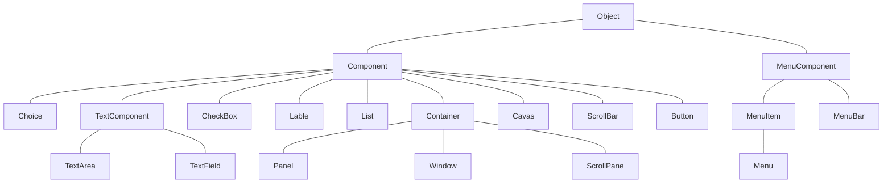

所有和 `AWT` 编程相关的类都放在 `java.awt` 包以及它的子包中， `AWT` 编程中有两个基类 `Component` 和 `MenuComponent` 。

- Component：代表一个能以图形化方式显示出来，并可与用户**交互**的对象。例如 Button 代表一个按钮，TextField 代表一个文本框等。
- MenuComponent：代表图形界面的菜单组件，包括 MenuBar（菜单条）、Menultem（菜单项）等子类。

其中 `Container` 是一种特殊的 `Component` ，它代表一种**容器**，可以盛装普通的 `Component` 。

`AWT` 中还有一个非常重要的接口叫 `LayoutManager` ，如果一个容器中有多个**组件**，那么容器就需要使用 `LayoutManager` 来管理这些组件的布局方式。

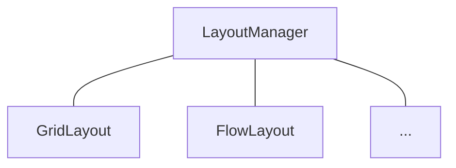

## Container 类

作为呈现组件的平台，我们有必要从**容器**入手。

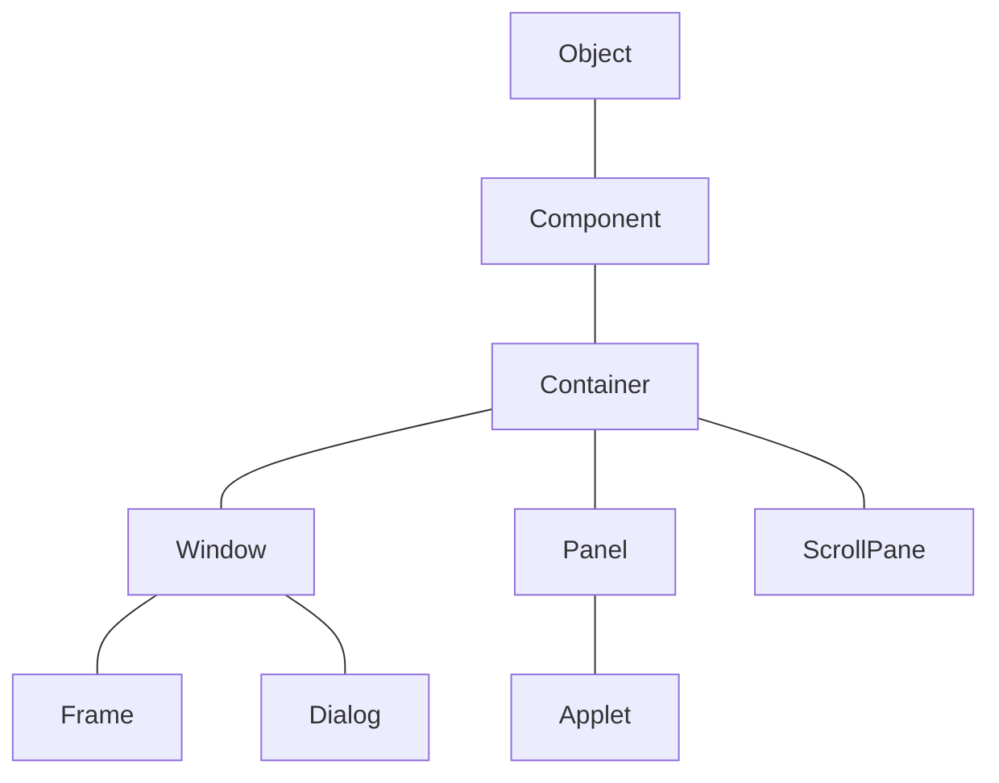

`Window` 是可以独立存在的**顶级窗口**，默认使用 `BorderLayout` 管理其内部组件布局； `Panel` 可以容纳其他组件，但**不能独立存在**，它必须内嵌其他容器中使用，默认使用 `FlowLayout` 管理其内部组件布局； `ScrollPane` 是一个带**滚动条**的容器，它也**不能独立存在**，默认使用 `BorderLayout` 管理其内部组件布局。

先看 `Component` ，作为基类，提供了如下常用的方法来设置组件的**大小、位置、可见性**等。

| 方法名                                              | 说明                     |
| --------------------------------------------------- | ------------------------ |
| void setLocation(int x, int y)                      | 设置组件的位置           |
| void setSize(int width, int height)                 | 设置组件的大小           |
| void setBounds(int x, int y, int width, int height) | 同时设置组件的位置、大小 |
| void setVisible(Boolean b)                          | 设置该组件的可见性       |

根据这些，我们可以先创建一个窗口了。

```java
import java.awt.*;

public class Demo {
    public static void main(String[] args) {
        // 实例化 Frame，窗口标题为 Hello, Java GUI!
        Frame frame = new Frame("Hello, Java GUI!");

        // 设置窗口的位置和大小
        // frame.setLocation(100,100);
        // frame.setSize(500,300);
        frame.setBounds(100, 100, 500, 300);

        // 设置窗口可见
        frame.setVisible(true);
    }
}
```

效果：

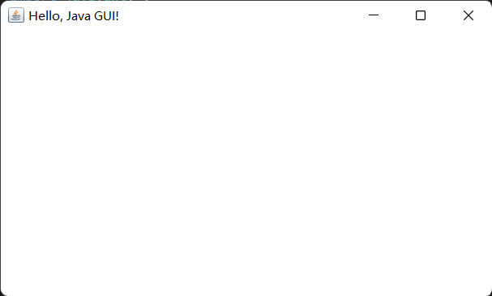

Container 作为**容器根类**，提供了如下方法来访问容器中的组件。

| 方法名                                 | 说明                                                                             |
| -------------------------------------- | -------------------------------------------------------------------------------- |
| Component add(Component comp)          | 向容器中添加其他组件（该组件既可以是普通组件，也可以是容器），并返回被添加的组件 |
| Component getComponentAt(int x, int y) | 返回指定点的组件                                                                 |
| int getComponentCount()                | 返回该容器内组件的数量                                                           |
| Component[] getComponents()            | 返回该容器内的所有组件                                                           |

于是我们可以结合 `Frame` 和 `Panel` 做一个有交互性的窗口了。

```java
import java.awt.*;

public class Demo {
    public static void main(String[] args) {
        Frame frame = new Frame("Outlooooooook E-mail");
        frame.setBounds(100, 100, 500, 300);
        frame.setVisible(true);

        // 实例化内嵌容器
        Panel panel = new Panel();

        // 向内嵌容器添加匿名类对象文本框和按钮
        panel.add(new TextField("Input your E-mail here"));
        panel.add(new Button("Sign in"));

        // 向容器添加内嵌容器
        frame.add(panel);
    }
}
```

效果：

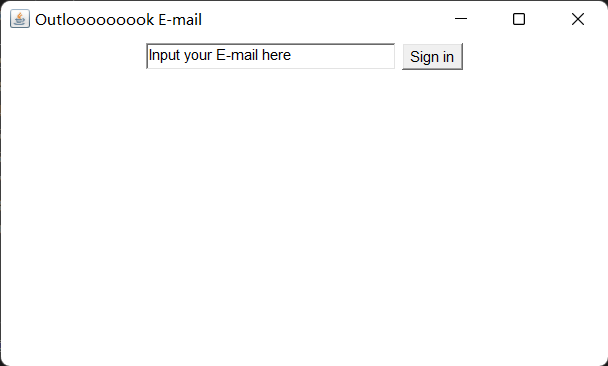

`Frame` 和 `ScrollPane` 结合：

```java
import java.awt.*;

public class Demo {
    public static void main(String[] args) {
        Frame frame = new Frame("Outlooooooook E-mail");
        frame.setBounds(100, 100, 500, 300);
        frame.setVisible(true);

        // 实例化带滚动条内嵌容器，并传参使滚动条常态显示
        ScrollPane sp = new ScrollPane(ScrollPane.SCROLLBARS_ALWAYS);
        sp.add(new TextField("Input your E-mail here"));
        sp.add(new Button("Sign in"));
        frame.add(sp);
    }
}
```

效果：

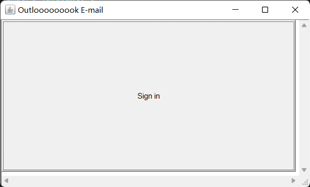

我们会发现 `TextField` 没有体现出来，而造成这种现象的罪魁祸首就是**布局管理器**（`LayoutManager`）—— `Window` 和 `ScrollPane` 默认使用的是 `BoaderLayout` ， `Panel` 默认使用的是 `FlowLayout` 。

## LayoutManager 接口

`LayoutManager` 下包含若干个布局管理器，如网格布局（`GridLayout`）和流式布局（`FlowLayout`），以及一个二级接口 `LayoutManager2` ，它也包含了若干个布局管理器，如 `CardLayout`、`GridBagLayout` 和 `BorderLayout`。**如果布局管理器是 null，则意味着你必须手动指定组件在容器内的绝对坐标。**

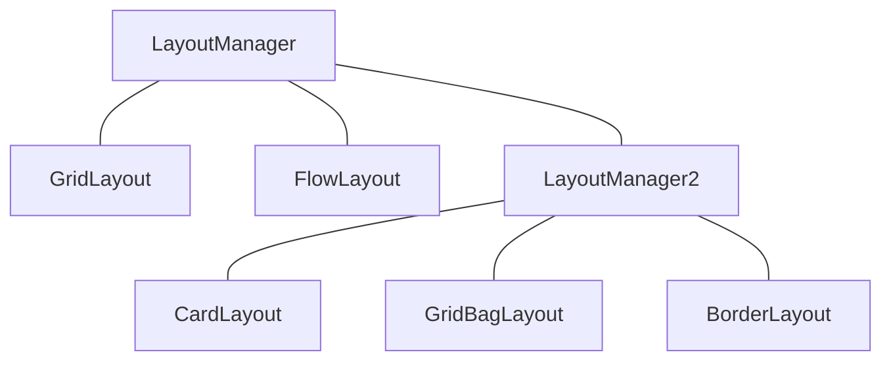

## FlowLayout 类

在 `FlowLayout` 中，组件像水流一样向某方向流动（排列），遇到障碍（边界）就折回，重头开始排列。在默认情况下，`FlowLayout` 从左向右排列所有组件，遇到边界就会折回下一行重新开始。

这里给出 `FlowLayout` 的三个构造器。

| 方法名                                    | 说明                                                        |
| ----------------------------------------- | ----------------------------------------------------------- |
| FlowLayout()                              | 使用默认的对齐方式及默认的垂直间距、水平间距创建 FlowLayout |
| FlowLayout(int align)                     | 使用指定的对齐方式及默认的垂直间距、水平间距创建 FlowLayout |
| FlowLayout(int align, int hgap, int vgap) | 使用指定的对齐方式及指定的垂直问距、水平间距创建 FlowLayout |

`FlowLayout` 中组件的排列方向（从左向右、从右向左、从中间向两边等），该参数应该使用 FlowLayout 类的静态常量：_FlowLayout.LEFT_、_FlowLayout.CENTER_、_FlowLayout.RIGHT_，**默认是中心对齐**。

`FlowLayout` 中组件中间距通过整数设置，单位是像素，**默认是 5 个像素**。

演示：流式布局

```java
import java.awt.*;

public class Demo {
    public static void main(String[] args) {
        Frame frame = new Frame("FlowLayout Build");

        // 通过 setLayout() 设置容器的布局管理器
        frame.setLayout(new FlowLayout(FlowLayout.LEFT, 20, 20));

        // 添加多个按钮到 frame 中
        for (int i = 0; i < 100; i++)
            frame.add(new Button("Button" + i));

        // 设置最佳大小，pack()
        frame.pack();
        frame.setVisible(true);
    }
}
```

没有设置最佳大小的效果：


设置了最佳大小的效果：


手动拉伸窗口后的效果：

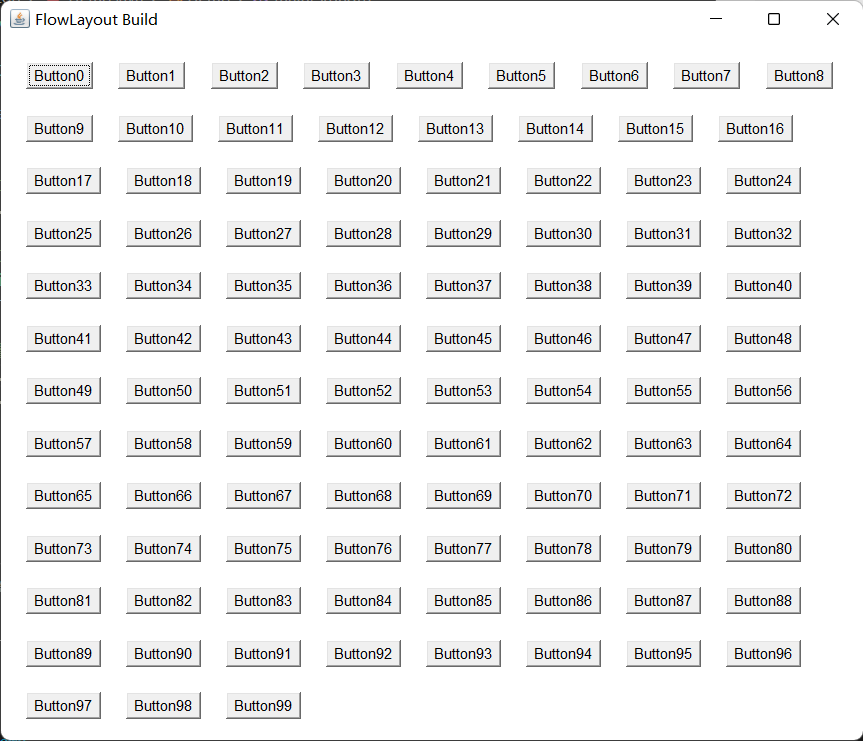

## BorderLayout 类

`BorderLayout` 将容器分为 **EAST**、**SOUTH**、**WEST**、**NORTH** 和 **CENTER** 五个区域，普通组件可以被放置在这 5 个区域的任意一个中。`BorderLayout` 的布局方案如图所示：


当改变使用 `BorderLayout` 的容器大小时，NORTH、SOUTH 和 CENTER 区域**水平调整**，而 EAST、WEST 和 CENTER 区域**垂直调整**。使用 `BorderLayout` 有如下两个注意点：

- 当向使用 BorderLayout 的容器中添加组件时，需要指定要添加到哪个区域中。如果没有指定添加到哪个区域中，则**默认添加到中间区域中**。
- 如果向同一个区域中添加多个组件时，**后放入的组件会覆盖先放入的组件**。

这里给出 `BorderLayout` 的三个构造器。

| 方法名                           | 说明                                              |
| -------------------------------- | ------------------------------------------------- |
| BorderLayout()                   | 使用**默认的**水平间距、垂直间距创建 BorderLayout |
| BorderLayout(int hgap, int vgap) | 使用**指定的**水平间距、垂直间距创建 BorderLayout |

演示：板式布局

```java
import java.awt.*;

public class Demo {
    public static void main(String[] args) {
        Frame frame = new Frame("BorderLayout Build");
        frame.setLayout(new BorderLayout(30, 20));

        // 向 frame 的指定区域中添加组件
        frame.add(new Button("EAST"), BorderLayout.EAST);
        frame.add(new Button("WEST"), BorderLayout.WEST);
        frame.add(new Button("CENTER"), BorderLayout.CENTER);
        frame.add(new Button("SOUTH"), BorderLayout.SOUTH);
        frame.add(new Button("NORTH"), BorderLayout.NORTH);

        frame.pack();
        frame.setVisible(true);
    }
}
```

效果：


全屏化窗口的效果：（能体现各部分调整的规律）


如果不往某个区域中放入组件，那么该区域不会空白出来，而是会被其他区域（CERTER）占用。

演示 2：在板式布局中嵌入流式布局

```java
import java.awt.*;

public class Demo {
    public static void main(String[] args) {
        Frame frame = new Frame("BorderLayout Build");
        frame.setLayout(new BorderLayout(30, 20));

        frame.add(new Button("EAST"), BorderLayout.EAST);
        frame.add(new Button("WEST"), BorderLayout.WEST);
        frame.add(new Button("SOUTH"), BorderLayout.SOUTH);
        frame.add(new Button("NORTH"), BorderLayout.NORTH);

        Panel panel = new Panel();
        panel.add(new Button("CENTER"));
        panel.add(new TextField("RealCENTER"));

        frame.add(panel, BorderLayout.CENTER);
        frame.pack();
        frame.setVisible(true);
    }
}
```

效果：


## GridLayout 类

`GridLayout` 将容器分割成纵横线分隔的网格，每个网格所占的区域大小相同。当向使用 `GridLayout` 的容器中添加组件时，默认**从左向右、从上向下**依次添加到每个网格中。与 `FlowLayout` 不同的是，放置在 `GridLayout` 中的各组件的大小由组件所处的区域决定（每个组件将自动占满整个区域）。

| 方法名                                             | 说明                                                                   |
| -------------------------------------------------- | ---------------------------------------------------------------------- |
| GridLayout(int rows, int cols)                     | 采用指定的行数、列数，以及默认的横向间距、纵向间距将容器分割成多个网格 |
| GridLayout(int rows, int cols, int hgap, int vgap) | 采用指定的行数、列数，以及指定的横向间距、纵向间距将容器分割成多个网格 |

演示：使用 `Frame` 加 `Panel` ，配合 `FlowLayout` 和 `GridLayout` 完成一个计算器效果

```java
import java.awt.*;

public class Demo {
    public static void main(String[] args) {
        Frame frame = new Frame("Calculator");

        // 创建一个 Panel 对象，并且向 Panel 中放置一个 TextField 组件
        Panel panel = new Panel();
        panel.add(new TextField(20));

        // 将上述的 Panel 放入到 Frame 的北侧区域
        frame.add(panel, BorderLayout.NORTH);

        // 再创建一个 Panel 对象，并且设置其布局管理器为 GridLayout
        Panel panelDown = new Panel();
        panelDown.setLayout(new GridLayout(5, 4, 4, 4));

        // 向上述 Panel 中，放置 15 个按钮
        panelDown.add(new Button("AC"));
        panelDown.add(new Button("BS"));
        panelDown.add(new Button("%"));
        panelDown.add(new Button("÷"));
        for (int i = 7; i <= 9; i++)
            panelDown.add(new Button(i + ""));
        panelDown.add(new Button("×"));
        for (int i = 4; i <= 6; i++)
            panelDown.add(new Button(i + ""));
        panelDown.add(new Button("-"));
        for (int i = 1; i <= 3; i++)
            panelDown.add(new Button(i + ""));
        panelDown.add(new Button("+"));
        panelDown.add(new Button("e"));
        panelDown.add(new Button("0"));
        panelDown.add(new Button("."));
        panelDown.add(new Button("="));

        // 将上述 Panel 添加到 Frame 的中间区域
        frame.add(panelDown);

        frame.pack();
        frame.setVisible(true);
    }
}
```

效果：

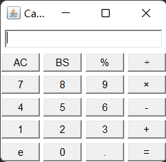

## GridBagLayout 类

`GridBagLayout` 的功能最强大，但也最复杂，与 `GridLayout` 不同的是，在 `GridBagLayout` 中，一个组件可以跨越一个或多个网格，并可以设置各网格的大小互不相同，从而增加了布局的灵活性。当窗口的大小发生变化时，`GridBagLayout` 也可以准确地控制窗口各部分的拉伸。

由于在 `GridBagLayout` 中，每个组件可以占用多个网格，此时，我们往容器中添加组件的时候，就需要具体的控制每个组件占用多少个网格，java提供的 `GridBagConstaints` 类，与特定的组件绑定，可以完成具体大小和跨越性的设置。

这里给出 `GridBagConstraints` 中的成员变量：

| 成员变量   | 说明                                                                                                                                                                                                                                                                                                                                                                                                                               |
| ---------- | ---------------------------------------------------------------------------------------------------------------------------------------------------------------------------------------------------------------------------------------------------------------------------------------------------------------------------------------------------------------------------------------------------------------------------------- |
| gridx      | 设置受该对象控制的 GUI 组件左上角所在网格的横向索引                                                                                                                                                                                                                                                                                                                                                                                |
| gridy      | 设置受该对象控制的 GUI 组件左上角所在网格的纵向索引                                                                                                                                                                                                                                                                                                                                                                                |
| gridwidth  | 设置受该对象控制的 GUI 组件横向跨越多少个网格，如果属性值为 _GridBagContraints.REMAIND_，则表明当前组件是横向最后一个组件，如果属性值为 _GridBagConstraints.RELATIVE_，表明当前组件是横向倒数第二个组件                                                                                                                                                                                                                            |
| gridheight | 设置受该对象控制的 GUI 组件纵向跨越多少个网格，如果属性值为 _GridBagContraints.REMAIND_，则表明当前组件是纵向最后一个组件，如果属性值为 _GridBagConstraints.RELATIVE_，表明当前组件是纵向倒数第二个组件                                                                                                                                                                                                                            |
| weightx    | 设置受该对象控制的 GUI 组件占据多余空间的水平比例，假设某个容器的水平线上包括三个 GUI 组件，它们的水平增加比例分别是 1、2、3，但容器宽度增加 60 像素时，则第一个组件宽度增加 10 像素，第二个组件宽度增加 20 像素，第三个组件宽度增加 30 像素。如果其增加比例为 0，则表示不会增加                                                                                                                                                   |
| weighty    | 设置受该对象控制的 GUI 组件占据多余空间的垂直比例                                                                                                                                                                                                                                                                                                                                                                                  |
| anchor     | 设置受该对象控制的 GUI 组件在其显示区域中的定位方式：<br>_GridBagConstraints.CENTER_（中间）<br>_GridBagConstraints.NORTH_（上中）<br>_GridBagConstraints.NORTHWEST_（左上角）<br>_GridBagConstraints.NORTHEAST_（右上角）<br>_GridBagConstraints.SOUTH_（下中）<br>_GridBagConstraints.SOUTHEAST_（右下角）<br>_GridBagConstraints.SOUTHWEST_（左下角）<br>_GridBagConstraints.EAST_（右中）<br>_GridBagConstraints.WEST_（左中） |
| fill       | 当“显示区域”大于“组件”的时候，如何调整组件：<br>_GridBagConstraints.NONE_: GUI 组件不扩大<br>_GridBagConstraints.HORIZONTAL_：GUI 组件水平扩大以占据空白区域<br>_GridBagConstraints.VERTICAL_：GUI 组件垂直扩大以占据空白区域<br>_GridBagConstraints.BOTH_：GUI 组件水平、垂直同时扩大以占据空白区域                                                                                                                               |
| insets     | 设置受该对象控制的 GUI 组件的外部填充的大小，即该组件边界和显示区域边界之间的距离                                                                                                                                                                                                                                                                                                                                                  |
| ipadx      | 设置受该对象控制的 GUI 组件横向内部填充的大小，即在该组件最小尺寸的基础上还需要增大多少                                                                                                                                                                                                                                                                                                                                            |
| ipady      | 设置受该对象控制的 GUI 组件纵向内部填充的大小，即在该组件最小尺寸的基础上还需要增大多少                                                                                                                                                                                                                                                                                                                                            |

使用步骤：

1. 创建 GridBagLayout 对象，并给容器设置该布局管理器对象。
2. 创建 GridBagConstraints 对象，并设置该对象的控制属性：
   - gridx：用于指定组件在网格中所处的横向索引
   - gridy：用于执行组件在网格中所处的纵向索引
   - gridwidth：用于指定组件横向跨越多少个网格
   - gridheight：用于指定组件纵向跨越多少个网格
3. 调用 GridBagLayout 对象的 setConstraints(Component c, GridBagConstraints gbc) 方法，把即将要添加到容器中的组件 c 和 GridBagConstraints 对象关联起来。
4. 把组件添加到容器中。

## CardLayout 类

`CardLayout` **以时间而非空间**来管理它里面的组件，它将加入容器的所有组件看成一叠卡片（每个卡片其实就是一个组件），每次只有最上面的 `Component` 才可见。就好像一副扑克牌，它们叠在一起，每次只有最上面的一张扑克牌才可见。

这里给出其构造器和常用方法：

| 方法名                                   | 说明                                                                              |
| ---------------------------------------- | --------------------------------------------------------------------------------- |
| CardLayout()                             | 创建默认的 CardLayout                                                             |
| CardLayout(int hgap, int vgap)           | 通过指定卡片与容器左右边界的间距（hgap）、上下边界（vgap）的间距来创建 CardLayout |
| void first(Container target)             | 显示 target 容器中的第一张卡片                                                    |
| void last(Container target)              | 显示 target 容器中的最后一张卡片                                                  |
| void previous(Container target)          | 显示 target 容器中的前一张卡片                                                    |
| void next(Container target)              | 显示 target 容器中的后一张卡片                                                    |
| void show(Container target, String name) | 显示 target 容器中指定名字的卡片                                                  |

演示：使用 `Frame` 和 `Panel` 以及 `CardLayout` 完成图片查看器的效果

```java
import java.awt.*;
import java.awt.event.*;

public class Demo {
    public static void main(String[] args) {
        Frame frame = new Frame("PicViewer");
        // 创建一个 p1，储存多张卡片
        Panel p1 = new Panel();

        // CardLayout 对象，并且把该对象设置给之前创建的容器
        CardLayout cardLayout = new CardLayout();
        p1.setLayout(cardLayout);

        // 往 p1 中储存多个组件
        String[] names = { "The 1st pic", "The 2nd pic", "The 3rd pic", "The 4th pic", "The 5th pic" };
        for (int i = 0; i < names.length; i++)
            p1.add(names[i], new Button(names[i]));

        // 把 p1 放在 frame 的中间
        frame.add(p1);

        // 创建另一个 panel p2，存放多个按钮组件
        Panel p2 = new Panel();

        Button b1 = new Button("The first");
        Button b2 = new Button("Previous one");
        Button b3 = new Button("Next one");
        Button b4 = new Button("The last");
        Button b5 = new Button("The third");

        // 创建一个时间监听器，监听按钮的点击动作
        ActionListener listener = new ActionListener() {
            @Override
            public void actionPerformed(ActionEvent e) {
                String command = e.getActionCommand();
                switch (command) {
                    case "The first":
                        cardLayout.first(p1);
                        break;
                    case "Previous one":
                        cardLayout.previous(p1);
                        break;
                    case "Next one":
                        cardLayout.next(p1);
                        break;
                    case "The last":
                        cardLayout.last(p1);
                        break;
                    case "The third":
                        cardLayout.show(p1, "The 3rd pic");
                        break;
                }
            }
        };

        // 绑定监听器与按钮
        b1.addActionListener(listener);
        b2.addActionListener(listener);
        b3.addActionListener(listener);
        b4.addActionListener(listener);
        b5.addActionListener(listener);

        // 把 5 个按钮添加到 p2 中
        p2.add(b1);
        p2.add(b2);
        p2.add(b3);
        p2.add(b4);
        p2.add(b5);

        // 把 p2 放在 frame 的下部
        frame.add(p2, BorderLayout.SOUTH);

        frame.pack();
        frame.setVisible(true);
    }
}
```

效果：

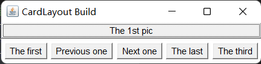

## BoxLayout 类

为了简化开发，`Swing` 引入了一个新的布局管理器：`BoxLayout`。它可以在垂直和水平两个方向上摆放GUI组件，`BoxLayout` 提供了如下一个简单的构造器：

| 方法名                                | 说明                                                                                                                                                     |
| ------------------------------------- | -------------------------------------------------------------------------------------------------------------------------------------------------------- |
| BoxLayout(Container target, int axis) | 指定创建基于 target 容器的 BoxLayout，该布局管理器里的组件按 axis 方向排列。其中 axis 有 _BoxLayout.X_AXIS_（横向）和 _BoxLayout.Y_AXIS_（纵向）两个方向 |

演示 1：使用箱式布局纵向排列组件

```java
import java.awt.*;
import javax.swing.*;

public class Demo {
    public static void main(String[] args) {
        Frame frame = new Frame("BoxLayout Build");
        BoxLayout boxLayout = new BoxLayout(frame, BoxLayout.Y_AXIS);
        frame.setLayout(boxLayout);
        frame.add(new Button("Button 1"));
        frame.add(new Button("Button 2"));
        frame.pack();
        frame.setVisible(true);
    }
}
```

效果：


在 `javax.swing` 包中，提供了一个新的容器 `Box`，该容器的默认布局管理器就是 `BoxLayout`，大多数情况下，使用 `Box` 容器去容纳多个 GUI 组件，然后再把 `Box` 容器作为一个组件，添加到其他的容器中，从而形成整体窗口布局。

这里给出它的两个方法：

| 方法名                           | 说明                           |
| -------------------------------- | ------------------------------ |
| static Box createHorizontalBox() | 创建一个**水平排列**组件的 Box |
| static Box createVerticalBox()   | 创建一个**垂直排列**组件的 Box |

演示 2：将水平 `Box` 嵌入垂直 `Box`

```java
import java.awt.*;
import javax.swing.*;

public class Demo {
    public static void main(String[] args) {
        // 创建 Frame 对象
        Frame frame = new Frame("BoxLayout Build");

        // 创建一个横向的 Box，并添加两个按钮
        Box hBox = Box.createHorizontalBox();
        hBox.add(new Button("HB1"));
        hBox.add(new Button("HB2"));

        // 创建一个纵向的 Box，将 hBox 嵌入，并再添加两个按钮
        Box vBox = Box.createVerticalBox();
        vBox.add(hBox);
        vBox.add(new Button("VB1"));
        vBox.add(new Button("VB2"));

        // 把 vBox 添加到 frame 容器中
        frame.add(vBox);

        // 设置 frame 最佳大小并可见
        frame.pack();
        frame.setVisible(true);
    }
}
```

效果：


`Box` 类中提供了相关的静态方法生成间隔组件：

| 方法名                                            | 说明                                                                             |
| ------------------------------------------------- | -------------------------------------------------------------------------------- |
| static Component createHorizontalGlue()           | 创建一条水平 Glue（可在两个方向上同时拉伸的间距）                                |
| static Component createVerticalGlue()             | 创建一条垂直 Glue（可在两个方向上同时拉伸的间距）                                |
| static Component createHorizontalStrut(int width) | 创建一条指定宽度（宽度固定了，不能拉伸）的水平 Strut（可在垂直方向上拉伸的间距） |
| static Component createVerticalStrut(int height)  | 创建一条指定高度（高度固定了，不能拉伸）的垂直 Strut（可在水平方向上拉伸的间距） |

演示 3：使用 `Frame` 和 `Box` ，生成组件间具有间隔的箱式布局

```java
import java.awt.*;
import javax.swing.*;

public class Demo {
    public static void main(String[] args) {
        // 创建 Frame 对象
        Frame frame = new Frame("BoxLayout Build");

        // 创建一个横向的 Box，并添加两个按钮
        Box hBox = Box.createHorizontalBox();
        hBox.add(new Button("HB1"));
        hBox.add(Box.createHorizontalGlue());
        hBox.add(new Button("HB2"));
        hBox.add(Box.createHorizontalStrut(10));
        hBox.add(new Button("HB3"));

        // 创建一个纵向的 Box，并添加两个按钮
        Box vBox = Box.createVerticalBox();
        vBox.add(new Button("VB1"));
        vBox.add(Box.createVerticalGlue());
        vBox.add(new Button("VB2"));
        vBox.add(Box.createVerticalStrut(10));
        vBox.add(new Button("VB3"));

        // 把 box 容器添加到 frame 容器中
        frame.add(hBox, BorderLayout.NORTH);
        frame.add(vBox);

        // 设置 frame 最佳大小并可见
        frame.pack();
        frame.setVisible(true);
    }
}
```

手动拉伸后的效果：

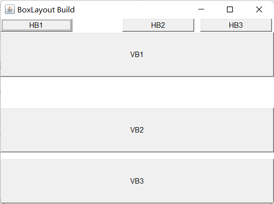

## 基本组件

| 类名          | 说明                                                                                                                                                                                    |
| ------------- | --------------------------------------------------------------------------------------------------------------------------------------------------------------------------------------- |
| Button        | 按钮                                                                                                                                                                                    |
| Canvas        | 用于绘图的画布                                                                                                                                                                          |
| Checkbox      | 复选框组件（也可当做单选框组件使用）                                                                                                                                                    |
| CheckboxGroup | 用于将多个 Checkbox 组件组合成一组，一组 Checkbox 组件将只有一个可以被选中，即全部变成单选框组件                                                                                        |
| Choice        | 下拉选择框                                                                                                                                                                              |
| Frame         | 窗口，在 GUI 程序里通过该类创建窗口                                                                                                                                                     |
| Label         | 标签类，用于放置提示性文本                                                                                                                                                              |
| List          | 表框组件，可以添加多项条目                                                                                                                                                              |
| Panel         | 不能单独存在基本容器类，必须放到其他容器中                                                                                                                                              |
| Scrollbar     | 滑动条组件。如果需要用户输入位于某个范围的值，就可以使用滑动条组件，比如调色板中设置 RGB 的三个值所用的滑动条。当创建一个滑动条时，必须指定它的方向、初始值、滑块的大小、最小值和最大值 |
| ScrollPane    | 带水平及垂直滚动条的容器组件                                                                                                                                                            |
| TextArea      | 多行文本域                                                                                                                                                                              |
| TextField     | 单行文本框                                                                                                                                                                              |

这些 `AWT` 组件的用法比较简单，可以查阅 API 文档来获取它们各自的构造方法、成员方法等详细信息。

演示：利用多个组件实现复合界面

_ComplexGUI.java_：

```java
import java.awt.*;
import javax.swing.*;

public class ComplexGUI {
    Frame frame = new Frame("ComplexGUI");
    TextArea textArea = new TextArea(5, 20);
    Choice domicileChooser = new Choice();

    CheckboxGroup checkboxGroup = new CheckboxGroup();
    Checkbox male = new Checkbox("Male", checkboxGroup, true);
    Checkbox female = new Checkbox("Female", checkboxGroup, true);

    Checkbox isAdult = new Checkbox("Adult");

    TextField textField = new TextField(60);
    Button ok = new Button("OK");
    List langList = new List(6, true);

    public void init() {
        // 组装底部
        Box bBox = Box.createHorizontalBox();
        bBox.add(textField);
        bBox.add(ok);
        frame.add(bBox, BorderLayout.SOUTH);

        // 组装选择部分
        domicileChooser.add("Unknown");
        domicileChooser.add("Northerner");
        domicileChooser.add("Southerner");
        Box cBox = Box.createHorizontalBox();
        cBox.add(domicileChooser);
        cBox.add(male);
        cBox.add(female);
        cBox.add(isAdult);

        // 组装文本域和选择部分
        Box topLeft = Box.createVerticalBox();
        topLeft.add(textArea);
        topLeft.add(cBox);

        // 组装顶部左边与列表框
        langList.add("Best at Cpp");
        langList.add("Best at Java");
        langList.add("Best at Python");
        Box top = Box.createHorizontalBox();
        top.add(topLeft);
        top.add(langList);

        frame.add(top);

        frame.pack();
        frame.setVisible(true);
    }
}
```

_Demo.java_：

```java
public class Demo {
    public static void main(String[] args) {
        new ComplexGUI().assemble();
    }
}
```

效果：


## Dialog 类

`Dialog`（对话框）是 `Window` 类的子类，是一个容器类，属于特殊组件。对话框是**可以独立存在**的顶级窗口，因此用法与普通窗口的用法几乎完全一样，但是使用对话框需要注意下面两点：

- 对话框通常依赖于其他窗口，就是通常需要有一个父窗口。
- 对话框有非模态（non-modal）和模态（modal）两种，当某个模态对话框被打开后，该模态对话框总是位于它的父窗口之上，**在模态对话框被关闭之前，父窗口无法获得焦点**。

下面给出 `Dialog` 的构造器：

| 方法名                                           | 说明                                                                                                              |
| ------------------------------------------------ | ----------------------------------------------------------------------------------------------------------------- |
| Dialog(Frame owner, String title, boolean modal) | 创建一个对话框对象：<br>owner：当前对话框的父窗口<br>title：当前对话框的标题<br>modal：当前对话框是否是模式对话框 |

演示：设计出能弹出模态和非模态窗口的 GUI

```java
import java.awt.*;
import java.awt.event.*;
import javax.swing.*;

public class Demo {
    public static void main(String[] args) {
        Frame frame = new Frame("Dialog Build");
        frame.setLayout(new BoxLayout(frame, BoxLayout.Y_AXIS));

        Dialog d1 = new Dialog(frame, "Model Dialog", true);
        Dialog d2 = new Dialog(frame, "Non-model Dialog", false);

        // 往对话框中添加内容
        Box vBox = Box.createVerticalBox();

        vBox.add(new TextField(
                "A component based on awt can hardly support Chinese character, but the component based on swing isn't."));
        vBox.add(new JButton("确认"));
        d1.add(vBox);

        Button b1 = new Button("Start a Model Dialog");
        Button b2 = new Button("Start a Non-model Dialog");

        // 设置对话框的大小和位置
        frame.setBounds(50, 50, 200, 100);
        d1.setBounds(250, 50, 200, 100);
        d2.setBounds(450, 50, 200, 100);

        // 给 b1 绑定监听事件
        b1.addActionListener(new ActionListener() {
            @Override
            public void actionPerformed(ActionEvent e) {
                d1.setVisible(true);
            }
        });
        b2.addActionListener(new ActionListener() {
            @Override
            public void actionPerformed(ActionEvent e) {
                d2.setVisible(true);
            }
        });
        frame.add(b1);
        frame.add(b2);

        frame.setVisible(true);
    }
}
```

效果：

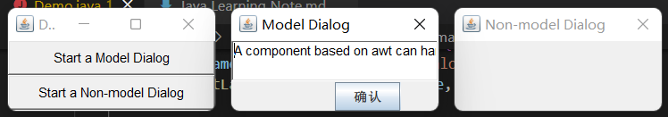

## FileDialog 类

`Dialog` 类还有一个子类：`FileDialog`，它代表一个文件对话框，用于打开或者保存文件，需要注意的是 `FileDialog` **无法指定模态或者非模态**。这是因为 `FileDialog` 依赖于运行平台的实现，如果运行平台的文件对话框是模态的，那么 `FileDialog` 也是模态的，否则就是非模态的。

下面给出 `FileDialog` 的构造器和常用方法：

| 方法名                                           | 说明                                                                                                                                                                             |
| ------------------------------------------------ | -------------------------------------------------------------------------------------------------------------------------------------------------------------------------------- |
| FileDialog(Frame parent, String title, int mode) | 创建一个文件对话框：<br>parent：指定父窗口<br>title：对话框标题<br>mode：文件对话框类型，如果指定为 _FileDialog.LOAD_，用于打开文件；如果指定为*FileDialog.SAVE*，则用于保存文件 |
| String getDirectory()                            | 获取被打开或保存文件的绝对路径                                                                                                                                                   |
| String getFile()                                 | 获取被打开或保存文件的文件名                                                                                                                                                     |

演示：使用 `Frame` 、 `Button` 和 `FileDialog` 完成文件载入和保存的效果

```java
import java.awt.*;
import java.awt.event.*;
import javax.swing.*;

public class Demo {
    public static void main(String[] args) {
        Frame frame = new Frame("FileDialog Build");
        frame.setLayout(new BoxLayout(frame, BoxLayout.Y_AXIS));
        frame.setSize(300, 200);

        FileDialog d1 = new FileDialog(frame, "Which to load", FileDialog.LOAD);
        FileDialog d2 = new FileDialog(frame, "Which to save", FileDialog.SAVE);

        Button b1 = new Button("Load a file");
        Button b2 = new Button("Save a file");

        // 给按钮添加事件
        b1.addActionListener(new ActionListener() {
            @Override
            public void actionPerformed(ActionEvent e) {
                d1.setVisible(true);
                // 输出用户选择的文件路径和名称
                System.out.println("You loaded " + d1.getDirectory() + d1.getFile());
            }
        });
        b2.addActionListener(new ActionListener() {
            @Override
            public void actionPerformed(ActionEvent e) {
                d2.setVisible(true);
                System.out.println("You saved " + d1.getDirectory() + d1.getFile());
            }
        });

        frame.add(b1);
        frame.add(b2);
        frame.setVisible(true);
    }
}
```

效果：


## 事件处理机制

前面介绍了如何放置各种组件，从而制造出各种 GUI，但这些界面还不能响应用户的操作。窗口和组件本身并没有事件处理能力，我们需要手动为它们编写**事件处理机制**。

在进入正题前，我们需要先了解几个概念：

- **事件源**（Event Source）：操作发生的场所，通常指某个组件。
- **事件**（Event）：在事件源上发生的操作可以叫做事件。GUI 会把事件都封装到一个 Event 对象里，如果需要知道该事件的详细信息，就可以通过这个对象来获取。
- **事件监听器**（Event Listener）：当某个事件源上发生了某个事件，事件监听器就可以对这个事件进行处理。
- **注册监听**：把某个事件监听器通过某个事件绑定到某个事件源上，那么当事件源上发生了事件后，事件监听器的代码就会自动执行。

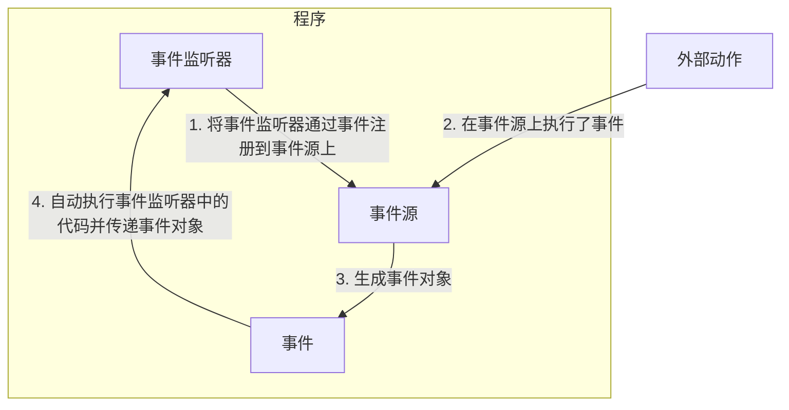

这里举一个关闭窗口的例子：

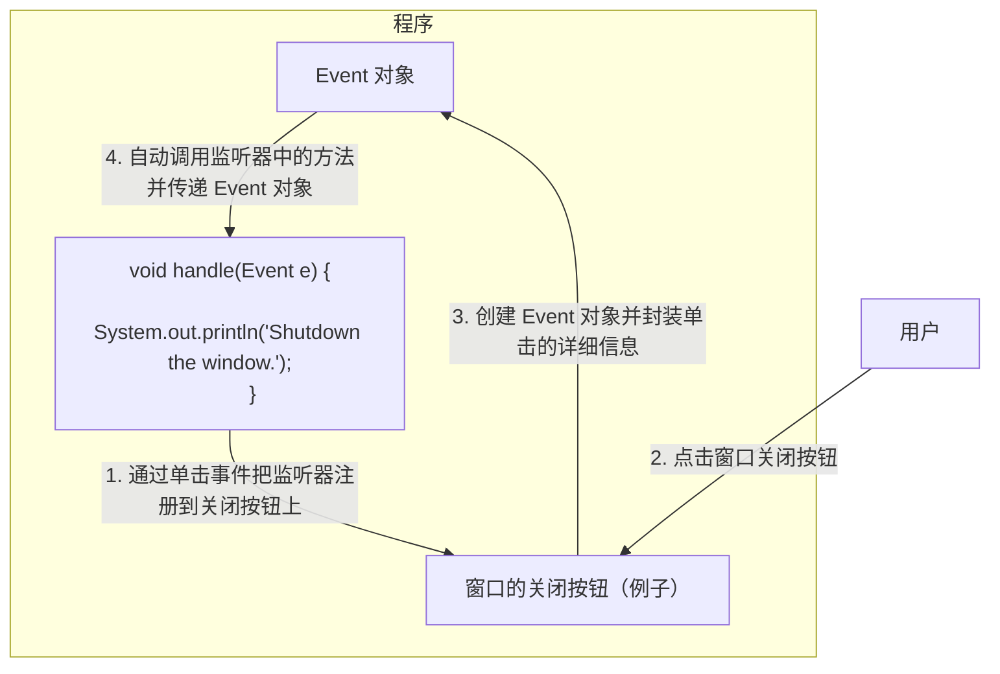

事件监听器必须实现事件监听器接口，AWT 提供了大量的事件监听器接口用于实现不同类型的事件监听器，用于监听不同类型的事件。AWT 中提供了丰富的事件类，用于封装不同组件上所发生的特定操作，AWT 的事件类都是 `AWTEvent` 类的子类， `AWTEvent` 是 `EventObject` 的子类。

AWT 把事件分为了两大类：

**低级事件**：这类事件是基于某个特定动作的事件。

| 事件           | 触发时机                                                                                                                               | 监听器                             |
| -------------- | -------------------------------------------------------------------------------------------------------------------------------------- | ---------------------------------- |
| ComponentEvent | 组件事件：当组件尺寸发生变化、位置发生移动、显隐状态发生改变的时触发该事件                                                             | ComponentListener                  |
| ContainerEvent | 容器事件：当容器里发生添加组件、删除组件时触发该事件                                                                                   | ContainerListener                  |
| WindowEvent    | 窗口事件：当窗口的状态发生改变（如打开、关闭、最大化或最小化等）时触发该事件                                                           | WindowListener                     |
| FocusEvent     | 焦点事件：当组件获得焦点或失去焦点时触发该事件                                                                                         | FocusListener                      |
| KeyEvent       | 键盘事件：当按键被按下、松开、单击时触发该事件                                                                                         | KeyListener                        |
| MouseEvent     | 鼠标事件：当进行单击、按下、松开或移动鼠标时触发该事件                                                                                 | MouseMotionListener和MouseListener |
| PaintEvent     | 组件绘制事件：该事件是一个特殊的事件类型，当 GUI 组件调用 update() 或 paint() 来呈现自身时触发该事件，**该事件并非专用于事件处理模型** | _N/A_                              |

相应的，它们都有自己的 XxAdapter 作为 XxListener 的简略版。

**高级事件**：这类事件并不会基于某个特定动作，而是根据功能含义定义的事件。

| 事件            | 触发时机                                                         | 监听器             |
| --------------- | ---------------------------------------------------------------- | ------------------ |
| ActionEvent     | 动作事件：当按钮、菜单项被单击或在 TextField 中按 Enter 键时触发 | ActionListener     |
| AdjustmentEvent | 调节事件：在滑动条上移动滑块以调节数值时触发该事件               | AdjustmentListener |
| ItemEvent       | 选项事件：当用户选中或取消选中某项时触发该事件                   | ItemListener       |
| TextEvent       | 文本事件：当文本框、文本域里的文本发生改变时触发该事件           | TextListener       |

演示：创建一个窗口，可以使用上、下、左、右键移动窗口

_DirectionKeyListener.java_：

```java
import java.awt.*;
import java.awt.event.*;

public class DirectionKeyListener implements KeyListener {
    @Override
    public void keyPressed(KeyEvent e) {
        // getSource() 能从事件中提取事件源，返回 Object 对象，所以需要向下强制转型
        Frame frame = (Frame) e.getSource();
        // getKeyCode() 与 getKeyChar() 并不相同，根据方向键的作用可以猜测，我们要获取的不是 char
        switch (e.getKeyCode()) {
            case KeyEvent.VK_UP:
                frame.setLocation(frame.getX(), frame.getY() - 1);
                break;
            case KeyEvent.VK_DOWN:
                frame.setLocation(frame.getX(), frame.getY() + 1);
                break;
            case KeyEvent.VK_LEFT:
                frame.setLocation(frame.getX() - 1, frame.getY());
                break;
            case KeyEvent.VK_RIGHT:
                frame.setLocation(frame.getX() + 1, frame.getY());
                break;
        }
    }

    @Override
    public void keyReleased(KeyEvent e) {
    }

    @Override
    public void keyTyped(KeyEvent e) {
    }
}
```

_Demo.java_：

```java
import java.awt.*;

public class Demo {
    Frame frame = new Frame();

    public static void main(String[] args) {
        Demo demo = new Demo();
        demo.frame.setBounds(0, 0, 480, 320);
        demo.frame.addKeyListener(new DirectionKeyListener());
        demo.frame.setVisible(true);
    }
}
```

效果：


键盘操作移动后效果：


### 精选案例：资生堂产品生产日期查询器

> 该 case 基于 Penyo 的项目 [ShiseidoMFTQuery](https://github.com/penyoofficial/ShiseidoMFTQuery) 编写。

_ShiseidoMFTQuery_GUI.java_：

```java
package com.penyo.shiseidomftquery;

import java.awt.*;
import java.awt.event.*;

public class ShiseidoMFTQuery_GUI {
    Frame frame = new Frame("Shiseido Products Manufacturing Time Query");

    Label guide = new Label("Welcome to use ShiseidoMFTQuery! Input the 6-bit code on the package:");
    TextField infoExchange = new TextField();
    Button query = new Button("Query");

    public void boot() {
        frame.add(guide, BorderLayout.NORTH);
        frame.add(infoExchange);
        frame.add(query, BorderLayout.SOUTH);

        // 只有一个事件源使用一个事件监听器的时候，可以用匿名内部类
        query.addActionListener(new ActionListener() {
            @Override
            public void actionPerformed(ActionEvent e) {
                infoExchange.setText(
                        ShiseidoMFTQuery_Core.core(
                                infoExchange.getText()));
            }
        });

        // 在 Swing 中，下一句可直接用 frame.setDefaultCloseOperation(EXIT_ON_CLOSE) 代替
        frame.addWindowListener(new WindowAdapter() {
            // 窗体点击关闭时，关闭虚拟机
            @Override
            public void windowClosing(WindowEvent e) {
                System.exit(0);
            }
        });

        frame.pack();
        frame.setVisible(true);
    }
}
```

_ShiseidoMFTQuery_Core.java_：

```java
package penyo.shiseidomftquery;

import java.util.Calendar;

public class ShiseidoMFTQuery_Core {
    static int MFT_YEAR, MFT_MONTH, MFT_DATE;

    public static String core(String code) {
        try {
            Integer.parseInt(String.valueOf(code.charAt(0)) +
                    String.valueOf(code.charAt(1)) +
                    String.valueOf(code.charAt(2)) +
                    String.valueOf(code.charAt(3)));
        } catch (Exception e) {
            return "您输入了错误的序列号！";
        }
        mftDate(code);
        StringBuilder result = new StringBuilder("您的产品生产于："
                + MFT_YEAR + "年" + MFT_MONTH + "月" + MFT_DATE + "日。");
        Calendar now = Calendar.getInstance(), mft = Calendar.getInstance();
        mft.set(MFT_YEAR, MFT_MONTH, MFT_DATE);
        if ((now.get(Calendar.YEAR) - mft.get(Calendar.YEAR) + 1) * 365
                + Math.abs(now.get(Calendar.DAY_OF_YEAR) - mft.get(Calendar.DAY_OF_YEAR)) < 3 * 365)
            result.append("产品保质期为3年，请尽快使用。");
        else
            result.append("产品已过期，请勿继续使用！");
        return result.toString();
    }

    public static void mftDate(String code) {
        Calendar date = Calendar.getInstance();
        int thisYear = date.get(Calendar.YEAR);
        for (int year = thisYear; year > thisYear - 10; year--)
            if (Integer.toString(year).charAt(3) == code.charAt(0)) {
                MFT_YEAR = year;
                break;
            }
        StringBuilder thisDay = new StringBuilder();
        thisDay.append(code.charAt(1)).append(code.charAt(2)).append(code.charAt(3));
        int day = Integer.valueOf(thisDay.toString());
        date.set(MFT_YEAR, 1, 1);
        date.set(Calendar.DAY_OF_YEAR, day);
        MFT_MONTH = date.get(Calendar.MONTH) + 1;
        MFT_DATE = date.get(Calendar.DATE);
    }
}
```

_Demo.java_：

```java
package penyo.shiseidomftquery;

public class Demo {
    public static void main(String[] args) {
        ShiseidoMFTQuery_GUI gui = new ShiseidoMFTQuery_GUI();
        gui.boot();
    }
}
```

效果：

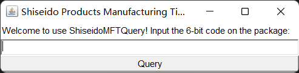


## 菜单组件

前面讲解了如果构建 GUI 界面，其实就是把一些 GUI 的组件，按照一定的布局放入到容器中展示就可以了。在实际开发中，除了主界面，还有一类比较重要的内容就是菜单相关组件，可以通过菜单相关组件很方便的使用特定的功能，在 AWT 中，菜单相关组件的使用和之前学习的组件是一模一样的，只需要把菜单条、菜单、菜单项组合到一起，按照一定的布局，放入到容器中即可。

下表中给出常见的菜单相关组件：

| 类名             | 说明                                                                 |
| ---------------- | -------------------------------------------------------------------- |
| MenuBar          | 菜单条，菜单的容器                                                   |
| Menu             | 菜单组件，菜单项的容器。它也是 Menultem 的子类，所以可作为菜单项使用 |
| PopupMenu        | 上下文菜单组件（右键菜单组件）                                       |
| Menultem         | 菜单项组件                                                           |
| CheckboxMenuItem | 复选框菜单项组件                                                     |

下图是常见菜单相关组件集成体系图：

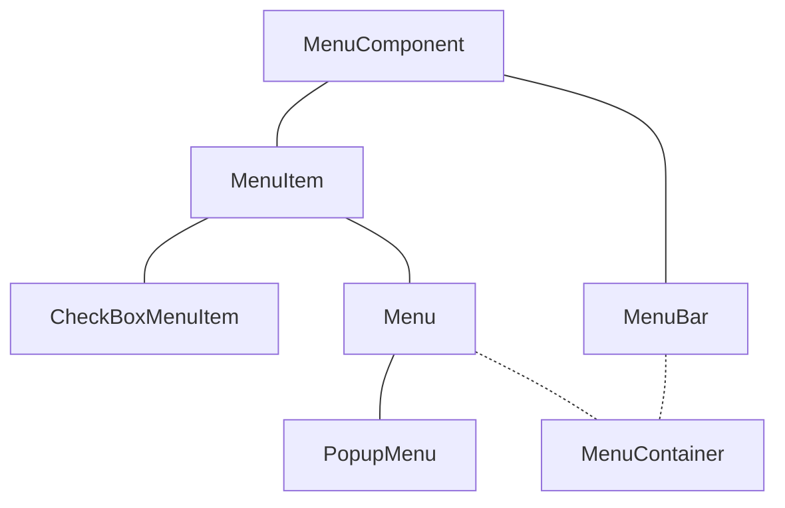

菜单相关组件使用步骤：

1. 准备菜单项组件，这些组件可以是 MenuItem 及其子类对象。
2. 准备菜单组件 Menu 或者 PopupMenu（右击弹出子菜单），把第一步中准备好的菜单项组件添加进来。
3. 准备菜单条组件 MenuBar，把第二步中准备好的菜单组件 Menu 添加进来。
4. 把第三步中准备好的菜单条组件添加到窗口对象中显示。

小技巧：

1. 如果要在某个菜单的菜单项之间添加分割线，那么只需要调用 Menu 的 add(new MenuItem("-")) 即可。
2. 如果要给某个菜单项关联快捷键功能，那么只需要在创建菜单项对象时设置即可，例如给菜单项关联 **Ctrl+Shift+Q** 快捷键，只需要 new MenuItem("菜单项名字", new MenuShortcut(KeyEvent.VK_Q, true))。

演示：制作简单的带有各种菜单的界面

```java
import java.awt.*;
import java.awt.event.*;

public class Demo {
    private Frame frame = new Frame("Menu Build");

    // 创建菜单条组件
    private MenuBar menuBar = new MenuBar();

    // 创建文件菜单组件
    private Menu m1 = new Menu("Menu 1");
    private Menu m2 = new Menu("Menu 2");
    private Menu m3 = new Menu("Menu 3");

    // 创建菜单项
    private MenuItem mi1 = new MenuItem("MenuItem 1");
    private MenuItem mi2 = new MenuItem("MenuItem 2");
    private MenuItem mi3 = new MenuItem("MenuItem 3");

    // 关联快捷键
    private MenuItem mi4 = new MenuItem("MenuItem 4 ", new MenuShortcut(KeyEvent.VK_A, true));
    private MenuItem mi5 = new MenuItem("MenuItem 5");

    // 创建一个文本域
    private TextArea ta = new TextArea(6, 40);

    // 创建 PopupMenu 菜单
    private PopupMenu popupMenu = new PopupMenu();

    // 创建菜单项
    private MenuItem mip1 = new MenuItem("Pop 1");
    private MenuItem mip2 = new MenuItem("Pop 2");
    private MenuItem mip3 = new MenuItem("Pop 3");
    private MenuItem mip4 = new MenuItem("Pop 4");

    public void init() {
        mi4.addActionListener(new ActionListener() {
            @Override
            public void actionPerformed(ActionEvent actionEvent) {
                ta.append("You pressed " + actionEvent.getActionCommand() + "\n");
            }
        });
        frame.addWindowListener(new WindowAdapter() {
            @Override
            public void windowClosing(WindowEvent e) {
                System.exit(0);
            }
        });

        // 把菜单项添加到 PopupMenu 中
        popupMenu.add(mip1);
        popupMenu.add(mip2);
        popupMenu.add(mip3);
        popupMenu.add(mip4);

        // 将弹出式菜单加入文本框
        ta.add(popupMenu);

        // 为 ta 注册鼠标事件
        ta.addMouseListener(new MouseAdapter() {
            @Override
            public void mouseReleased(MouseEvent e) {
                boolean flag = e.isPopupTrigger();
                // 判断当前鼠标操作是不是触发 PopupMenu 的操作
                if (flag) {
                    // 让 PopupMenu 显示在 ta 上，并且跟随鼠标事件发生的地方显示
                    popupMenu.show(ta, e.getX(), e.getY());
                }
            }
        });

        m3.add(mi4);
        m3.add(mi5);

        m2.add(mi1);
        m2.add(mi2);
        m2.add(mi3);
        m2.add(m3);

        menuBar.add(m1);
        menuBar.add(m2);

        frame.setMenuBar(menuBar);
        frame.add(ta);

        frame.pack();
        frame.setVisible(true);
    }

    public static void main(String[] args) {
        new Demo().init();
    }
}
```

效果：

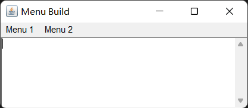

按下快捷键 `Ctrl+Shift+A` 或点击了菜单里的 _MenuItem 4_ 选项后的效果：

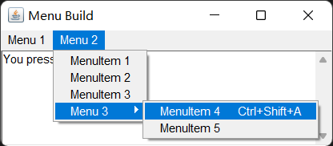

鼠标右击文本框效果：

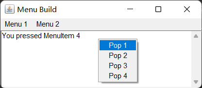

## 绘图与 ImageIO 类

很多程序如各种游戏都需要在窗口绘制各种图形，除此之外，即使在开发 JavaEE 项目时，有时候也必须“动态”的向客户端生成各种图形，图表，比如图形验证码、统计图等，这都需要利用 `AWT` 的**绘图**功能。

之前我们已经学习了很多组件，例如 `Button`、`Frame`、`Checkbox` 等，不同的组件，展示出来的图形都不一样，其实这些组件展示出来的图形，其本质就是用 `AWT` 的绘图来完成的。

在 `AWT` 中，真正提供绘图功能的是 `Graphics` 对象，那么 `Component` 组件和 `Graphics` 对象存在什么关系，才能让 `Component` 绘制自身图形呢？

在 `Component` 类中，提供了下列三个方法来完成组件图形的绘制与刷新：

| 方法名                  | 说明                           |
| ----------------------- | ------------------------------ |
| void paint(Graphics g)  | 绘制组件的外观                 |
| void update(Graphics g) | 内部调用 paint()，刷新组件外观 |
| void repaint()          | 调用 update()，刷新组件外观    |

组件绘制图形流程图：

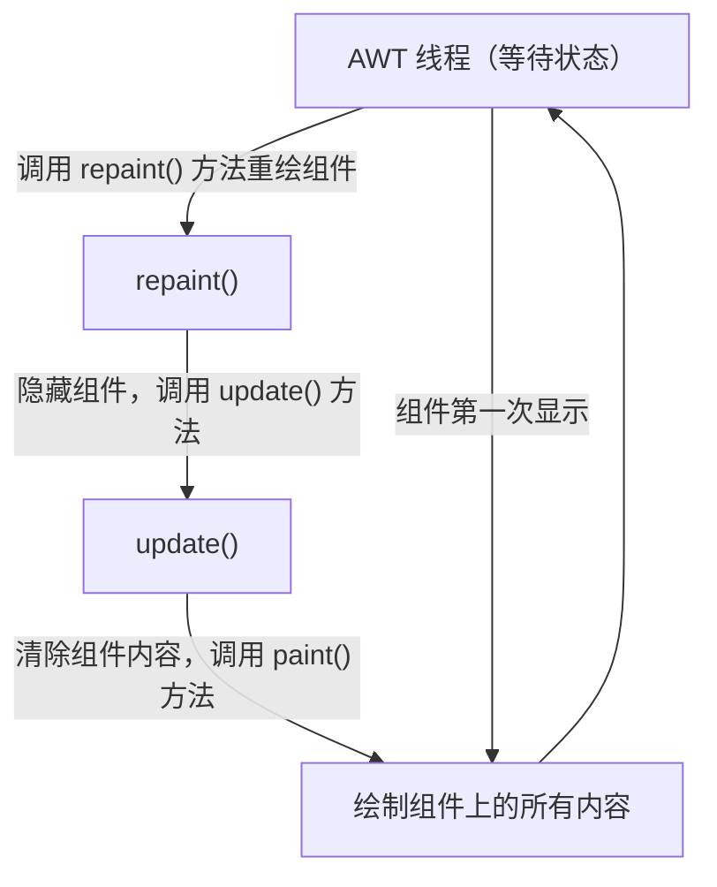

一般情况下， `update()` 和 `paint()` 是由 AWT 系统负责调用，如果程序要希望系统重新绘制组件，可以调用 `repaint()` 完成。

AWT 中提供了 `Canvas` 类充当画布，提供了 `Graphics` 类来充当画笔，通过调用 `Graphics` 对象的 `setColor()` 方法可以给画笔设置颜色。

画图的步骤：

1. 自定义类，继承 Canvas 类，重写 paint(Graphics g) 方法完成画图。
2. 在 paint() 内部，真正开始画图之前调用 Graphics 对象的 setColor()，setFont() 等方法设置画笔颜色，字体等属性。
3. 调用 Graphics 画笔的 drawXxx() 方法开始画图。

下面列出 Graphics 类中常用的一些方法：

| 方法名                  | 说明                   |
| ----------------------- | ---------------------- |
| void setColor(Color c)  | 颜色设置               |
| void setFont(Font font) | 字体设置               |
| void drawLine()         | 绘制直线               |
| void drawRect()         | 绘制矩形               |
| void drawRoundRect()    | 绘制圆角矩形           |
| void drawOval()         | 绘制椭圆形             |
| void drawPolygon()      | 绘制多边形             |
| void drawArc()          | 绘制圆弧               |
| void drawPolyline()     | 绘制折线               |
| void fillRect()         | 填充矩形区域           |
| void fillRoundRect()    | 填充圆角矩形区域       |
| void fillOval()         | 填充椭圆区域           |
| void fillPolygon()      | 填充多边形区域         |
| void fillArc()          | 填充圆弧对应的扇形区域 |
| void drawImage()        | 绘制位图               |

演示：使用 `AWT` 绘图 API 在窗口画出圆和矩形。

```java
import java.awt.*;
import java.awt.event.*;

public class Demo {
    Frame frame = new Frame("Graphics Build");
    Button dRect = new Button("Draw a rectangle");
    Button dOval = new Button("Draw an oval");
    Panel p = new Panel();

    final String RECT_SHAPE = "rect";
    final String OVAL_SHAPE = "oval";
    String shape = "";

    class DraftCanvas extends Canvas {
        @Override
        public void paint(Graphics g) {
            if (shape.equals(RECT_SHAPE)) {
                g.setColor(Color.BLACK);
                g.drawRect(75, 30, 150, 100);
            } else if (shape.equals(OVAL_SHAPE)) {
                g.setColor(Color.BLACK);
                g.drawOval(75, 30, 150, 100);
            }
        }
    }

    DraftCanvas draft = new DraftCanvas();

    public void init() {
        dRect.addActionListener(new ActionListener() {
            @Override
            public void actionPerformed(ActionEvent e) {
                shape = RECT_SHAPE;
                draft.repaint();
            }
        });
        dOval.addActionListener(new ActionListener() {
            @Override
            public void actionPerformed(ActionEvent e) {
                shape = OVAL_SHAPE;
                draft.repaint();
            }
        });

        p.add(dRect);
        p.add(dOval);
        frame.add(p, BorderLayout.SOUTH);

        draft.setPreferredSize(new Dimension(300, 300));
        frame.add(draft);
        frame.addWindowListener(new WindowAdapter() {
            @Override
            public void windowClosing(WindowEvent e) {
                System.exit(0);
            }
        });

        frame.pack();
        frame.setVisible(true);
    }

    public static void main(String[] args) {
        new Demo().init();
    }
}
```

绘制矩形效果：

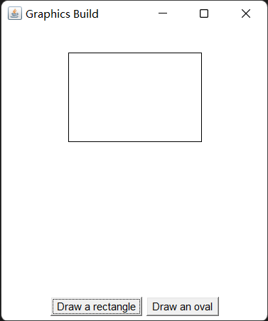

绘制椭圆效果：

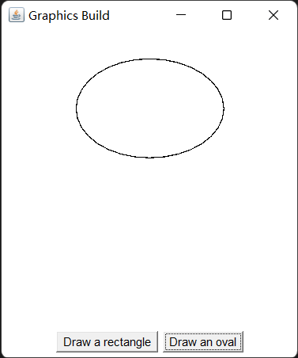

如果仅仅绘制简单的几何图形，程序的效果依旧比较单调。AWT 也允许在组建上绘制**位图**， `Graphics` 提供了 `drawImage(Image image)` 方法用于绘制位图，该方法需要一个 `Image` 参数代表位图，通过该方法就可以绘制出指定的位图。

位图使用步骤：

1. 创建 Image 的子类对象 BufferedImage(int width, int height, int ImageType)，创建时需要指定位图的宽高及类型属性，此时相当于在内存中生成了一张图片。
2. 调用 BufferedImage 对象的 getGraphics() 方法获取画笔，此时就可以往内存中的这张图片上绘图了，绘图的方法和之前学习的一模一样。
3. 调用组件 paint() 中提供的 Graphics 对象的 drawImage() 方法，一次性的内存中的图片 BufferedImage 绘制到特定的组件上。

使用位图来绘制组件，相当于实现了图的缓冲区，此时绘图时没有直接把图形绘制到组件上，而是先绘制到内存中的 `BufferedImage` 上，等全部绘制完毕，再一次性的图像显示到组件上即可。

演示：通过 `BufferedImage` 实现一个简单的手绘程序：通过鼠标可以在窗口中画图，右键鼠标可变更画笔颜色。

```java
import java.awt.*;
import java.awt.event.*;
import java.awt.image.*;

public class Demo {
    Frame frame = new Frame("Digital Plate Lite");

    PopupMenu colorMenu = new PopupMenu();
    MenuItem blackItem = new MenuItem("Black");
    MenuItem redItem = new MenuItem("Red");
    MenuItem blueItem = new MenuItem("Blue");

    Color nowColor = Color.BLACK;
    final int AREA_WIDTH = 500;
    final int AREA_HEIGHT = 400;
    BufferedImage image = new BufferedImage(AREA_WIDTH, AREA_HEIGHT, BufferedImage.TYPE_INT_RGB);
    Graphics g = image.getGraphics();

    class MyCanvas extends Canvas {
        @Override
        public void paint(Graphics g) {
            g.drawImage(image, 0, 0, null);
        }
    }

    MyCanvas drawArea = new MyCanvas();
    int preX = -1;
    int preY = -1;

    public void init() {
        ActionListener listener = new ActionListener() {
            @Override
            public void actionPerformed(ActionEvent e) {
                String actionCommand = e.getActionCommand();
                switch (actionCommand) {
                    case "Black":
                        nowColor = Color.BLACK;
                        break;
                    case "Red":
                        nowColor = Color.RED;
                        break;
                    case "Blue":
                        nowColor = Color.BLUE;
                        break;
                }
            }
        };
        drawArea.addMouseMotionListener(new MouseMotionAdapter() {
            @Override
            public void mouseDragged(MouseEvent e) {
                if (preX > 0 && preY > 0) {
                    g.setColor(nowColor);
                    g.drawLine(preX, preY, e.getX(), e.getY());
                }
                preX = e.getX();
                preY = e.getY();
                drawArea.repaint();
            }
        });

        blackItem.addActionListener(listener);
        redItem.addActionListener(listener);
        blueItem.addActionListener(listener);
        colorMenu.add(blackItem);
        colorMenu.add(redItem);
        colorMenu.add(blueItem);

        drawArea.add(colorMenu);
        drawArea.addMouseListener(new MouseAdapter() {
            @Override
            public void mouseReleased(MouseEvent e) {
                boolean popupTrigger = e.isPopupTrigger();
                if (popupTrigger) {
                    colorMenu.show(drawArea, e.getX(), e.getY());
                }
                preX = -1;
                preY = -1;
            }
        });
        g.setColor(Color.white);
        g.fillRect(0, 0, AREA_WIDTH, AREA_HEIGHT);

        drawArea.setPreferredSize(new Dimension(AREA_WIDTH, AREA_HEIGHT));
        frame.add(drawArea);
        frame.addWindowListener(new WindowAdapter() {
            @Override
            public void windowClosing(WindowEvent e) {
                System.exit(0);
            }
        });

        frame.pack();
        frame.setVisible(true);
    }

    public static void main(String[] args) {
        new Demo().init();
    }
}
```

效果：


在实际生活中，很多软件都支持打开本地磁盘已经存在的图片，然后进行编辑，编辑完毕后，再重新保存到本地磁盘。如果使用 `AWT` 要完成这样的功能，那么需要使用到 `ImageIO` 这个类，可以操作本地磁盘的图片文件。

| 方法名                                                                 | 说明                                             |
| ---------------------------------------------------------------------- | ------------------------------------------------ |
| static BufferedImage read(File input)                                  | 读取本地磁盘图片文件（所传参数为一个 File 对象） |
| static BufferedImage read(InputStream input)                           | 读取本地磁盘图片文件（所传参数为输入流）         |
| static boolean write(RenderedImage im, String formatName, File output) | 往磁盘中输出图片文件                             |

演示：编写图片查看程序，支持另存操作。

```java
import java.awt.*;
import java.awt.event.*;
import java.awt.image.*;

import java.io.*;

import javax.imageio.ImageIO;

public class Demo {
    private Frame frame = new Frame("PicViewer");
    MenuBar menuBar = new MenuBar();
    Menu menu = new Menu("File");
    MenuItem open = new MenuItem("Open");
    MenuItem save = new MenuItem("Save as");
    BufferedImage image;

    private class MyCanvas extends Canvas {
        @Override
        public void paint(Graphics g) {
            g.drawImage(image, 0, 0, null);
        }
    }

    MyCanvas drawArea = new MyCanvas();

    public void init() throws Exception {
        open.addActionListener(e -> {
            FileDialog fileDialog = new FileDialog(frame, "Open the picture file", FileDialog.LOAD);
            fileDialog.setVisible(true);
            String dir = fileDialog.getDirectory();
            String fileName = fileDialog.getFile();
            try {
                image = ImageIO.read(new File(dir, fileName));
                drawArea.repaint();
            } catch (IOException ex) {
                ex.printStackTrace();
            }
        });
        save.addActionListener(e -> {
            FileDialog fileDialog = new FileDialog(frame, "Save the picture file", FileDialog.SAVE);
            fileDialog.setVisible(true);
            String dir = fileDialog.getDirectory();
            String fileName = fileDialog.getFile();
            try {
                ImageIO.write(image, "JPEG", new File(dir, fileName));
            } catch (IOException ex) {
                ex.printStackTrace();
            }
        });
        menu.add(open);
        menu.add(save);
        menuBar.add(menu);
        frame.setMenuBar(menuBar);
        frame.add(drawArea);
        frame.setBounds(200, 200, 740, 508);
        frame.setVisible(true);
        frame.addWindowListener(new WindowAdapter() {
            @Override
            public void windowClosing(WindowEvent e) {
                System.exit(0);
            }
        });
    }

    public static void main(String[] args) throws Exception {
        new Demo().init();
    }
}
```

效果：


## Java FX 体系

实际上，无论是 AWT 还是 Swing 体系，它们都已经很久没有更新过了。可以说，它们已经被 Oracle 放弃了。

本来 Java 是一门跨平台、多用途的语言，但后来 Oracle 却认为 Java 只适合用于服务端开发，不适合面向消费级用户。因此，Java 的 GUI 算是没落了，毕竟服务端要什么好看界面，性能高最重要（多线程的强大支持）。直到 Java FX 的出现，它拥有一个重要的特性——支持 Webview，这意味着 Java FX 是真正现代的、强大的 GUI 体系。当然并不是说 AWT 和 Swing 体系不好，它们都比 Java FX 更接近底层，性能上还是不弱的。IntelliJ IDEA 的界面就是使用 Swing 编写的。

如果想要使用 Java 开发消费级应用，Java FX 的学习是不可避免的。本文档受限于篇幅，不再展开来讲。
