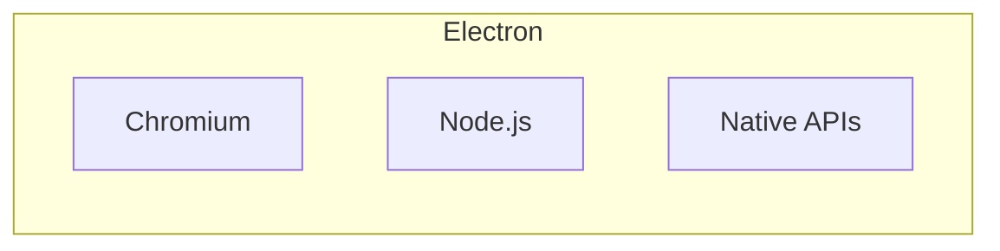
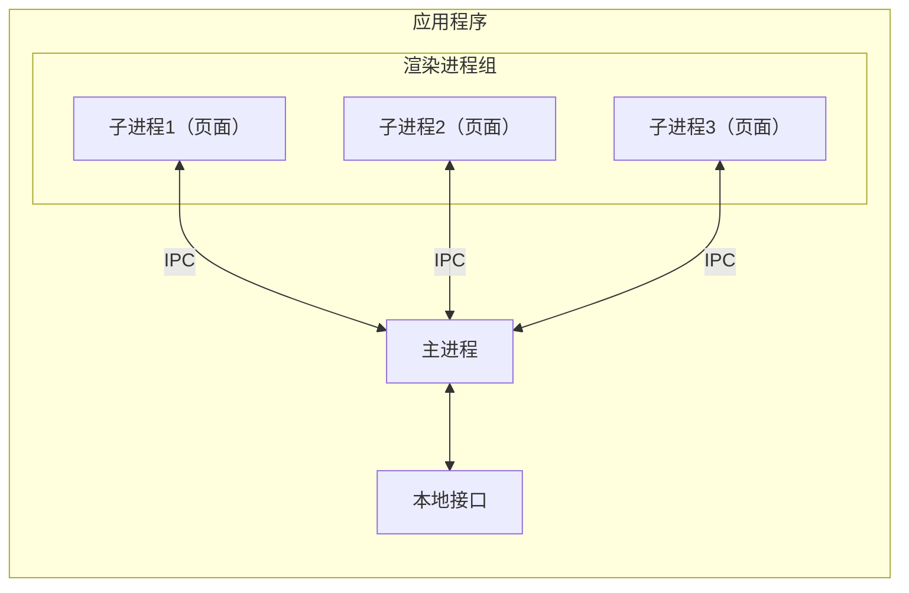
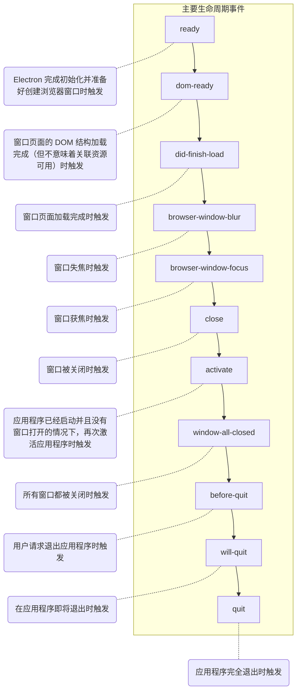
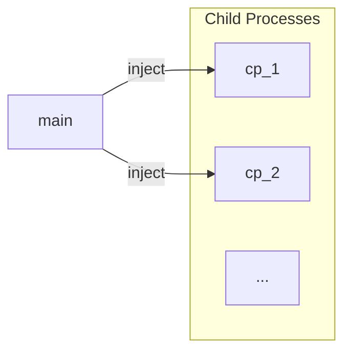
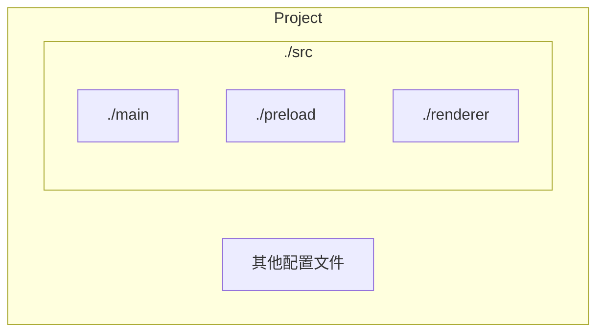

# Electron 基础

:::tip
阅读本章需要读者有过含 GUI 的应用程序设计经验，如主导过 JFX 或 QT 项目。
:::

:::warning
Electron 本身不支持 ESM，只支持 CJS。为了贯彻 ESM，本文档默认使用支持 ESM 的 TS 进行主进程开发。
:::

:::warning
Electron 迭代非常快！今天还正确的文档，可能明天就变成了错误！一切以官方文档为准！
:::

Electron.js 是一款~~由米哈游开发的~~跨平台前后端统一框架，开发者只需要会 JavaScript，就可以开发出一个桌面级应用程序。下图展示了 Electron 的大致组成：



Chromium 使我们可以使用 HTML + CSS + JS 设计用户界面（亦可以结合 Vue）；Node.js 提供了强大的扩展，方便我们实现复杂功能；本地接口让我们能与系统通信，从而真正开发应用程序。

Electron 的官方文档：<https://www.electronjs.org/zh/docs/latest/>

## 基本知识

**一个应用程序只有一个主进程。** 主进程并非严格的一个文件，而是逻辑上程序的主体。主进程负责解析各种引用、调度等等等等。子进程想调用本地接口（和 Node.js 包）必须借助主进程。

窗口中展示的界面通过**渲染进程**表现。一个应用可以有多个渲染进程。



## 初次构建

由于 Electron 基于 Node.js，所以我们要先创建一个 Node.js 工程：

```txt
npm init
```

配置 package.json 的入口（并确保入口可用）和启动方式：

```json
{
  "description": "打包时是必须填写的，现在可以先不管",
  "main": "dist/main.js",
  "scripts": {
    "start": "tsc ./main.ts --outDir ./dist --sourceMap true & electron ."
  },
  "author": "打包时是必须填写的，现在可以先不管"
}
```

再安装 Electron 包（**下载 Chromium 将会花费很长时间！**）：

```txt
npm i typescript -D# 如果有全局的 TS 包，就不用装了
npm i electron -D
```

配置 main.ts：

```ts
// 导入 app 对象和 BrowserWindow 对象
import { app, BrowserWindow } from "electron";

// 创建函数：实例化“浏览器窗口”，并调用“载入链接”方法。createWindow 和 entity 可以随意命名
const createWindow = () => {
  const entity = new BrowserWindow({
    width: 1280,
    height: 720,
  });
  entity.loadURL("https://penyoofficial.github.io/blog/"); // 也可以用 loadFile() 载入本地文件
};

// whenReady() 包装了对应用加载状态的监听
// 当 app 加载完毕时，就（Promise.then()）加载窗口
app.whenReady().then(() => {
  createWindow();
});
```

执行以启动：

```txt
npm run start
```

## 应用生命周期

一个 Electron 应用的生命周期如下图：



我们可以对这些事件注册监听，在这些事件发生后指定指定操作。如：

```ts
const createWindow = () => {
  let entity = new BrowserWindow({
    width: 1280,
    height: 720,
  });

  entity.loadFile("./index.html");

  // 当窗口页面加载完成时输出一句话
  entity.webContents.on("did-finish-load", () => {
    console.log("最喜欢的一集！");
  });
};

// 一般不这么写，因为这具有风险。推荐使用 whenReady()
app.on("ready", createWindow);

// window-all-closed 默认会调起 before-quit、will-quit、quit 三个事件
// 但显式地不指定调用，就不会调用
app.on("window-all-closed", () => {
  console.log("最抽象的一集。");
  // app.quit()
});
```

## 小技巧

- 利用 Nodemon

  为了提高开发效率（避免把时间浪费在构建的部署上），我们可以使用 nodemon 来监视我们的源文件——一旦变化就自动更新其到内存中：

  ```txt
  npm i nodemon -D
  ```

  设置脚本，监视 TS 文件：

  ```json
  "dev": "nodemon --watch ./*.ts --exec npm run start"
  ```

- 更自然的交互

  窗口一旦就绪，就会立即显示。如果我们的网页碰巧需要一定时间才能显现，就会出现**白屏**现象。为了避免这种情况，我们可以设置窗口默认不显示，当窗口内容就绪后才显示：

  ```ts
  import { app, BrowserWindow } from "electron";

  const createWindow = () => {
    const entity = new BrowserWindow({
      width: 1280,
      height: 720,
      show: false,
    });
    entity.loadURL("https://penyoofficial.github.io/blog/");

    // did-finish-load 在网页加载完成后立即触发，ready-to-show 在窗口准备好显示给用户时触发。通常情况下，did-finish-load 会先于 ready-to-show 被触发。
    entity.on("ready-to-show", () => {
      entity.show();
    });
  };

  app.whenReady().then(() => {
    createWindow();
  });
  ```

  :::tip
  `BrowserWindow` 到底能接受多少参数？[官方文档](https://www.electronjs.org/zh/docs/latest/api/browser-window#new-browserwindowoptions)非常详细地列出来了，还挺多的。
  :::

  在等待的这段时间内，你可以添加另一个本地化的窗口作为启动窗口（_frame=false_）。

- 客制化组件和主要信息

  Electron 创建的窗口默认带有顶部菜单栏，我们可能不是很想要它。可以向 `BrowserWindow` 构造器传达参数：

  ```ts
  new BrowserWindow({
    autoHideMenuBar: true,
  });
  ```

  想让窗口拥有指定的图标（左上角）和标题？

  ```ts
  new BrowserWindow({
    icon: "some uri",
    title: "some text",
  });
  ```

## 渲染进程提权

Electron 很强大的一点就在于，能让浏览器页面使用 Node.js 的能力，从而实现更多*不安全的*功能。但之前已经提到，渲染进程不能直接引用 Node.js 包或者操作 Native APIs，而是必须通过主进程。

在早期版本中，Electron 还没有将**沙盒化**的概念引入，渲染进程可以（在设置 _nodeIntegration=true_ 后）直接 require 其它模块。20 版本后，一般只通过**预加载脚本**或**进程间通讯（IPC）** 来为其提权。这里重点介绍第一种方法。

举个例子，我希望前端能够操纵系统的音量，_loudness_ 包可以帮我们实现。

这里就不能在 HTML 页面所用的 JS 里导入，无论是使用 CJS 还是 ESM 都会显示未定义。而是要在 _preload.ts_ 里导入再导出：

```ts
import { contextBridge } from "electron"; // 桥接模块
import { getVolume, setVolume } from "loudness";

// 暴露全局对象给前端 JS。你当然也可以直接把整个 loudness 模块暴露，但在某些情况下并不安全
contextBridge.exposeInMainWorld("loudness", {
  getVolume: getVolume, // 一般建议换个名字或者再包装一层以限制参数
  setVolume: setVolume,
});
```

main.ts 里再设置一下：

```ts
import { app, BrowserWindow } from "electron";
import * as path from "path";

const createWindow = () => {
  const entity = new BrowserWindow({
    width: 1280,
    height: 720,
    webPreferences: {
      sandbox: false, // 禁用沙盒化（危险！）
      preload: path.join(__dirname, "./dist/preload.js"), // 预载绝对路径下的脚本
    },
  });
  entity.loadFile("./index.html");
};

app.whenReady().then(() => {
  createWindow();
});
```

页面可载入的 index.js：

```js
window.addEventListener("DOMContentLoaded", async () => {
  // DOM 结构可用后
  const vc = document.querySelector("#volume-changer"); // input[type="range"]
  vc.value = await loudness.getVolume(); // 亦可作 window.loudness.member
  document.querySelector("#volume-changer").addEventListener("input", () => {
    loudness.setVolume(Math.round(vc.value));
  });
});
```

另一种思路就是主进程实时获得前端滑块的值，由主进程来设置系统音量。这就要涉及到进程间通信，需要使用 Electron 的 `ipcMain` 模块和 `ipcRenderer` 模块。由于它非常重要，所以我们留到之后再介绍。

## 进程间通信

在前面的学习中，我们已经了解主进程如何利用预加载脚本向渲染进程注入全局对象以变相实现提权：



这被认为是安全的，因为页面上*可能*有来自外部的危险 JS 代码。一旦它们被执行，且能够很方便地控制*关键*包或接口，用户的终端就会暴露在危险之中。所以我们指定能用的范围，并通过隔离注入的方式提供给前端，就在功能性和安全之间找到了平衡。

但预加载脚本只能在一开始提供一些信息。如果页面在之后产生了一些信息，需要**复杂处理**，就必须设法使主进程和渲染进程通讯。常见的通讯可以被分为这四类：

| 类型                           | 方式                                                                                    |
| ------------------------------ | --------------------------------------------------------------------------------------- |
| 渲染进程**单向**发给主进程     | 子进程使用 `ipcRenderer.send()` 发送<br>主进程使用 `ipcMain.on()` 接收                  |
| 主进程**单向**发给渲染进程     | 主进程使用 `BrowserWindow.webContent.send()` 发送<br>子进程使用 `ipcRenderer.on()` 接收 |
| 渲染进程与主进程间**双向**通讯 | 子进程使用 `ipcRenderer.invoke()`<br>主进程使用 `ipcMain.handle()`                      |
| 渲染进程间通讯                 | 需要借助主进程作为代理或使用 `MessagePort`                                              |

:::tip
Q：我明明可以在预加载脚本里向前端注入各种需要的模块，为什么还要转移到后端处理？这不是多此一举吗？

A：在 Electron 的文档中有这样一段话：

..._附属于沙盒化的渲染进程的 preload 脚本中仍可使用一部分以 Polyfill 形式实现的 Node.js API。 有一个与 Node 中类似的 `require` 函数提供了出来，但只能载入 Electron 和 Node 内置模块的一个子集_...

这表示其实 preload 并不是万能的，它不足以完全访问 Node.js 或 Electron API。如要进行一些原生操作（如 `fs`），就必须转移到主进程中进行。

我们在之前的演示中，是通过**禁用沙盒化**来达到随意引用的目的的，这牺牲了安全性换取功能性。否则必须借助 IPC。
:::

:::details 你知道吗：什么是 polyfill？
在早期浏览器中，部分现代特性不能被支持，我们给其添加的“补丁”就被称为 polyfill。即在效果上实现了一个 API，但内部可能完全不是那么回事。
:::

## 与 Vue / Element 一起

Electron 官方提供了*快速开始*引导，我们可以在引导中选择集成时兴的前端框架：

```txt
npm init @quick-start/electron
```

初始化后，我们可以得到以下文件目录树（核心部分）：



我们只关心 _./src_ 里的内容：_main_ 表示 Electron 项目的主进程，_./preload_ 表示预加载脚本，_./renderer_ 表示渲染器，这块“外包”给 Vue 了。项目启动时，会先启动 Vite，使页面暴露到 5173 端口；然后 Electron 会来监听该端口，并渲染出来。

如果需要使用 Element，推荐[自动导入](https://element-plus.org/zh-CN/guide/quickstart.html#%E8%87%AA%E5%8A%A8%E5%AF%BC%E5%85%A5-%E6%8E%A8%E8%8D%90)。对于部分短生命周期的组件，可能需要[额外配置](https://blog.csdn.net/Delete_89x/article/details/126430049)。

## 签名、分发与更新

签名可以使应用来源可信。签名需要你[有一份数字证书](https://blog.csdn.net/dounick/article/details/105643285)。在 _package.json_ 里配置：

```json
"build": {
  "publish": {
    "provider": "提供商。如 GitHub、Microsoft Store 等。"
  },
  "win": {
    "publisherName": "你的名称。"
  }
}
```

脚手架已经预装了 Electron Builder，你可以执行来签名：

```txt
npx electron-builder --win -c.win.certificateFile=证书路径 -c.win.certificatePassword=证书密钥
```

在基于脚手架的工程中，可以直接执行 `npm run build:win` 来获得适用于 Windows 系统的安装包（在 _./dist_ 里）。

自动更新需要配置 _package.json>build.publish.url_ 为发行地址，并在 _main.ts_ 里为应用启动设置监听：调用 `autoUpdate.setFeedURL()`，再根据[不同的事件](https://www.electronjs.org/zh/docs/latest/api/auto-updater#%E4%BA%8B%E4%BB%B6)来选择策略。
