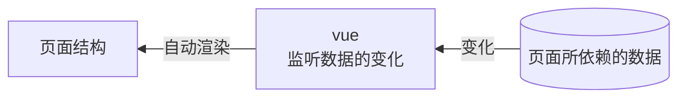
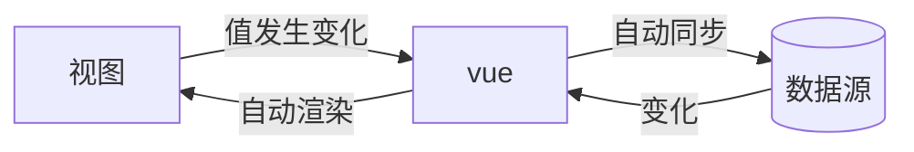
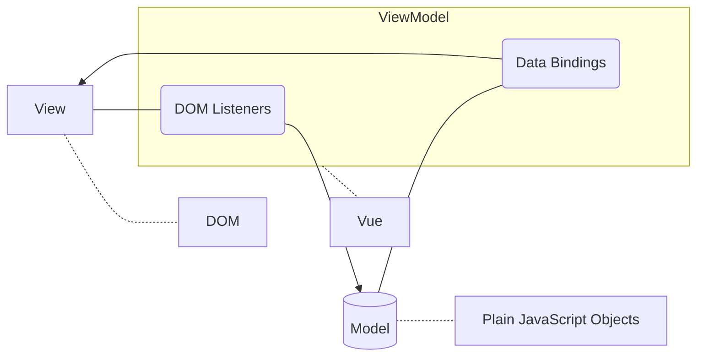
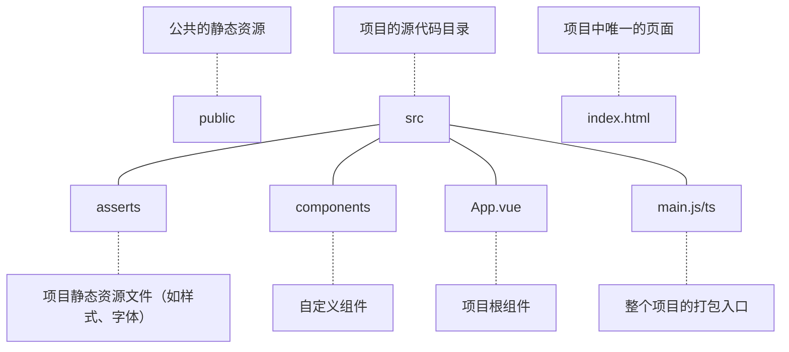
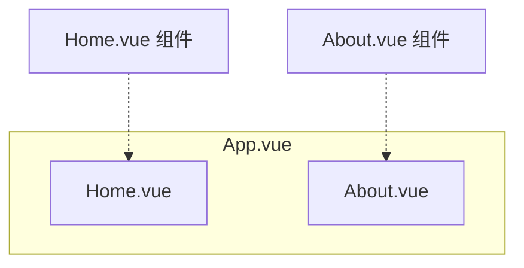
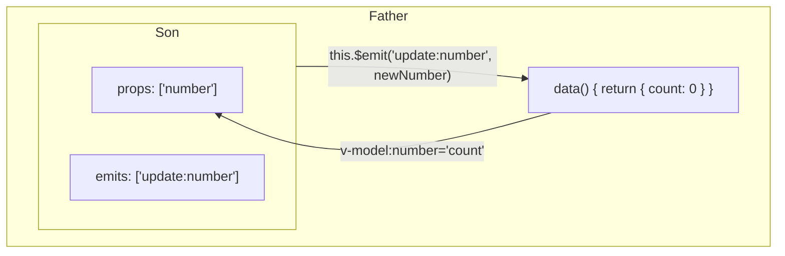

# Vue 基础

Vue 是一个基于 Node.js 的前端框架，提供了一套**声明式的、组件化的**编程模型，帮助我们高效地开发用户界面。

在传统的 Web 前端开发中，是基于 **jQuery + 模板引擎**的方式来构建用户界面的。但是需要我们定义大量的模板结构；缺少语法高亮和智能提示；数据变化时需要重新调用模板编译的函数，否则页面结构不会更新。

jQuery 虽然帮我们解决了 DOM 操作的兼容性问题，却仍然很麻烦。我们还是需要把大量时间浪费在 DOM 操作而非业务核心上。

而 Vue 解决了以上痛点，为开发者提供了一整套解决方案：

- Vue 核心库
- Vue Router（路由方案）
- ~~Vuex~~ / Pinia（状态管理方案）
- Vue 组件库

以及辅助 Vue 项目开发的一系列工具：

- ~~Vue Cli~~（一键生成基于 webpack 的工程化 Vue 项目）
- Vite（一键生成小型工程化 Vue 项目）
- Vue Devtools（浏览器插件：辅助调试）
- ~~Vetur~~ / Volar（VS Code 插件，提供语法高亮和智能提示）

开发时可以多多参考[官方文档](https://cn.vuejs.org/guide/introduction.html)。

## MVVM

在使用了 vue 的页面中，vue 会**监听数据的变化**，从而**自动**重新渲染数据的结构：



**数据驱动视图**的数据流是**单向**的，即影响只能从右向左传播。若页面结构发生变化，页面依赖数据并不会同步。

但在有些场景中，我们希望当页面上的数据改变时，数据源也能随之改变（反之亦然），这就需要引入**双向数据绑定**。



这样我们就不用手动获取 DOM 元素的值了，vue 会自动帮我们生成。

**MVVM** 是 vue 实现数据驱动视图和双向数据绑定的核心原理。它把每个 HTML 页面都拆分成如下三个部分：



## 以插件方式引入

:::warning
这种方式构建的项目非 [SPA](#spa) 项目。
:::

在原生 HTML 代码头部嵌入（其中一个）：

```html
<!-- Vue 2 -->
<script src="https://cdn.jsdelivr.net/npm/vue@2/dist/vue.js"></script>
<!-- Vue 3 -->
<script src="https://unpkg.com/vue@3/dist/vue.global.js"></script>
```

正文中添加：

```html
<div id="app">
  {{ message }}
  <!-- 插值表达式 -->
</div>
```

插件中添加：

```js
// Vue 2
let appV2 = new Vue({
  el: "#app",
  data: {
    message: "Hello Vue! ",
  },
});

// Vue 3，下面的演示全部使用 Vue 3
let appV3 = Vue.createApp({
  data() {
    return {
      message: "Hello Vue!",
    };
  },
}).mount("#app");
```

我们就在页面中看到 _Hello Vue!_ 了。

在 Vue 实例中，_el_ 属性/_mount_ 方法用于指定**挂载点**。其值是一个单元素选择器（_querySelector_），一般是 id 选择器，辐射范围是命中元素及其后代元素。特别的，不能挂在 `<html>` 或 `<body>` 上。_data_ 属性/函数用于存放数据，可以存放不止一个、复杂的数据。

## Vue 指令

:::tip
**指令**（directives）是 vue 为开发者提供的模板语法，用于辅助开发者渲染页面的基本结构。按照用途可以划分成六类：

1. 内容渲染：v-text、\{\{ \}\}、v-html...
2. 属性绑定：v-bind（:）
3. 事件绑定：v-on（@）
4. 双向绑定：v-model
5. 条件渲染：v-if、v-else、v-else-if、v-show
6. 列表渲染：v-for

:::

除了用**插值表达式**为数据占位，还可以使用 `v-text` ，它会填充一个元素的文本内容（innerText）：

```html
<div id="msg" v-text="msg+'！'"></div>
<!-- 模仿差值表达式的拼接，加了一个全角感叹号 -->
<script>
  let app = Vue.createApp({
    data() {
      return {
        msg: "娇宝我真的好喜欢你啊",
      };
    },
  }).mount("#msg");
</script>
```

如果只是想修改而不是覆盖，则需要使用插值表达式。如果想要更底层的修改，可以使用 `v-html`，它设置了元素的 HTML 代码（innerHTML）。

Vue 还提供了许多形如 _v-xxx_ 的指令，你可以在官方文档中查阅。

### 案例：事件监听

:::tip
_$event.target_ 表示显式事件源。未向函数传参时，函数仍可接收隐式事件 _e_。
:::

设计一些按钮，按动它们时触发 vue 实例**值改动**并**改变位置**的事件。

```html
<!doctype html>
<html lang="zh">
  <head>
    <meta charset="UTF-8" />
    <meta http-equiv="X-UA-Compatible" content="IE=edge" />
    <meta name="viewport" content="width=device-width, initial-scale=1.0" />
    <title>事件监听</title>
    <script src="https://unpkg.com/vue@3/dist/vue.global.js"></script>
  </head>

  <body>
    <div id="app">
      <p>您点了{{ time }}次</p>
      <button @click="addAndMove(1, $event)">+1</button>
    </div>
  </body>
  <script>
    let app = Vue.createApp({
      data() {
        return {
          time: 0,
        };
      },
      methods: {
        addAndMove(num, e) {
          this.time += num;
          e.target.style.cssText +=
            "margin-left: " +
            Math.random() * 100 +
            "px; " +
            "margin-top: " +
            Math.random() * 100 +
            "px";
        },
      },
    }).mount("#app");
  </script>
</html>
```

### 案例：单向与双向绑定

:::tip
`v-model` 是对作用在表单上的 `v-bind` 和 `v-on` 的集成。
:::

设计一个含两个表单元素的页面，一个数据单向绑定，另一个数据双向绑定，两个元素的 _value_ 属性共通。

```html
<!doctype html>
<html lang="zh">
  <head>
    <meta charset="UTF-8" />
    <meta http-equiv="X-UA-Compatible" content="IE=edge" />
    <meta name="viewport" content="width=device-width, initial-scale=1.0" />
    <title>单向与双向绑定</title>
    <script src="https://unpkg.com/vue@3/dist/vue.global.js"></script>
  </head>

  <body>
    <div id="app">
      单向绑定：<input type="text" :value="publicText" /><br />
      双向绑定：<input type="text" v-model="publicText" />
      <p>您输入的是：{{ publicText }}</p>
    </div>
  </body>
  <script>
    let app = Vue.createApp({
      data() {
        return {
          publicText: "nothing",
        };
      },
    }).mount("#app");
  </script>
</html>
```

### 案例：条件渲染

:::tip
`v-if` 接收布尔值或表达式，为真时表示渲染（_create_），为假时表示不渲染（_remove_）。**切换开销较大。**

`v-show` 接收布尔值或表达式，为真时表示显示（_display: block_），为假时表示隐藏（_display: none_）。**初始渲染开销较大。**
:::

设计 CET 评级计算器，用户输入分数得到评级。

```html
<!doctype html>
<html lang="zh">
  <head>
    <meta charset="UTF-8" />
    <meta http-equiv="X-UA-Compatible" content="IE=edge" />
    <meta name="viewport" content="width=device-width, initial-scale=1.0" />
    <title>CET 评级计算器</title>
    <script src="https://unpkg.com/vue@3/dist/vue.global.js"></script>
  </head>

  <body>
    <div id="app">
      分数：<input
        type="text"
        placeholder="请输入分数"
        v-model.number="score"
        @change="isOriginal = false"
      />
      <div v-show="!isOriginal">
        <div v-if="score <= 710">
          <p v-if="score >= 605">评级：A</p>
          <p v-else-if="score >= 515">评级：B</p>
          <p v-else-if="score >= 425">评级：C</p>
          <p v-else-if="score >= 0">评级：D</p>
        </div>
        <p v-else>你在输入什么？</p>
      </div>
    </div>
  </body>
  <script>
    let app = Vue.createApp({
      data() {
        return {
          isOriginal: true,
          score: "",
        };
      },
    }).mount("#app");
  </script>
</html>
```

### 案例：列表渲染

:::tip
`v-for` 提供了循环渲染相似结构的能力，值可以是 _element in array_ 或 _(element, index) in array_ 的形式。它通常配合插值表达式一起使用。
:::

:::tip
`v-for` 常用于渲染列表（或等效于列表的表格行）。当列表的数据变化时，vue 会尽可能复用已存在的 DOM 元素，从而提升渲染的性能。但这种复用会导致有状态（如每一项前面都有一个复选框）的列表无法正常更新（除非我们单独处理状态，如绑定其到一个属性上）。为了阻拦这种复用，需要为每项提供一个唯一的 **key** 属性。

特别的，_index_ 是动态更新的，不能当作 key 使用。
:::

设计用户变长列表，并确保每项状态不紊乱。

```html
<!doctype html>
<html lang="zh">
  <head>
    <meta charset="UTF-8" />
    <meta http-equiv="X-UA-Compatible" content="IE=edge" />
    <meta name="viewport" content="width=device-width, initial-scale=1.0" />
    <title>列表渲染</title>
    <script src="https://unpkg.com/vue@3/dist/vue.global.js"></script>
  </head>

  <body>
    <div id="app">
      <button @click="add()">+ Item</button>
      <ul>
        <li v-for="li in lis" :key="li.id">
          <input type="checkbox" name="checking" />
          {{ li.name }}
        </li>
      </ul>
    </div>
  </body>
  <script>
    let app = Vue.createApp({
      data() {
        return {
          lis: [
            { id: 1, name: "Duan" },
            { id: 2, name: "Dai" },
            { id: 3, name: "Liu" },
            { id: 4, name: "Zheng" },
          ],
        };
      },
      methods: {
        add() {
          this.lis.unshift({ id: this.lis.length, name: "new Item" });
        },
      },
    }).mount("#app");
  </script>
</html>
```

## 修饰符

在事件监听类型的后面可以添加**事件修饰符**来改变一些属性，如 _.prevent_ 等效于 `preventDefault()`。下表展示了 Vue 中所有的事件修饰符，高亮表示较为常用：

| 事件修饰符   | 说明                                             | 注释                                    |
| ------------ | ------------------------------------------------ | --------------------------------------- |
| **.prevent** | 阻止默认行为                                     | 限 `@click` 使用                        |
| **.stop**    | 阻止单击事件向上冒泡                             | 限 `@click`、`@submit` 使用             |
| .capture     | 添加事件监听器时使用捕获模式                     |                                         |
| .self        | 只当事件是从侦听器绑定的元素本身触发时才触发回调 | 限 `@click`、`@dbclick` 使用            |
| .once        | 只触发一次事件                                   | 限 `@click`、`@dbclick`、`@submit` 使用 |
| .passive     | 没有阻止默认行为，但提高了性能                   | 限鼠标滚轮和触摸事件使用                |

特别的（语法糖），如果我们需要快捷判断**键盘按键事件中的按键名**，可以使用**按键修饰符**：

```html
<!-- 按下键且键名为 enter 时触发 funcDemo() -->
<input @keyup.enter="funcDemo" />
```

| 按键修饰符         | 说明                                                                 |
| ------------------ | -------------------------------------------------------------------- |
| `.enter`           | 等同于 `keyCode` 为 `13` 的按键                                      |
| `.tab`             | 等同于 `keyCode` 为 `9` 的按键                                       |
| `.delete` / `.del` | 等同于 `keyCode` 为 `46` 的按键                                      |
| `.esc`             | 等同于 `keyCode` 为 `27` 的按键                                      |
| `.space`           | 等同于 `keyCode` 为 `32` 的按键                                      |
| `.up`              | 等同于 `keyCode` 为 `38` 的按键                                      |
| `.down`            | 等同于 `keyCode` 为 `40` 的按键                                      |
| `.left`            | 等同于 `keyCode` 为 `37` 的按键                                      |
| `.right`           | 等同于 `keyCode` 为 `39` 的按键                                      |
| `.ctrl`            | 需要同时按下 `Ctrl` 并与其他键配合使用，如 _.ctrl.meta.c_            |
| `.alt`             | 需要同时按下 `Alt` 并与其他键配合使用                                |
| `.shift`           | 需要同时按下 `Shift` 并与其他键配合使用                              |
| `.meta`            | 需要同时按下 `Meta`（Windows 徽标键或 Mac 公司键）并与其他键配合使用 |

还有一些普通修饰符：

| 修饰符  | 说明                           | 注释              |
| ------- | ------------------------------ | ----------------- |
| .native | 监听组件根元素的原生事件       |                   |
| .sync   | 双向绑定语法糖                 |                   |
| .lazy   | 延迟更新绑定值（失焦时更新）   | 限 `v-model` 使用 |
| .trim   | 输入框自动过滤首尾空格         | 限 `v-model` 使用 |
| .number | 将输入值转为数字类型           | 限 `v-model` 使用 |
| .camel  | 将短横线命名转为驼峰式命名     |                   |
| .prop   | 指定传递给子组件的属性名       |                   |
| .attr   | 指定传递给子组件的 HTML 属性名 |                   |
| .class  | 绑定 class                     |                   |
| .style  | 绑定 style                     |                   |

## 过滤器\*

:::warning
Vue 3 已废弃过滤器。如需使用，请换用**[计算属性](#计算属性)**（computed）。
:::

**过滤器**（filter）常用于文本的格式化，本质上就是函数。

可在 textContent 或不可视属性中使用：

```html
<!-- 假设若 rawId 为 "abc"，filterDemo 可以将其转换为 "ABC" -->
<p>{{ rawId | filterDemo }}</p>
<div :id="rawId | filterDemo"></div>
```

需要在 Vue 实例中配置 filters 节点：

```js
filters: {
    filterDemo(str) {
        return str.toUpperCase()
    }
}
```

若需要过滤器适用于所有 Vue 实例（全局化），可以使用 `Vue.filter()` 方法：

```js
Vue.filter("filterDemo", (str) => {
  return str.toUpperCase();
});
```

若全局过滤器与私有过滤器重名，则以全局过滤器为准。

过滤器还支持**链式调用**和自定义传参：

```html
<p>{{ rawId | filterDemo1 | filterDemo2(10) }}</p>
```

## SPA

**单页面应用程序**（Single Page Application，SPA）指的是一个 Web 网站中只有一个 HTML 页面，所有的功能和交互都在该页面完成。SPA 仅在页面初始化时加载资源，交互只依靠 JS 而不是重新刷新页面。

SPA 具有三个优点：

- 良好的交互体验
  - 单页应用的内容的改变不需要重新加载整个页面
  - 获取数据通过 AJAX
  - 没有页面间的跳转，不会出现“白屏”
- 良好的前后端工作分离模式
  - 后端专注于提供 API，更利于实现 API 服用
  - 前端专注于页面的渲染，更利于前端工程化的发展
- 减轻服务器压力
  - 服务器只提供数据，不负责页面合成与逻辑的处理，吞吐能力提高

SPA 具有两个缺点：

- 首屏加载慢
  - 但可以通过：路由懒加载、代码压缩、CDN 加速、网络传输压缩 来缓解
- 不利于 SEO（搜索引擎优化）
  - 可以通过：SSR 服务器端渲染 来解决

Vue 提供了两种方式来创建工程化 SPA 项目：

| 特性\\方式       | vite   | vue-cli |
| ---------------- | ------ | ------- |
| 支持的 vue 版本  | vue 3  | vue2/3  |
| 是否基于 webpack | 否     | 是      |
| 运行速度         | 快     | 慢      |
| 功能完整度       | 小而巧 | 大而全  |

## 以 Node.js 模块方式引入

Vue 提供了基于 Vite 的“脚手架”，可以快速构建一个 SPA 项目原型：

```txt
npm init vue@latest
npm i
npm run dev
```

具体的步骤和讲解在[官方文档](https://cn.vuejs.org/guide/quick-start.html#creating-a-vue-application)中。

在最终弹出的终端中选中超链接访问，若能看到 _“Hello, Vue!”_ 或 _“You did it!”_ 则表示构建完成。若需要关闭服务器，删除终端窗口即可。

项目核心文件结构如下：



在工程化项目中，**vue 会通过 _main.js/ts_ 把 _App.vue_ 渲染到 _index.html_ 的指定区域中**。

其中：

- _App.vue_ 用于编写待渲染的**模板结构**
- _index.html_ 中需要预留**数据挂载区**
- _main.js/ts_ 将 _App.vue_ 渲染到 _index.html_ 所预留的区域中

## 组件化开发

**组件化开发**指的是根据**封装**的思想，把页面上可重用的部分封装为**组件**，从而方便项目的开发和维护。

Vue 是一个完全支持组件化开发的框架。Vue 中规定组件的后缀名是 _.vue_。_App.vue_ 就是一个组件。

每个组件由三部分构成：

1. template（必选）：组件的模板结构
2. script（可选）：组件的行为
3. style（可选）：组件的样式

`<template>` 只是包裹性质的，不会被渲染为真正的 DOM 元素：

```vue
<template>
  <!-- 在 Vue 2 中，模板内的所有元素必须被包裹在一个根节点中。Vue 3 取消了该限制 -->
  <h1>Hello, Vue!</h1>
</template>
```

`<script>` 中最好采用 ESM：

```js
export default {
  // 默认导出
  name: "Vue App", // 当前组件的名称
  data() {
    return {
      str: "Vue is super easy to learn.",
    };
  },
  methods: {
    alert(msg) {
      alert(msg);
    },
  },
};
```

组件之间可以**相互引用**：



图示 _App.vue_ 组件**注册**并使用了 _Home.vue_ 和 _About.vue_ 两个组件。**组件必须先被注册才能被引用。**

Vue 中组件注册分为**全局注册**和**局部注册**。全局注册可以在全局任意一个组件里使用，局部注册只能在当前注册的范围内使用。

```js
// 全局注册，在 main.js/ts 里
// 导入组件
import ComponentA from "./components/ComponentA.vue";
import ComponentB from "./components/ComponentB.vue";
// 调用 Vue 实例的 component() 方法
app.component("ComA", ComponentA); // 可以在组件中使用 <ComA></ComA> 了
app.component("ComB", ComponentB); // 你亦可以使用 app.component(ComponentB.name, ComponentB)
```

```js
// 局部注册，在 xxx.vue>script 里
// 导入组件
import ComponentC from "./components/ComponentC.vue";
import ComponentD from "./components/ComponentD.vue";
// 默认导出 components 节点
export default {
  comnponents: {
    ComC: ComponentC, // 可以在组件中使用 <ComC></ComC> 了
    ComponentD, // 可以在组件中使用 <ComponentD></ComponentD> 了
  },
};
```

组件注册命名可以采用**短横线命名法**或**大驼峰命名法**。前者注册和调用的名称必须相同，后者**使用时**却可以任意使用短横线式或大驼峰式。

## 样式冲突问题

组件化开发能够很好的隔离结构和行为，但样式不会。父组件的样式总会影响子组件，这是因为最终所有 DOM 元素和样式配置都在 _index.html_ 里。

为了解决该问题，Vue 为 style 节点添加了 _scoped_ 属性。它能够为当前组件模板里所有 DOM 元素分配一个组件 id，并为当前组件里所有选择器添加属性约束：

```vue
<!-- 原始做法 -->
<template>
  <h1 data-v-00000001>标题</h1>
  <p data-v-00000001>正文</p>
</template>
<style>
h1[data-v-00000001] {
  text-size: 80px;
}
</style>
```

```vue
<!-- 简化做法 -->
<template>
  <h1>标题</h1>
  <p>正文</p>
</template>
<style scoped>
h1 {
  text-size: 80px;
}
</style>
```

这样样式就也有作用域（为当前组件）了。如果需要**使某些选择器例外**，可以使用深度选择器 `/deep/` 或 `:deep()`：

```css
/* Vue 2 */
/deep/ h1 {
  text-size: 80px;
}

/* Vue 3 */
:deep(h1) {
  text-size: 80px;
}
```

## props

在 `v-for` 那里尝到甜头之后，我们开始设想，能不能让组件接收参数，渲染的时候直接利用我们传进去的参呢？

答案是可以。借助默认导出的 _props_ 节点设置形参，父组件调用时以属性的方式传入实参：

```vue
<!-- 子组件 -->
<template>
  <p>Hello, {{ skillName }}!</p>
</template>
<script>
export default {
  name: SayHello,
  props: ["skillName"], // 以数组方式存放属性名。当属性名为小驼峰式时，父组件调用可以使用短横线式或小驼峰式
};
</script>
```

```vue
<!-- 父组件 -->
<template>
  <SayHello skillName="Vue"></SayHello>
</template>
<script>
import SayHello from "SayHello.vue";
export default {
  components: {
    SayHello,
  },
};
</script>
```

若父组件传入子组件未定义的参数，则不能被接收。

数组式 props 不能指定数据类型，若有此方面需求，可以改用对象式 props：

```ts
export default {
    props: {
        skillName: String, // 与 TS 类型标注不同，这里 String 是首字母大写的。总共支持 8 种简单类型检查：String、Number、Boolean、Array、Object、Date、Function、Symbol
        anotherProp1: [String, Number], // 联合类型
        anotherProp2: {
            type: String,
            required: true // 表示必须传入
        },
        anotherProp3: {
            type: String,
            default: "娇宝" // 表示未传入时的默认值
        },
        anotherProp4: {
            validator(value) { // 自定义验证器。返回值为真时表示验证通过
                return ['初见', '可爱', '结婚'].indexOf(value) !=== -1
            }
        }
    }
}
```

## 计算属性

**计算属性**本质上就是函数。它可以**实时监听** data 中数据的变化，并返回一个计算后的新值，供组件渲染 DOM 时使用。

默认导出 computed 节点：

```vue
<template>{{ count }} + 1 = {{ selfAdd }}</template>

<script>
export default {
  data() {
    return {
      count: 1,
    };
  },
  computed: {
    selfAdd() {
      return this.count + 1;
    },
  },
};
</script>
```

计算属性仅在依赖项变化时才重新计算，值存放在缓存区供 DOM 元素调用；方法每调用一次就要重新计算一遍。因此，计算属性的性能更好。

:::warning
计算属性更适合作为“动态属性”，而不能完全取代“方法”。因为计算属性只看重返回值，而不关心过程；方法却很看重过程（如按一次按钮就触发 `alert()`，使用计算方法只会弹出一次）。
:::

## 自定义事件

在封装组件时，为了让组件的使用者可以监听到组件内状态的变化，要用到组件的自定义事件。

默认导出 emits 节点：

```vue
<template>
  <button @click="onButtonClick">Click me!</button>
</template>

<script>
export default {
  emits: ["clickCustom"], // 定义事件
  methods: {
    onButtonClick() {
      this.$emit("clickCustom", "114514"); // 触发事件和传参（参数是可选的）
    },
  },
};
</script>
```

父组件监听：

```vue
<template>
  <custom-component @clickCustom="customFn"></custom-component>
</template>
```

## 组件上的 `v-model`

有时我们需要子组件控制父组件里的数据：



Vue 原生组件已经编写好了 `v-model` 的逻辑，所以我们可以很便捷的调用。我们则需要自定义这个流程：

1. 使用 `v-bind` 将父组件数据传到子组件壳上，子组件 props 接收；
2. 子组件内自定义事件，修改数据；
3. 子组件内使用 `update` 型事件将值上传到壳上；
4. 父组件使用 `v-model` 获取子组件壳上变动的数据。
