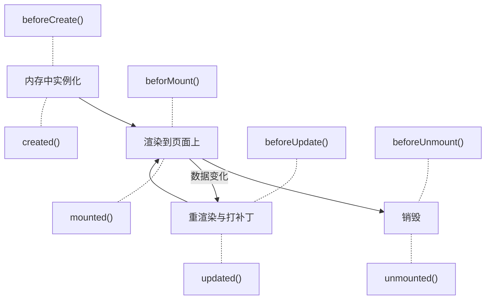

# Vue 高级应用

:::tip
在之前的教程中，我们一直使用的是**选项式 API**，之后我们会切换到**组合式 API**，即当下最主流的方式。
:::

## 侦听器

`watch` 侦听器能够帮助我们监听响应式成员的变化。

```ts
import { ref, watch } from "vue";
const username: Ref<string> = ref("");
watch(username, (newValue, oldValue) => {
  console.log(`username从${oldValue}变成了${newValue}`);
});
```

如果需要组件渲染后立刻调用侦听器，而不是条件触发，则需要配置 immediate 参数：

```ts
watch(
  source,
  (n, o) => {
    console.log(source);
  },
  { immediate: true },
);
```

以上函数可以用 `watchEffect` 简写为：

```ts
watchEffect(() => {
  // operation
});
```

这会立刻执行，且追踪所有依赖的变化。简化了我们侦听的流程。

组合式侦听器默认是深层的，即侦听对象时，内部成员变化也会引起侦听器动作。**但选项式侦听器不是！**你必须显式地指定 deep=true。由于深层侦听面对大型数据结构的性能消耗是巨大的，所以使用时要慎重。如果只是需要监听对象中的一个成员，可以只对这个成员监听。

:::details 计算属性 vs. 侦听器？
计算属性更像是“动态复杂属性”；而侦听器不返回值，常用于执行一系列业务流程。
:::

## 生命周期

Vue 中的组件存在生命周期，组件经历不同的生命周期时会自动调用对应的函数。



常用的是 `created()`（发出异步请求）和 `mounted()`（操作 DOM）。

## 组件数据共享

## Vue 与 axios

## ref

## \$nextTick

## keep-alive

## 插槽

## 自定义指令
