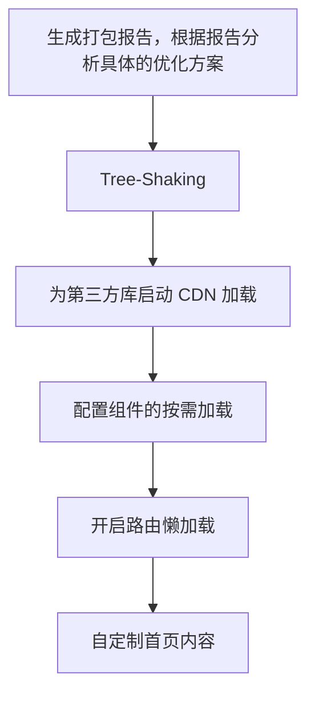

# 前端工程化

:::tip
本章从底层的角度解析 Vue-Cli / Vite（下一章会提到）的运行原理。
:::

**前端工程化**是指在**企业级的前端项目**开发中，把前端开发所需的工具、技术、流程、经验等进行规范化、标准化。最终落实到细节上，就是实现前端的“四个现代化”：

- **模块化**：JS 的模块化、CSS 的模块化、其他资源的模块化
- **组件化**：**复用**现有的 UI 结构、样式、行为
- **规范化**：目录结构的划分、编码规范化、接口规范化、文档规范化、Git 分支管理
- **自动化**：自动化构建（打包）、自动部署、自动化测试

前端工程化的好处主要体现在以下两方面：

- 让前端开发**自成体系**，覆盖了前端项目从创建到部署的方方面面
- 最大程度提高了前端的开发效率，降低了技术选型、前后端联调等带来的协调沟通成本

而光靠 HTML+CSS+JS 和引用现成的模板和引擎，是远远不足的。

目前主流的前端工程化解决方案有 [webpack](https://www.webpackjs.com/) 和 [parcel](https://www.parceljs.cn/)，部分过时项目可能还在用 [grunt](https://www.parceljs.cn/) 或 [gulp](https://www.gulpjs.com.cn/)。

## webpack

**webpack** 是前端项目工程化的具体解决方案。它提供了友好的前端模块化开发支持，以及**代码压缩混淆、处理浏览器端JS的兼容性、性能优化**等强大的功能。这使程序员可以把工作重心放在**具体功能的实现**上，提高了前端的开发效率和项目的可维护性。

下面是一个使用 webpack 的场景：

在空白项目中执行以下命令（获得 _package.json_ 和 jQuery）：

```txt
npm init -y
npm i jquery
```

并手动新建文件夹 _src_，在里面创建 _index.html_ 来开始开发。

在 JS 中，使用 ES6 语法导入 jQ：

```js
import $ from "jquery";
```

但由于浏览器对 ES6 语法支持不佳（虽然现在可以通过设置 _type="module"_ 来解决），因此页面没有顺利载入。

这时候引入 webpack 来解决兼容性问题：

```txt
npm i webpack webpack-cli -D
```

创建 _webpack.config.js_：

```js
export const mode = "development"; // 指定构建模式，可为 development 或 production。前者打包速度快，后者会尽可能压缩源代码。
```

在 _package.json_ 的 _scripts_ 节点下新增：

```json
"script": {
    "dev": "webpack" // 可以使用 npm run dev 来打包构建项目了，"dev" 是用户指定的名字。
}
```

运行后，在浏览器中访问 localhost:8080 查看效果。

webpack 4 及之后，默认打包入口是 _src>index.js_，默认文件输出路径为 _dist>main.js_。这都可以在 _webpack.config.js_ 被规定：导出 _entry_ 与 _output_ 属性：

```js
export const entry = path.join(__dirname, "./src/xxx.js"); // 入口
export const output = {
  // 出口
  path: path.join(__dirname, "./dist"), // 输出路径
  filename: "xxx.js", // 输出文件名
};
```

## webpack-dev-server

当我们的代码变动时，需要重新使用 webpack 打包才能看到变动效果。这是不太便利的。

webpack-dev-server 提供了类似 **nodemon** 的效果，能够实时打包构建项目到一个**内存中的** http 服务器。

使用以下命令安装：

```txt
npm i webpack-dev-server -D
```

修改 _package.json_ 的 _scripts_ 节点为：

```json
"script": {
    "dev": "webpack serve"
}
```

再次执行 `npm run dev` 来运行项目。

如果希望访问地址不是默认的，可以在 _webpack.config.js_ 中导出 _devServer_：

```js
export const devServer = {
  open: true, // 是否初次打包完成后自动打开浏览器
  host: "127.0.0.1", // 主机地址
  port: 80, // 端口号
};
```

## html-webpack-plugin

按照规范要求，我们的源代码需要放在 _src_ 中，这使得我们访问 _localhost_ 时不能直接看到目标网页（_index.html_）。这是不太便利的。

html-webpack-plugin 能够映射一个文件到另一个位置（一般是项目根目录），解决我们的问题。

使用以下命令安装：

```txt
npm i html-webpack-plugin -D
```

在 _webpack.config.js_ 中配置：

```js
import HTMLPlugin from "html-webpack-plugin";

const hp = new HTMLPlugin({
  template: "./src/index.html", // 映射源
  filename: "./index.html", // 映射目的
});

export const mode = "development";
export const plugins = [hp]; // 导出节点数组，里面含 hp
```

打包时，它会自动注入 _bunble.js_，不需要我们关心。

## loader

在开发中，webpack 只能处理 JS 模块。要想处理其他类型的模块，需要借助 **loader** 的帮助。不同类型的模块使用不同的 loader。

:::tip
webpack 讲究**一切皆模块**，即 HTML、CSS/LESS、JS/TS 都应该被视作独立的模块，它们互相不存在依赖（如 HTML 中不应导入 CSS 和 JS，而是交给 _index.js_ 来处理）。
:::

如导入 CSS 模块，需要借助 **style-loader** 和 **css-loader**：

```txt
npm i style-loader css-loader
```

```js
// webpack.config.js
export const rules = [
  // 文件后缀名匹配规则
  { text: /\.css$/, use: ["style-loader", "css-loader"] }, // use 数组的调用顺序是从后向前，由于我们要先载入 css 文件才能读取 CSS，所以顺序不能颠倒
];
```

```js
// index.js
import "style.css"; // 若需要接受具体的值，才需要使用关键字 from，但在此处无意义
```

打包后，发现 css 被转换为 JS 的形式来执行。

下表展示了常见类型模块与其所需要的依赖、加载器的对应关系：

| 类型          | 所需加载器 [依赖]                          |
| ------------- | ------------------------------------------ |
| CSS           | style-loader css-loader                    |
| LESS          | style-loader css-loader less-loader [less] |
| *RESOURCE*S   | url-loader [file-loader]                   |
| _advanced_ JS | babel-loader [@babel/core @babel/插件名]   |

在对高级 JS 配置规则时，需要创建 _babel.config.js_：

```js
export const plugins = [["@babel/插件名", { legacy: true }]];
```

再在 _webpack.config.js_ 中加入排除（_exclude_）以节省时间：

```js
{ test: /\.js$/, use: 'babel-loader', exclude: '/node_modules/' } // 对第三方库不进行转换
```

:::tip
“资源”一般指多媒体文件。页面载入时，使用原生写法会导致请求次数太多（每个资源都会请求一次），拖慢渲染速度。但是使用 url-loader 可以把文件编码为 **base64** 字符串，从引用变成了值存储。

但是并不建议所有的资源都模块化，太大的页面文件本身也是一种负担。我们可以根据情况选择策略：如需要用户点击才展示的资源，可以引用；页面的 favicon、ui 采用编码。

常用的限制方式是为 url-loader 添加 GET 参数 _limit_，表示限制尺寸的上限：

```js
{ test: /\.(jpg|png|gif)$/, use: 'url-loader?limit=22229' } // 只有一个元素就用不着数组了
```

:::

这部分内容较多，仅作了解，无需深究细节。

## 打包发布

webpack 将我们的代码打包到内存中，而不是放到硬盘中，因此我们不能直接的获取到打包的文件。且在开发环境下，打包的文件不会被**压缩和性能优化**。

为了上线项目，我们需要在 _package.json_ 中配置：

```json
"scripts": {
    "build": "webpack --mode production" // 准备发布命令
}
```

然后运行：

```txt
npm run build
```

就可以在 _dist_ 中获得结果了。如果 _dist_ 中有上一次打包产生的内容，它们并不会被移除，而是会被饱和替代。除非在 _webpack.config.js_ 中配置：

```js
export const output = {
  clean: true,
};
```

以上的步骤仅适用于小型工程，对于企业级工程，打包的步骤要复杂得多：



## SourceMap

**压缩混淆**将我们的代码转换为**一行**看似乱码的代码：变量被替换为没有任何语义的名称，空行和注释被删除。**SourceMap** 存放了“乱码”与“明文”的对应关系。有了它，出错的时候，调试工具将显示可读代码而不是不可读的代码。

webpack 默认开启了 SourceMap。但展示的是转换后可读的代码，与我们编写时的不太一样。除非配置：

```js
export const devtool = "eval-source-map";
```

而在生产环境下，为了保护代码安全，应当禁用 SourceMap（_devtool = false_）。
