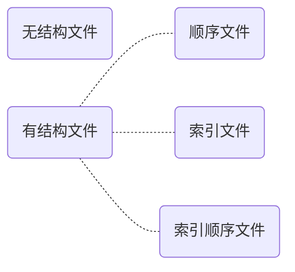

# 文件管理

**文件**具备**文件名**、**标识符**、**类型**和**路径**等属性。

文件中的数据可被组织：

1. 无结构（流式）

2. 有结构（记录式）

文件之间可被组织：

1. 树状

操作系统对上层提供这些服务：

1. 创建
2. 读
3. 写
4. 删除
5. 打开
6. 关闭

外存按照**块**为单位操作数据，不满一块的按一块处理。

操作系统还提供**文件共享**、**文件保护**（权限组）等管理功能。

## 文件的逻辑结构

**逻辑结构**就是文件内部数据组织的方式，与**物理结构**相对。

文本文件（txt）是很典型的无结构文件，没有什么特性。

数据库表文件是典型的有结构文件，由一组相似的记录组成，每条记录又由若干数据项组成。一般来说每条记录都有一个**关键字**。根据记录长度的不同，可分为**定长记录**和**可变长记录**。

接下来分别讲一下三种有结构文件：

1. 顺序文件：在物理上可分**顺序存储**或**链式存储**，根据是否依赖关键字排序可分为**串结构**（不排序）和**顺序结构**（排序）。
2.

## 文件系统基础

## 文件系统实现

## 磁盘组织与管理
