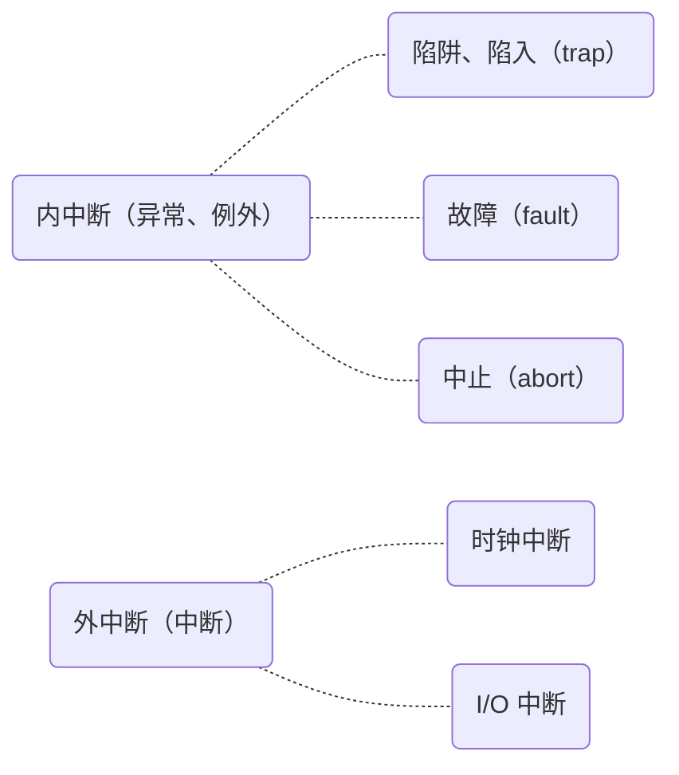

# 概述

操作系统具有四个特征：**并发、共享、虚拟、异步**。其中前两者是共生的。

**并发**指两个或多个事件在同一时间间隔内发生。这些事件**宏观上是同时**发生的，但**微观上是交替**发生的。这是最根本的特性。

:::tip
**并行**指两个或多个事件在同一时刻同时发生。与并发不一样。
:::

:::tip
单核 CPU 同一时刻只能执行一个程序，各个程序只能并发执行。而多核 CPU 可以并行运行多个程序。
:::

由于操作系统是伴随着**多道程序技术**出现的，因此其与**程序并发**是一起诞生的。

**共享**即资源共享，是指系统中的资源可供内存中多个并发执行的进程共同使用。它分为两种方式：**互斥共享方式**（一个时间段内**只允许一个**进程访问该资源）和**同时共享方式**（允许一个时间段**有多个进程同时**对它们进行访问）。

这里的“同时”是宏观的。

**虚拟**是把一个物理上的实体变为若干个逻辑上的对应物。物理实体是实际存在的，而逻辑上对应物是用户感受到的。常见的虚拟化技术有内存虚拟化（**空分复用**）、处理器虚拟化（**时分复用**）。

**异步**是指在多道程序环境下，允许多个程序并发执行，但由于资源有限，进程的执行**不是一贯到底**的，而是以**不可预知**的速度向前推进。

## 操作系统的发展与分类

1. 手工操作阶段

   程序员将纸带送入纸带机（输入），这占据了很大部分的时间，期间处理机一直闲置。只用很短的时间，结果就运算出来了。输出到纸带上又花了很多时间。

   **但**机器同时只能为一个人服务，且不能打断；处理机的时间利用率也很低......

2. 批处理阶段：单道批处理系统

   引入**脱机输入/输出**（外围机 + 磁带），并由**监督程序**负责控制作业的输入/输出。

   外围机能够提前读取纸带，并写入到高速磁带里；处理机会读取磁带，并将结果写入磁带；外围机将磁带里的结果写入到纸带上。

   **但**任务仍然是线性执行的，每个任务结果被写入到磁带后，才会读取下一个任务。I/O 仍然占据大量时间。

3. 多道批处理系统

   监督程序更智能了，它会令输入端尽可能一直处于忙碌状态：每读完一个任务到磁带，就会紧接着读下一个任务到磁带，直到没有任务。此时资源利用率大幅提升。

   **但**在多道批处理系统中，用户不能随时掌握任务的进行状态，灵活性欠佳。即**不能调试程序、不能在程序运行时输入参数**（交互）。

4. 分时操作系统

   计算机**以时间片为单位**轮流为各个用户/作业服务，各个用户可通过终端与计算机进行交互。

   当时间片足够短时，用户感到自己的请求**如同**被实时响应——解决了人机交互问题。进一步的，多个用户可以使用同一台计算机，且不会感受到彼此的存在。

5. 实时操作系统

   实时操作系统能够优先相应一些紧急任务，某些紧急任务不需要排队。任务要在严格的时限内处理完（硬实时，否则是软实时）。

   如导弹控制系统、自动驾驶系统，都属于硬实时系统。对任务**既要求效率，也要求正确性**。

6. 其他

   现在还有很多类型的操作系统，如网络操作系统、分布式操作系统、个人计算机操作系统......

## 操作系统的运行机制

:::tip
若无特别说明，下面的**指令**都是指二进制指令、机器指令。
:::

操作系统中最核心的功能由**内核程序**（内核）实现，所有更高层的功能都要依赖内核才能运行。内核本身具有最高权限，能够执行一些不对用户开放的指令。

指令的内容和权限级别被硬编码在 CPU 里，因此 CPU 总是知道指令的类型。为了区别发出指令的对象，CPU 有两种状态：**内核态**（核心态、管态）和**用户态**（目态）。处于内核态时，说明此时正在运行的是内核程序，才能允许执行特权指令。

:::tip
CPU 中有一个寄存器叫**程序状态字寄存器**（PSW），其中有个二进制位，来区分内核态或用户态。

切换状态的指令本身是特权指令，因此应用程序无权切换状态，这是由内核控制的。
:::

操作系统在运行应用程序时，会将内核态修改为用户态，并主动让出 CPU 使用权。

如果 CPU 在用户态收到特权指令请求，则会发出**中断信号**——CPU 控制权随即转交到处理中断信号的内核程序，当前应用程序中止。即**操作系统通过中断信号重新夺取 CPU 控制权**。处理完后，再把 CPU 使用权交给别的应用程序。

中断信号分很多种，只要是需要操作系统介入，都可以去触发中断信号。

## 中断和异常

**中断**是让操作系统内核夺回 CPU 使用权的**唯一途径**。如果没有中断机制，一个应用程序就会一直运行，即不能实现任务并发。

中断分为**内中断**（来自 CPU 内部）和**外中断**（来自 CPU 外部）。

上一节提到的，用户态 CPU 遇到特权指令产生的中断由 CPU 自发产生，属于内中断。任何非法指令或导致非法结果的指令都会引发内中断，其本质是**终止指令**。

若应用程序需要调用内核服务，会执行**陷入指令**，这也会触发一个内部中断信号。应用程序通过陷入指令主动将 CPU 还给操作系统。

时钟部件每隔一个时间片会向 CPU 发送一个时钟中断信号，提醒其切换任务。而处理中断信号的内核程序就会打断当前应用程序。I/O 设备在读写任务执行到关键点时也会向 CPU 发送中断，提示其对数据做出响应。这些就属于外中断。

由于中断具体上分很多种，所以会有很多不同的处理程序。这被记载在**中断向量表**中：

| 中断信号类型 | 中断处理程序指针 |
| ------------ | ---------------- |
| 0            | 0x00001000       |
| 1            | 0x00001100       |
| ...          | ...              |

## 操作系统体系结构
