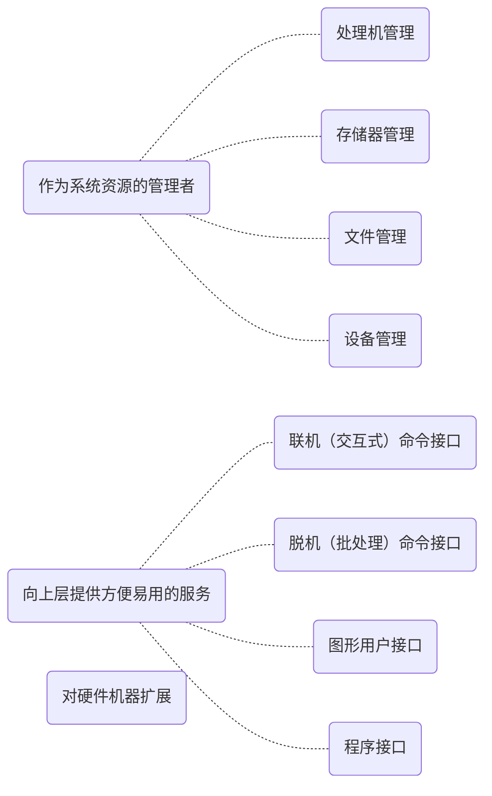

# 操作系统

**操作系统**（Operating System）是指控制和**管理**整个计算机系统的**硬件和软件**资源，并合理的组织调度计算机的工作和资源的分配；以**提供给用户和其他软件方便的接口和环境**；它是计算机系统中最基本的**系统软件**。

操作系统本质是一种软件，但是比任何应用程序都更接近硬件。

计算机厂商向我们交付设备的时候，不能只提供一个**裸机**，这将使计算机极难使用。用户必须对硬件接口十分了解，而且编写软件只能使用机器语言。覆盖了软件的机器被称为**扩充机器**，又称**虚拟机**。
